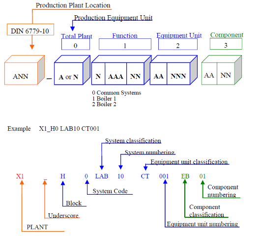
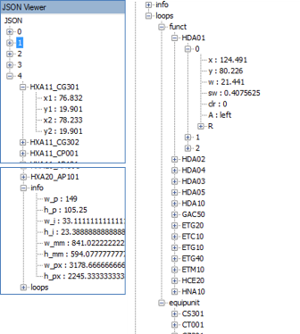
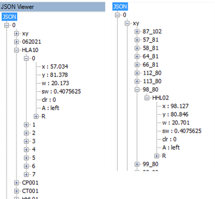

# Утиліти для роботи зі схемами P&ID (схеми автоматизації)

## Вибірка функціональних елементів зі схеми P&ID

### Завдання та функції

**Загальна постановка завдання**

Необхідно вибрати зі схем P&ID оформлених за методикою KKS у форматі PDF усі необхідні ідентифікатори та їх координати для можливості формування зі схеми в подальшому окремих рисунків (фрагментів схеми) за вказаними ідентифікаторами для відображення. 

Загальний принцип ідентифікації по KKS показаний на рис.1



рис.1. Формування ідентифікаторів KKS

Передбачається, що на схемі автоматизації присутні рівень `Function` та `Equipment Unit`. Інші рівні не враховуються. Тобто з наведеного вище рисунку елемент який відшукується - це `LAB10 CT001`.  


рис.2. Фрагмент схеми автоматизації.

**Функції**

Зі схеми автоматизації, що надана в форматі PDF:

- вибрати усі тексти що задовольняють шаблонам KKS рівнів `Function` та `Equipment Unit` та для кожного з них запам'ятати координати X, Y та значення тексту;
- по кожній сторінці записати в файл JSON:
  - інформацію про сторінку `info`: висоту та ширину сторінки PDF (в одиницях, в дюймах, в пікселях, в мм)
  - згрупувати в окремий об'єкт з властивостей-елементів `loops.funct` для рівня  `Function` KKS
  - згрупувати в окремий об'єкт з властивостей-елементів `loops.equipunit` для рівня  `Equipment Unit` KKS
  - знайти тексти  `Function` та  `Equipment Unit` які знаходяться рядом і об'єднати їх в єдині елементи, для яких зафіксувати координати кожного з них, як  



### Реалізація

Файл `getdatafrompdf.js` експортує функцію `getfrompdf` першим аргументом для якої є вказівка на файл PDF зі схемою P&ID, другим - функція зворотного виклику з аргументами (номер помилки та обєктом `pagesinfo`). 

```js
let fs = require('fs');
let getfrompdf = require (`./getfrompdf.js`);
let fsapdf = 'exmpl/fsa.pdf';
let fsajson = 'exmpl/fsa.json';
getfrompdf(fsapdf, (err,pagesinfo)=> {
  if (err) {
    console.log (err)
  } else {
    fs.writeFileSync(fsajson, JSON.stringify(pagesinfo));
  }
})
```

Використовується бібліотека [`pdf2json`](../../Довідники/jspdf/pdf2json.md)

На перошому кроці після парсингу перебираються усі текстові елементи по сторінкам, викидаються ті, які не підходять по кількості символів, видаляється вся кирилиця та недруковані символи. Для кожного з таких елементів створюється об'єкт-масив, назва якого відповідає за текстовий зміст а кожне входження - кординати де він з'являється на рисунку схеми автоматизації.      



Крім того для зручності пошуку формується об'єкт-масив `xy`, імя якого складається з кординат в  умовних точках pdf2json  `x_y`, а  елементи - на координати елемнтів, які знаходяться в цих точках.  

На другому кроці робиться упорядкування між  `Function` та `Equipment Unit` позначенням а також по координатам.


На третьому кроці формується перелік умовних позначень KKS, які складаються з двох частин:  `Function` та `Equipment Unit`. 

Йде перебір по кожній функції, для якої визначалися координати. Далі для кількох координат, наближених до цеї точки. Для схем, що використовувалися, було експериментально визначено, що зближення текстів варто шукати в межах:

- тієї ж точки (x_y) 
- (x + 1)_y
- (x + 2)_y
- x_(y + 1)

Для інших схем і випадків не перевірялося, і очевидно треба розглядати інший алгоритм пошуку текстів поруч.

Якщо тексти знаходяться поруч то формується обєкт з іменем комбінацією цих текстів, для якого вказуються обидві точки.    

Також на цьому кроці для кожної сторінки записуються її ширина і висота.

