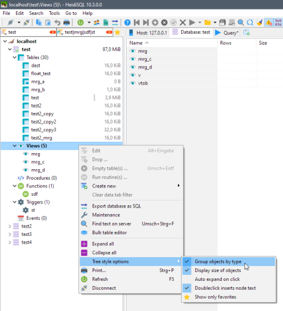
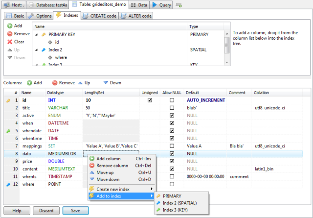

# Утиліти для роботи з БД 

[10 Best MySQL GUI Tools](https://codingsight.com/10-best-mysql-gui-tools/)

## HeidiSQL

[Basic help on using HeidiSQL](https://www.heidisql.com/help.php?place=menuReadme)

HeidiSQL - це клієнтський застосунок, який можна використовувати лише тоді, коли у вас є SQL-сервер. Цей застосунок можна підключати до однієї із СКБД MariaDB, MySQL, MS SQL, PostgreSQL, або файлу бази даних SQLite.

### Підключення до серверу


 Нижче наведений приклад підключення до локальної СКБД MariaDB. 

У диспетчері сеансів HeidiSQL ви натискаєте кнопку "New", щоб створити нове з'єднання, і більшість налаштувань за замовчуванням для вас уже встановлені, за винятком пароля, який здебільшого не є порожнім на нещодавно встановленому сервері MariaDB.

Ви можете організувати свої збережені сеанси в папках. Щоб створити папку, натисніть стрілку спадного меню на кнопці "New", потім натисніть "*Folder in root folder*" або "*Folder in selected folder*". Щойно у вас є папка, ви можете створити в ній з'єднання або перетягнути наявні з'єднання в цю папку.

### Командний рядок 

Хоча HeidiSQL є застосунком з графічним інтерфейсом, він може бути автоматизований для підключення та відкриття файлів за допомогою параметрів командного рядка. Назви параметрів залежать від регістру і засновані на тих, які використовуються в командному рядку MariaDB/MySQL, наприклад, mysqldump. Не забудьте викликати HeidiSQL з повним ім'ям файлу ("heidisql.exe"), а не з короткою версією ("heidisql"). Аналізатор командного рядка HeidiSQL очікує саме цього. Це слід виправити в майбутньому.

### Дерево бази даних 

​        Якщо у вашій базі даних є велика кількість таблиць, представлень або будь-чого іншого, ви, мабуть, хочете згрупувати їх за їх видами для кращого огляду. Клацніть правою кнопкою миші дерево та активуйте *Tree style options > Group objects by type*:    



​       	Ви також можете позначити важливі елементи, так звані улюблені, клацанням мишкою в лівій частині таблиці. Після цього ви можете обмежити дерево показувати лише вибране, натиснувши нову кнопку "Показати лише вибране" вгорі:


### Створення таблиці 

 	HeidiSQL постачається з багатофункціональним графічним інтерфейсом для створення та редагування структури таблиці. Просто клацніть правою кнопкою миші базу даних, в якій потрібно створити таблицю, потім наведіть на пункт "Створити нову", а потім натисніть "Таблиця":


Зробивши це, ви побачите редактор таблиці, як на наступному рисунку:




### Добавлення, редагування, видалення записів таблиці


### Створення view

​    


### Створення stored procedure

​        Just right click the datatabase in which you want to create a procedure, then point on "Create new", then click        "Procedure" or "Function".        Done that, you'll see the procedure editor like in the following picture:    


### Створення тригеру 

​    


### Створення запланованої події 

​    


### Таблиця даних 

​	На вкладці даних відображається вміст поточно вибраної таблиці або представлення. Це одна з найкорисніших та найпотужніших особливостей HeidiSQL. Ви побачите різні кольори для різних груп типів даних. Ці кольори можна налаштувати в *Tools > Preferences > Data appearance*.  

​	Натискання клавіші F2 або клацання одним довгим у комірці сітки запустить режим редактора. Це дозволить вставити звичайні значення в рядок. Для вставки спеціальних значень, таких як функції SQL, NULL або GUID, клацніть правою кнопкою миші на клітинку та вкажіть на підменю  *Insert value >* submenu

​	Швидкі фільтри: клацніть правою кнопкою миші значення в сітці, а потім натисніть *Quick filter* , щоб отримати різні параметри одним клацанням миші, щоб створити пункт WHERE для значення сітки. Цей фільтр може базуватися або на зосередженій комірці в сітці, на підказці або на вмісті буфера обміну.

У підменю швидкого фільтру ви знайдете підменю *More values*. Вказуючи на це меню, HeidiSQL швидко збирає та відображає 30 найпопулярніших елементів у зосередженому стовпчику, згруповані за їх значенням:


Ймовірно, у вас є таблиця з одним або кількома цілими стовпцями, які представляють часові позначки UNIX. HeidiSQL може відображати такі цілі стовпці, як значення дати / часу, тому ви можете краще їх прочитати:


### Виконання SQL запитів

​	У HeidiSQL за замовчуванням є вкладка "Запит". Ви можете створити більше, ніж цей за замовчуванням, натиснувши Ctrl + T або клацнувши правою кнопкою миші основні вкладки, а потім натисніть "New query tab". На такій вкладці запитів ви можете написати власні запити до бази даних або завантажити файл .sql зі свого жорсткого диска. Натискання клавіші F9 або кнопки із синьою піктограмою "play" на ній виконує ваш запит чи запити.

​	HeidiSQL може виконати партію запитів (= кілька запитів, розділених крапкою з комою) за один раз. Таким чином, виконання стає значно швидшим, особливо при наявності міні-запитів. Щоб активувати це «виконання за один раз», просто натисніть спадне меню синьої кнопки «відтворити», а потім натисніть «Надіслати пакет за один раз»:


​	У правій частині кожної вкладки запитів ви маєте панель «помічники запитів» із стовпцями таблиці, зарезервованими словами, функціями SQL тощо.
​         Маючи таблицю, вибрану в лівому дереві, перший елемент дерева у помічниках показує "Стовпці в <вибраному_таблиці>". Елементи меню "Створити ..." використовують вибрані назви стовпців для створення швидкого запиту для вас у редакторі:


Щоб побачити, як працює ваш запит у MariaDB або MySQL, ви можете активувати параметр "Профіль запиту" у полі помічників праворуч. Потім запустіть запит або запити і подивіться, що показує хронологія профілю. Це в основному те, що робить [SHOW PROFILE](http://dev.mysql.com/doc/refman/5.0/en/show-profiles.html) у MySQL 5.0.37 та пізніших випусках.


​	HeidiSQL підтримує параметризовані SQL-запити: активуйте його за один клік у вікні «Прив’язати параметр» та починайте писати запит із параметрами, наприклад.   `select ':p'`.  


## DbVyz

### Для з'єднання з mariaDB

Завантажити драйвер (mariadb-java-client)

[MariaDB Connector/J .jar](https://downloads.mariadb.org/connector-java/+releases/) 

### Для з'єднання з MySQL 8.0

- Продублювати драйвер в `Tools->Driver Manager` (`Driver->Duplicate Driver`) добавити туди новий драйвер, який ставиться разом з MySQL, описано тут  [link](https://medium.com/@orafaelreis/workaround-to-unable-to-load-authentication-plugin-caching-sha2-password-message-85ddf6a98611)

- У налаштуваннях драйвера `Properties` -> `Driver Properties` поставити

```
serverTimezone=UTC
```

