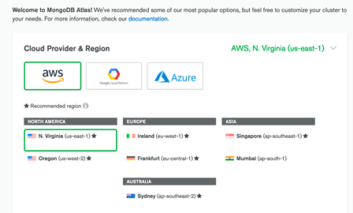

# Cloud MongoDB Atlas

https://cloud.mongodb.com

MongoDB Atlas — це багатохмарна служба баз даних, створена тими ж людьми, що створюють MongoDB. Atlas спрощує розгортання ваших баз даних і керування ними, водночас пропонуючи універсальність, необхідну для створення стійких і продуктивних глобальних додатків у хмарних постачальниках за вашим вибором.

## Швидкий старт

### 1. Створіть обліковий запис Atlas

 [Зареєструйте](https://www.mongodb.com/docs/atlas/tutorial/create-atlas-account/) обліковий запис Atlas за допомогою свого облікового запису Google або електронної адреси.

### 2. Розгорніть безкоштовний кластер

[Створіть і розгорніть безкоштовний кластер](https://www.mongodb.com/docs/atlas/tutorial/deploy-free-tier-cluster/). Ви можете використовувати безкоштовні кластери Atlas як невелике середовище розробки для розміщення своїх даних. Термін дії безкоштовних кластерів ніколи не закінчується, вони надають доступ до піднабору функцій Atlas.

1) Увійдіть в Atlas.

2) Натисніть Build a Cluster.

3) Виберіть Shared Clusters and click Create a Cluster.

4) Select your preferred Cloud Provider & Region.

   Atlas supports M0 free clusters on Amazon Web Services (AWS), Google Cloud Platform (GCP), and Microsoft Azure. Atlas displays only the regions that support M0 free clusters and M2/M5 shared clusters.

5) Select M0 Sandbox for cluster tier.

Selecting M0 automatically locks the remaining configuration options. If you cannot select the M0 cluster tier, return to the previous step and select a Cloud Provider & Region that supports M0 free clusters.

6) Enter a name for your cluster in the Cluster Name field.

You can enter any name for your cluster. The cluster name can contain ASCII letters, numbers, and hyphens.

7) Click Create Cluster to deploy the cluster.

Once you deploy your cluster, it can take up to 10 minutes for your cluster to provision and become ready to use.

### 3. Додайте свою IP-адресу підключення до списку IP-доступу

[Додайте свою IP-адресу до списку надійних IP-адрес](https://www.mongodb.com/docs/atlas/security/add-ip-address-to-list/). IP-адреса унікально ідентифікує пристрій, який підключається до мережі. В Atlas ви можете підключитися до кластера лише з довіреної IP-адреси. В Atlas ви можете створити список надійних IP-адрес, який називається списком IP-доступу. Список IP-доступу визначає IP-адреси, які можуть підключатися до вашого кластера та отримувати доступ до ваших даних.

1. Click Connect.

   - Click Databases in the top-left corner of Atlas.
   - In the Database Deployments view, click Connect for the cluster or serverless instance to which you want to connect.

   Atlas highlights the Setup connection security step.

2. Click Add Your Current IP Address.

   - To secure your MongoDB Atlas cluster, limit access to specified IP addresses.

   - The menu expands to show the Add a connection IP address modal.

3. Click Add IP Address.

### 4. Створіть користувача бази даних для свого кластера 

[Створіть користувача бази даних для доступу до вашого кластера](https://www.mongodb.com/docs/atlas/tutorial/create-mongodb-user-for-cluster/). З міркувань безпеки Atlas вимагає від клієнтів автентифікації як користувачів бази даних MongoDB для доступу до кластерів.

### 5. Підключіться до свого кластера

 [Підключіться до свого кластера](https://www.mongodb.com/docs/atlas/tutorial/connect-to-your-cluster/) за допомогою [mongosh](https://www.mongodb.com/docs/mongodb-shell/#mongodb-binary-bin.mongosh), драйвера [Node.js](https://www.mongodb.com/docs/drivers/node/), [драйвера PyMongo](https://www.mongodb.com/docs/drivers/python/) або [Compass](https://www.mongodb.com/docs/compass/current/).

### 6. Вставте та перегляньте документ

 [Вставте документ у свій кластер](https://www.mongodb.com/docs/atlas/tutorial/insert-data-into-your-cluster/) за допомогою одного з підтримуваних [драйверів MongoDB](https://www.mongodb.com/docs/drivers/). Драйвери MongoDB дозволяють програмно взаємодіяти з базами даних за допомогою підтримуваної мови програмування.

### 7. Завантажити зразки даних.

 [Завантажте зразки даних у ваші кластери Atlas](https://www.mongodb.com/docs/atlas/sample-data/#std-label-sample-data). Atlas надає зразки даних, які можна завантажити у свої кластери Atlas. Ви можете використовувати ці дані, щоб швидко почати експериментувати з даними в MongoDB і використовувати такі інструменти, як [Atlas UI](https://www.mongodb.com/docs/atlas/atlas-ui/#std-label-atlas-ui) і [MongoDB Charts](https://www.mongodb.com/docs/charts/saas/).