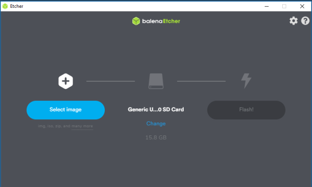
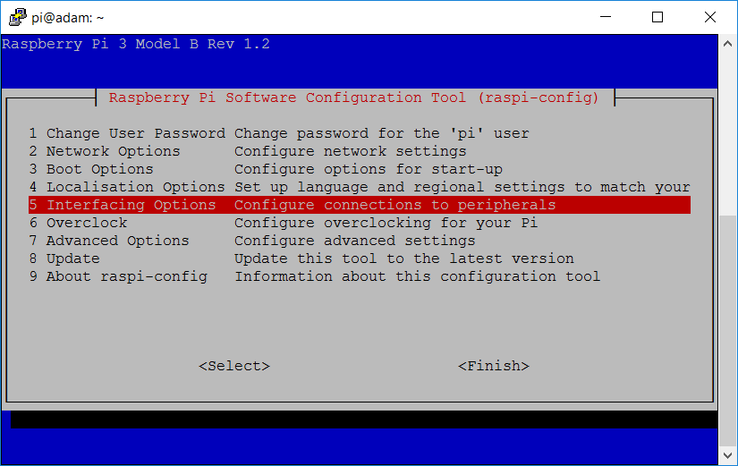
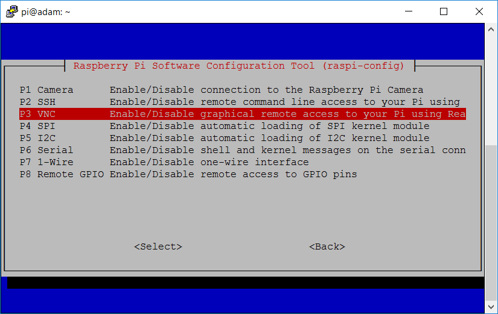
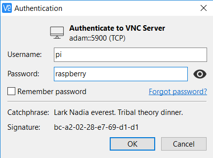

**Програмна інженерія в системах управління. Лабораторний практикум.** Автор і лектор: Олександр Пупена 

| [<- до лаборних робіт](README.md) | [на основну сторінку курсу](../README.md) |
| --------------------------------- | ----------------------------------------- |
|                                   | [2 частина ->](lab4_2_RPIProg.md)         |

#  Лабораторна робота №5.    Основи роботи з Raspberry PI3

Рекомендується попередньо ознайомитися з матеріалами лекції по RPI за [посиланням](../Лекц/RaspberryPi.md).

## 1. Підготовка образу карти налаштування Raspberry Pi.

У даній частині лабораторної роботи проводиться підготовка Raspberry Pi для проведення інших лабораторних робіт та курсового проектування. Встановлення необхідного програмного забезпечення проводиться таким чином щоб не підключати клавіатуру, мишу та монітор до Raspberry PI. 

###### 1.1. Завантаження образу для RPI з Інтернету.

Завантажте образ з ОС та мінімальним ПЗ для карти RPI (`Raspberry Pi OS with desktop`) за [посиланням](https://www.raspberrypi.org/downloads/raspbian). Виберіть один з варіантів завантаження `Download` або `Download Torrent`. 

###### 1.2. Завантаження утиліти для створення образу.

Завантажте утиліту balenaEtcher для запису образу Raspbian на SD карту за [посиланням](https://www.balena.io/etcher/) або попросіть її у викладача. 

###### 1.3. Запис початкового образу.

Запустіть balenaEtcher на виконання.

                               

- Натисніть Select Image та виберіть завантажений в п.1.1 образ Raspbian.
- Натисніть Change для вибору SD карти.
- Натисніть Flash для запису образу, та зачекайте закінчення цього процесу.

###### 1.4. Створення конфігураційного файлу з налаштуваннями WiFi.

На SD карті в кореневій директорії створіть текстовий файл з наведеним нижче змістом (вказані налаштування працюють тільки в лабораторії А-532 НУХТ). Даний файл автоматично налаштує Raspberry на підключення до WiFi-мережі з іменем записаним в полі `ssid`, та паролем в полі `psk`. Поле `key_mgmt` вказує на тип шифрування.

```bash
ctrl_interface=DIR=/var/run/wpa_supplicant GROUP=netdev
update_config=1
country=UA

network={
	ssid="WF532"
	psk="123456789"
	key_mgmt=WPA-PSK
}
```

Збережіть даний файл з іменем та розширенням wpa_supplicant.conf.

###### 1.5. Активація способу підключення через SSH.

На SD карті в кореневій директорії створіть пустий текстовий файл з іменем SSH . Даний файл автоматично активує спосіб підключення до Raspberry через [SSH](https://uk.wikipedia.org/wiki/SSH#%D0%9F%D0%B5%D1%80%D0%B5%D0%B4%D0%B0%D1%87%D0%B0_%D1%84%D0%B0%D0%B9%D0%BB%D1%96%D0%B2_%D0%B7_%D0%B2%D0%B8%D0%BA%D0%BE%D1%80%D0%B8%D1%81%D1%82%D0%B0%D0%BD%D0%BD%D1%8F%D0%BC_SSH).


###### 1.6. Увімкнення та пошук в мережі Raspberry.

- Вставте SD карту в Raspberry та ввімкніть його.
- Разом з викладачем дізнайтесь IP адресу Вашого Raspberry (наприклад через сканування мережі, або переглядаючи перелік вузлів в маршрутизаторі).

###### 1.7. Встановлення програми терміналу PuTTY. 

Завантажте утиліту роботи з терміналом PuTTY з [офіційного сайту](https://www.putty.org/ ) та установіть її на свій ПК, якщо це не було зроблено раніше.

###### 1.8. З'єднання з Raspberry по SSH 

- Запустіть PuTTY на виконання.
- У поле `Host Name` (`Ім'я хоста`) введіть IP-адресу Raspberry, яку Ви дізналися в п.1.6 та натисніть кнопку `Open` .


- Відкриється командне вікно, яке служить для діалогу через захищений SSH канал зв'язку з Raspberry Pi.

- Система попросить ввести логін и пароль. По замовчуванню логін — `pi`, а пароль — `raspberry`. При введенні паролю символи в консолі не відображаються.

  

- Після введення паролю Вам доступна можливість діалогу через команди SSH. 

  Перелік найбільш вживаних команд можна знайти за [посиланням](../Довідники/командиSSH.md)   

###### 1.9. Зміна параметрів монітора

- Через термінал PuTTY запустіть команду зміни файлу налаштування параметрів монітора 

```bash
sudo nano /boot/config.txt
```

- у редакторі змініть поля 

```bash
framebuffer_wight=1280
framebuffer_height=720
```


- Збережіть файл через комбінацію ctrl+X, Y

###### 1.10. Зміна імені RPI

- Через термінал PuTTY запустіть команду зміни файлу налаштування параметрів імені

```bash
sudo nano /etc/hostname
```

- дайте ім'я латинськими літерами щоб воно було унікальним в межах університету; рекомендується давати ім'я в форматі

```
firstnamelastnameRPI
```

де `firstname` - ім'я (латинськими літерами), `lastname` - прізвище (латинськими літерами)

- Збережіть файл через комбінацію ctrl+X, Y 

###### 1.11. Зміна налаштувань DNS

- Через термінал PuTTY запустіть команду зміни файлу налаштування параметрів імені

```bash
sudo nano /etc/hosts
```

- напроти `127.0.0.1` змініть ім'я аналогічно п.1.10

- Збережіть файл через комбінацію  ctrl+X, Y 

- перезавантажте RPI через командний рядок 

```bash
sudo reboot
```

###### 1.12. Перевірка підключення через ім'я

Після того як Raspberry перевантажиться повторно, підключіться до нього з PuTTY, але вже через ім'я (в полі hostname).

###### 1.13. Встановлення Samba

**Samba** - це [пакет](https://uk.wikipedia.org/wiki/Samba) програм, які дозволяють підключатися до мережних дисків і принтерів на різних операційних системах по протоколу SMB/CIFS. Наприклад, встановлення серверу на RPI дає можливість підключатися до RPI з ОС Windows по його імені.    

- Через термінал PuTTY запустіть команду встановлення samba з репозиторію

```bash
sudo apt-get install samba
```

###### 1.14. Налаштування samba

- Через термінал PuTTY запустіть команду зміни файлу налаштування параметрів серверу samba

```bash
sudo nano /etc/samba/smb.conf
```

- встановіть поле

```bash
win support = yes
```

- Збережіть файл через комбінацію  ctrl+X, Y 

- перезапустіть службу

```bash
sudo service smbd restart
```

###### 1.15. Перевірка видимості через ім'я 

У командному рядку Windows на ПК розробника зробіть пінг RPI по імені 

```bash
ping firstnamelastnameRPI
```

де `firstnamelastnameRPI` - ім'я RPI, що надане йому в п. 1.10

###### 1.16. Активацій сервісу VNC (сервер) на RPI 

- Запустіть команду  запуску опцій налаштування Raspberry
```bash
sudo raspi-config  
```



- Відкрийте розділ 5 `Interfacing Options` та активуйте P3 VNC.



###### 1.17. Завантаження, запуск та підключення сервісу VNC-клієнта на PC-розробника 

- Завантажте VNC з [офіційного сайту](https://www.realvnc.com/en/connect/download/viewer/ ) та запустіть його

- у полі `VNC Conect` введіть ім'я вашого Raspberry та натисніть `Enter` . Під час входу необхідно ввести логін і пароль (логін — `pi`, пароль — `raspberry`).

  


- після цього відкриється віддалений робочий стіл вашого Raspberry.


###### 1.18.   Встановлення npm для Manage Pallete

- Запустіть командний рядок та запустіть команду для встановлення `npm` для Manage Pallete

```bash
sudo apt-get install npm
sudo npm install -g npm
sudo reboot
```


[2 частина ->](lab4_2_RPIProg.md)