**Програмна інженерія в системах управління. Лабораторний практикум.** Автор і лектор: Олександр Пупена 

| [<- до лаборних робіт](README.md) | [на основну сторінку курсу](../README.md) |
| --------------------------------- | ----------------------------------------- |

# Лабораторна робота №4. Основи роботи з Git та GitHub

**Тривалість**: 4 акад. години.

**Мета:** Познайомитися з Git та GitHub. Почати використовувати для роботи з проектами Node-RED.

**Лабораторна установка**

- Апаратне забезпечення: ПК. 
- Програмне забезпечення: Node-RED, Git, сервіси GitHub

## Порядок виконання роботи 

### 1. Основи роботи з Git

Перед виконанням лабораторної роботи варто ознайомитися з лекцією по Git та GitHub, яка доступна [за посиланням](https://drive.google.com/open?id=1WgLFaHt1Z9de_k_JkmdmFXZXW-UNPl3s).

#### 1.1. Встановлення Notepad++

Завантажте <https://notepad-plus-plus.org/downloads/> та встановіть редактор Notepad++, якщо він ще не встановлений у вас в системі.

#### 1.2. Встановлення Git

- [ ] Завантажте та інсталюйте Git <https://git-scm.com/downloads>. При інсталяції залишайте усі опції за замовченням, окрім редактору, виберіть Notepad++ (рис.4.1).

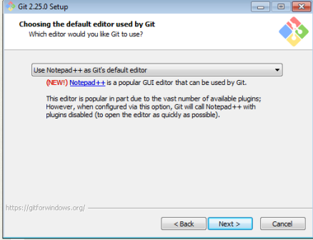

рис.4.1. Встановлення Git

#### 1.3. Реєстрація користувача в Git

- [ ] У одній із директорій створіть папку «Project». 
- [ ] Перейдіть до папки і через контекстне меню виберіть `Git Bash Here`


рис.4.2. Запуск Git Bash

- [ ] В консолі введіть команду перегляду конфігурації

```bash
git config --list
```

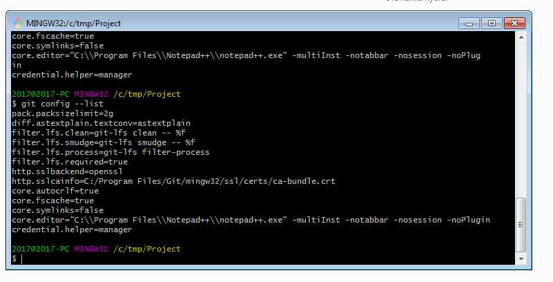

рис.4.3. Git команда перегляду конфігурації 

- [ ] У переліку конфігурацій немає зареєстрованого користувача. Використовуючи команди добавте свого користувача та пошту. 

```bash
git config --global user.name "John Doe"
git config --global user.email johndoe@example.com
```

- [ ] Після цього перевірте, що вони добавлені через команду `git config ---list`

#### 1.4. Ініціалізація локального репозиторію

- [ ] Використовуючи команду git init ініціалізуйте репозиторій. 
- [ ] Зробіть налаштування провідника, щоб відображилися приховані файли та директорії.
- [ ] Перевірте, що в робочій папці створилася папка з назвою .git

#### 1.5. Створення файлу в робочій папці. Робота з Get Gui

- [ ] Використовуючи Notepad++ у папці створіть текстовий документ «file1**X**» (де **X** -- номер варіанту) з трьома рядками і збережіть. 
- [ ] Використовуючи git status перевірте стан репозиторію. Зробіть копію екрану.


рис.4.4. Створення файлу та його коміт через консольну утиліту

- [ ] Використовуючи команду «Get Gui Here» контекстного меню в папці проекту викличте графічний інтерфейс. 
- [ ] Проконтролюйте щоб в налаштуваннях проекту стояв шрифт `utf-8`

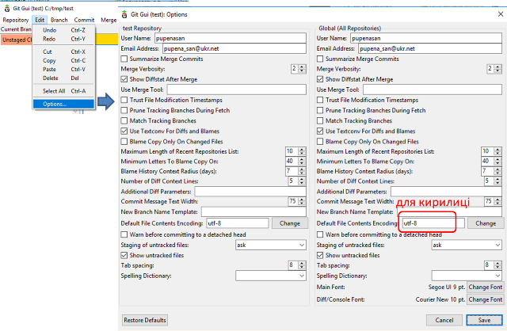

рис.4.5. Налаштування роботи з кодуванням шрифтів в Git

- [ ] Проаналізуйте зміст. Зробіть копію екрану.

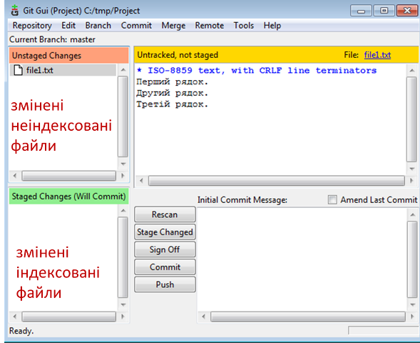

рис.4.6. Перегляд змін у файлі

#### 1.6. Індексування (Staging)

- [ ] Запустіть команду для добавлення файлу на індексування, повторіть пункт 5.

```
git add file1X.txt  
```

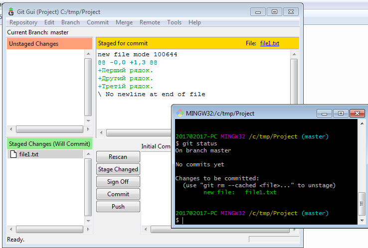

рис.4.7. Добавлення файлів у індекс

#### 1.7. Збереження відтиску (commit)

- [ ] Запустіть команду коміту з повідомленням (опція -m) «Перша версія проекту», повторіть пункт 5.

```bash
git commit -m 'Перша версія проекту' 
```

- [ ] Порівняйте збережені копії екранів, зробіть висновок, щодо їх змісту.

#### 1.8. Історія проекту через Git Bash

- [ ] Створіть новий файл в робочій директорії з назвою file2X.txt. 
- [ ] Запишіть туди три довільні рядки. 
- [ ] У першому файлі видаліть другий рядок, та добавте в кінець рядок з написом «четвертий рядок». 
- [ ] Добавте оба файли до індексу та зробіть коміт.

```bash
git add *.txt
git commit -m 'Друга версія проекту' 
```

- [ ] Виконайте команду для перегляду історії проекту. 

```bash
git log
```

- [ ] Зробіть копію екрану.

#### 1.9. Історія проекту через Git Gui

- [ ] Відкрийте графічний інтерфейс, викличте меню «Repository-\>Visualize master's History», передивіться історію комітів. 


рис.4.8. Перегляд історії комітів

- [ ] Зробіть копію екрану.

### 2. Налаштування Node-RED для роботи з проектами 

#### 2.1. Налаштвання Node-RED, щоб він працював на основі проектів

Node-RED має можливість працювати в режимі проектів, де на одному робочому місці можна створювати кілька проектів і керувати ними.

- [ ] За допомогою Notepad++ відкрийте конфігураційний файл settings.js що знаходиться в папці «.node-red» за місцем розташування файлів користувача. Наприклад, якщо зареєстрований користувач в системі «User1», то розміщення буде

```bash
C:\Users\User1\.node-red
```

- [ ] Змініть налаштування, активувавши проекти, як показано на рисунку. Збережіть файл.


рис.4.9. Активація опції роботи з проектами в Node-RED

#### 2.2. Створення нового проекту node-red

- [ ] Запустіть node-red. 
- [ ] Перший раз, після активації опції проектів, node-red запропонує створити новий проект (див.рис.2.2):

1.  У першому вікні необхідно вибрати опцію «Create project».
2.  У другому вікні треба ввести користувача.
3.  У третьому вікні вказати ім'я нового проекту, після чого натиснути «Next»
4.  У четвертому вікні система запропонує усі існуючі потоки програми node-red перемістити в указаний файл. Це дасть можливість зробити імпорт цих файлів за необхідності. Натисніть Next.
5.  У п'ятому вікні зробіть відмову від шифрування "Disable encription" після чого натисніть "Create Project".
6.  На останній сторінці натисніть "Done"

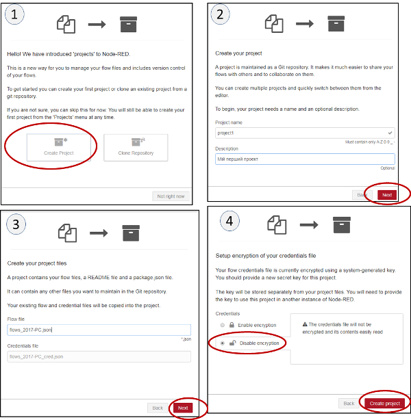

рис.4.10. Створення проекту в Node-RED

Новий проект включить в себе усі існуючі до цього потоки. 

- [ ] Видаліть усі потоки окрім того, який був зроблений в 1-й лбораторній роботі. 
- [ ] Після цього зробіть розгортання проекту.

#### 2.3. Аналіз стану проекту

- [ ] Перейдіть на папку node-red

```bash
 C:\Users\<ім’я користувача>\.node-red
```

Там ви побачите папку «projects», де зберігатимуться усі локальні проекти. 

- [ ] У цій папці знайдіть папку з назвою вашого проекту і зайдіть в неї. Там буде кілька файлів і папка «.git». Як Ви вже здогадалися, Node-RED використовує для ведення проекту систему Git. Тому папка проекту є робочою папкою Git з репозиторієм.

- [ ] Використовуючи «Git Gui» або «Git Bash» проаналізуйте стан проекту.

- [ ] Перейдіть в Node-RED на закладку "Project History" і передивіться зроблені зміни в локальному репозиторію. Як видно, Node-RED надає інтерфейс для деяких основних команд керування Git.

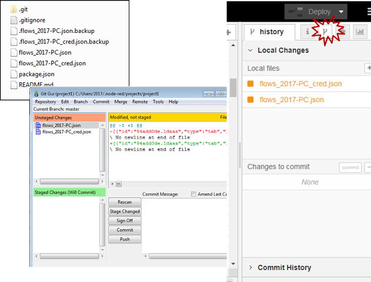

рис.4.11. Project History в Node-RED

#### 2.4. Керування проектом

- [ ] У Node-RED на закладці "Project History - Local Changes" через кнопку «+All» зробіть індексування усіх змінених файлів. 
- [ ] Після цього вони з'являться в Changes to commit. Натисніть «Commit» і в полі повідомлення введіть «Мій перший коміт».

- [ ] Перейдіть на вкладу "Project History -- Commit History" і подивіться історію коммітів. 
- [ ] Виберіть останній коміт і у вікні що з'явиться подивіться деталі змін, які були зроблені. 
- [ ] Використовуючи з «Git Gui» утиліту «Visualize Master History» порівняйте зміни.

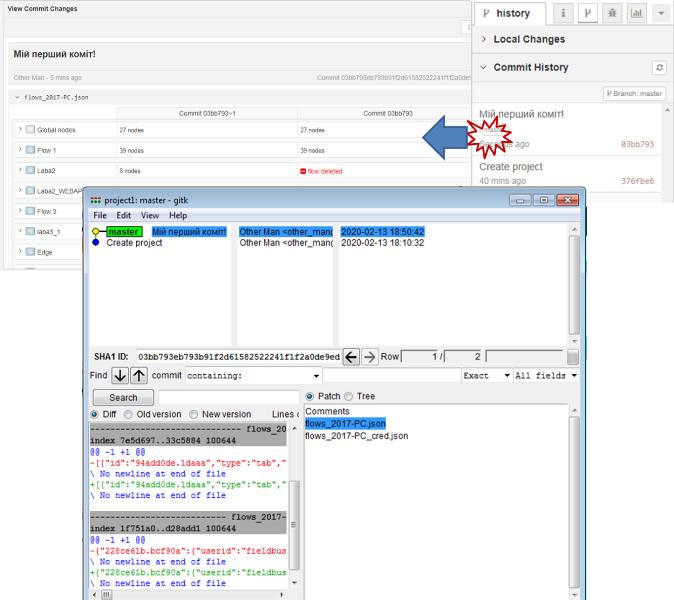

рис.4.12. Візуалізація змін в Node-RED

### 3. Створення SSH ключа

Для безпечного з'єднання з GitHub, який буде налаштовуватися в наступному пунктів, можна використовувати кілька варіантів. Один з них SSH. Для цього необхідно створити SSH-ключ і прописати його в GitHUB. У даному пункті необхідно створити SSH ключа, який використовуватиметься для доступу до віддалених GIT серверів. Детальне пояснення щодо створення ключа можете прочитати за [посиланням](https://git-scm.com/book/uk/v2/Git-%D0%BD%D0%B0-%D1%81%D0%B5%D1%80%D0%B2%D0%B5%D1%80%D1%96-%D0%93%D0%B5%D0%BD%D0%B5%D1%80%D0%B0%D1%86%D1%96%D1%8F-%D0%B2%D0%B0%D1%88%D0%BE%D0%B3%D0%BE-%D0%BF%D1%83%D0%B1%D0%BB%D1%96%D1%87%D0%BD%D0%BE%D0%B3%D0%BE-%D0%BA%D0%BB%D1%8E%D1%87%D0%B0-SSH#_generate_ssh_key).

#### 3.1. Перевірка наявності ssh ключів

- [ ] На локальному ПК запустіть «Git Bash» з папки користувача

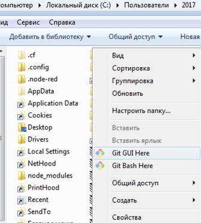

рис.4.13. Запуск Git Bash

- [ ] Запустіть команду перевірки наявності ключів ssh

```bash
ls -al ~/.ssh
```


рис.4.14. Команда перевірки наявності ключів ssh

#### 3.2. Створення ssh ключа

- [ ] Для створення нового SSH ключа необхідно викликати команду в якій вказати свою поштову адресу. Увага, важливо вказувати свою поштову адресу, яка буде використовуватися в подальшому при реєстрації в GitHUB.

```bash
ssh-keygen -t rsa -b 4096 -C other_man@ukr.net
```


рис.4.15. Запуск створення нового SSH ключа

- [ ] На прохання ввести назву файлу, натисніть ENTER


рис.4.16. Введення секретної фрази 

- [ ] Вкажіть пароль-фразу «passphrase» (необхідно запам'ятати пароль, потім буде вказуватися при з'єднання Git в Node-red). Пароль не буде відображатися при вводі.


рис.4.17. Повторне введення секретної фрази 

- [ ] Повторно вкажіть пароль.

- [ ] Після цього виведеться повідомлення, в якому буде вказано файл з ключем. Цей файл потрібно буде відкрити текстовим редактором, наприклад Notepad++

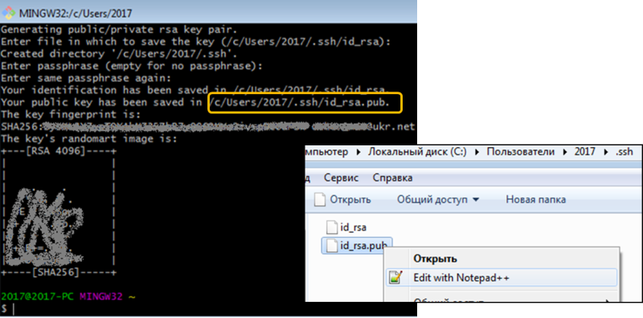

рис.4.18. Перегляд шифрованого ключа

### 4. Основи роботи з GitHub

#### 4.1. Реєстрація на GitHub

- [ ] Зайдіть на сайт <https://github.com/>

- [ ] Зареєструйтеся в системі. Опис процесу реєстрації наведений за [цим](https://git-scm.com/book/uk/v2/GitHub-%D0%A1%D1%82%D0%B2%D0%BE%D1%80%D0%B5%D0%BD%D0%BD%D1%8F-%D1%82%D0%B0-%D0%BD%D0%B0%D0%BB%D0%B0%D1%88%D1%82%D1%83%D0%B2%D0%B0%D0%BD%D0%BD%D1%8F-%D0%BE%D0%B1%D0%BB%D1%96%D0%BA%D0%BE%D0%B2%D0%BE%D0%B3%D0%BE-%D0%B7%D0%B0%D0%BF%D0%B8%D1%81%D1%83) посиланням.

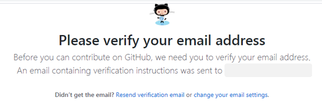

рис.4.19. Реєстрація на сайті GitHub

- [ ] Дочекайтеся, коли прийде лист для підтвердження вашої поштової скриньки, підтвердіть кнопкою "Verify email address".

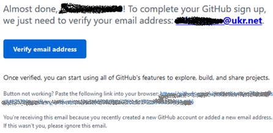

рис.4.20. Лист для підтвердження

- [ ] Увійдіть в систему GitHub.

#### 4.2. Добавлення ключу SSH

- [ ] Зайдіть в налаштування Settings. Виберіть пункт "SSH and GPS keys". Натисніть «NewSSH key».


рис.4.21. Формування SSH на GitHub

- [ ] У вікні що з'явиться необхідно ввести найменування та ключ SSH, який було створено в попередньому пункті. Для цього відкрийте файл з ключем (id\_rsa.pub) скопіюйте весь зміст у вікно «key». Після цього натисніть Add SSH key.


рис.4.22. Вікно для копіювання SSH

- [ ] Після цього необхідно буде ввести користувача і пароль для GitHUB. На пошту прийде повідомлення про добавлення SSH ключа. Він також буде відображатися списку ключів GitHUB.

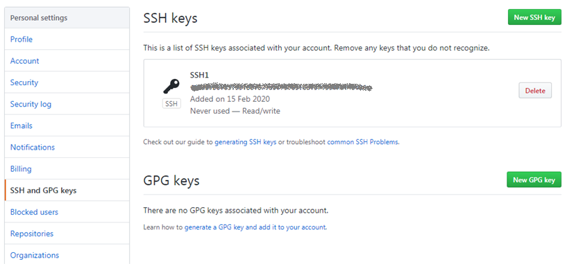

рис.4.23. Відображення списку ключів GitHUB

#### 4.3. Створення нового репозиторію

На даному кроці в GitHub необхідно створити новий репозиторій, який буде використовуватися для збереження лабораторних робіт.

- [ ] Зайдіть в перелік репозиторіїв. 
- [ ] Створіть новий репозиторій з назвою «LabsNodeRED», зробіть його приватним (див.рис.4.6)

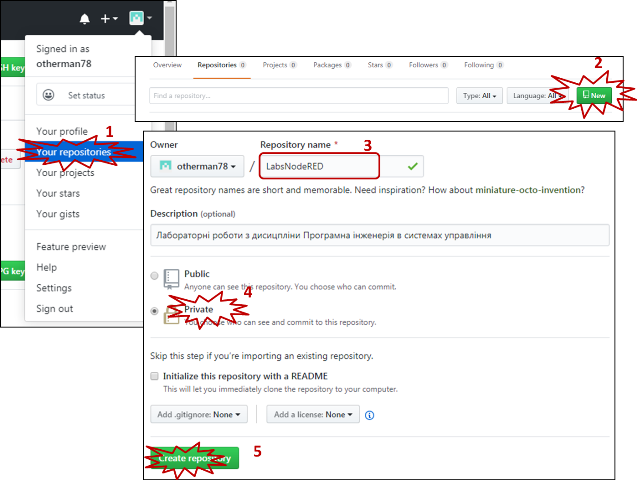

рис.4.24. Створення нового репозиторію в GitHub 

- [ ] Після створення відкриється сторінка налаштування репозиторію. Не закривайте її, вона знадобиться в наступному пункті.


рис.4.25. Сторінка налаштування репозиторію

### 5. Підключення локального репозиторію до GitHub

#### 5.1. Налаштування з'єднання локального та віддаленого репозиторію. Завантаження файлів локального репозиторію на віддалений

- [ ] Зайдіть в локальну директорію проекту Nod-RED. Запустіть Git Bash


рис.4.26. Запуск Git Bash

- [ ] У вікні \<Code\> репозиторію GitHub активуйте кнопку SSH і скопіюйте в буфер обміну команди, як показано на рисунку. 
- [ ] Введіть пароль, який ви вказували при генеруванні SSH


рис.4.27. З'єднання локального та віддаленого репозиторію та відправка коміту 

- [ ] Має з'явитися повідомлення, що файли локального репозиторію завантажені на віддалений репозиторій.

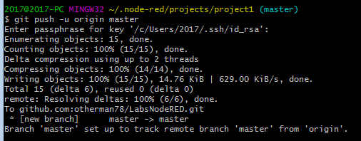

рис.4.28. Повідомлення про результат завантаження

- [ ] Відновіть сторінку \<Code\> репозиторію GitHub. Вона тепер повинна містити клон локального репозиторію Node-RED. Передивіться вкладку Branch та Commits.


рис.4.29. Перегляд змісту репозиторію на GitHub

#### 5.2. Перевірка налаштувань в Node-RED

Команди push можна також робити через Node-RED.

- [ ] Запустіть Node-RED на локальній машині, якщо він не запущений. 
- [ ] Відкрийте налаштування і перевірте, що ключ SSH видимий для Node-RED.


рис.4.30. Завантаження даних на GitHub з Node-RED 

Ви завжди зможете передивитися і скопіювати значення ключа звідси, натиснувши по його назві.

- [ ] Зайдіть в налаштування проекту, впевніться що підключення дійсно є для даного репозиторію.

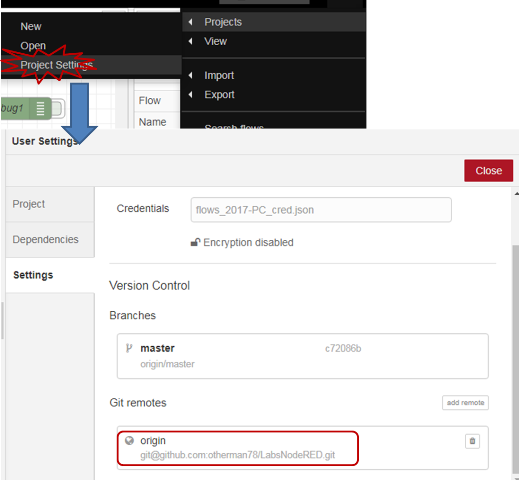

рис.4.31. Перевірка підключення локального до віддаленого репозиторію 

- [ ] Якщо його немає, то перезавантажте Node-RED і сторінку браузера розробки і спробуйте знову.

#### 5.3. Push з NodeRED у віддалений репозиторій

- [ ] Змініть потік в Node-RED, наприклад перемістіть якийсь вузол. 
- [ ] Зробіть розгортання, в Project History зробіть індексування, коміт (див.рис.4.32), після чого перейдіть в «Commit History». 
- [ ] Ви побачите в кутку, що є один коміт, який не запушений в віддалений репозиторій. Натисніть кнопку «Push». 
- [ ] Перший раз з'явиться екран для вводу паролю-фрази на SSH, введіть її і натисніть «Retry».

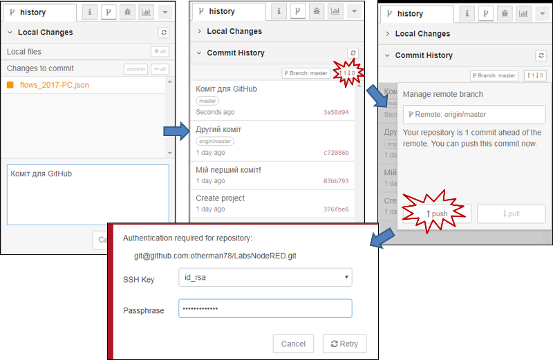

рис.4.32. Завантаження на віддалений репозиторій з Node-RED

#### 5.4. Перевірка коміту в GitHub

- [ ] Перейдіть на сторінку репозиторію GitHub. Обновіть сторінку. Ви побачите, що кількість комітів збільшилася на 1.

- [ ] Натиснувши на кнопку перегляду останнього коміту, можна побачити усі файли, які в ньому є. А якщо натиснути кнопку по самому коміту, то можна побачити які саме зроблені зміни.


рис.4.33. Перевірка коміту в GitHub

### 6. Підключення до репозиторію GitHub інших користувачів для колаборативної роботи

#### 6.1. Підключення викладача до власного репозиторію

- [ ] Зайдіть в Setting-\>Collaborations. 
- [ ] Добавте в команду проекту викладача «pupenasan».

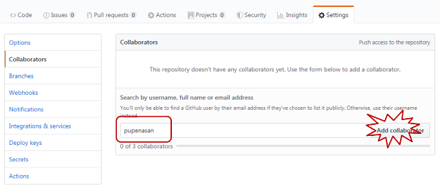

рис.4.34. Підключення до репозиторію викладача

#### 6.2. Підключення колеги до власного репозиторію

- [ ] Підключіть одного колегу до репозиторію.

## Питання до захисту

1. Назвіть основні функції Git. 
2. Які команди Git і для чого використовувалися в лабораторній роботі?
3. Що таке індексування і коміт?
4. Яку інформацію можна отримати з аналізу історії проекту?
5. Які функції надає налаштування Node-RED для роботи з проектами?
6. Які базові функції GitHub використовувалися в даній лабораторній роботі?
7. Які функції захисту GitHub використовувалися в лабораторній роботі для доступу до репозиторію тільки авторизованим користувачам?
8. Як налаштовується підключення локального репозиторію до віддаленого?