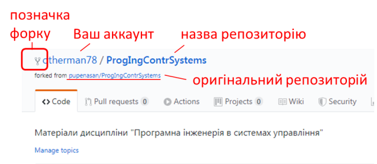
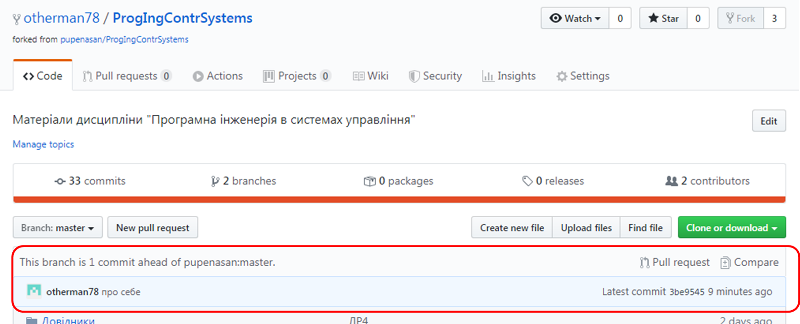
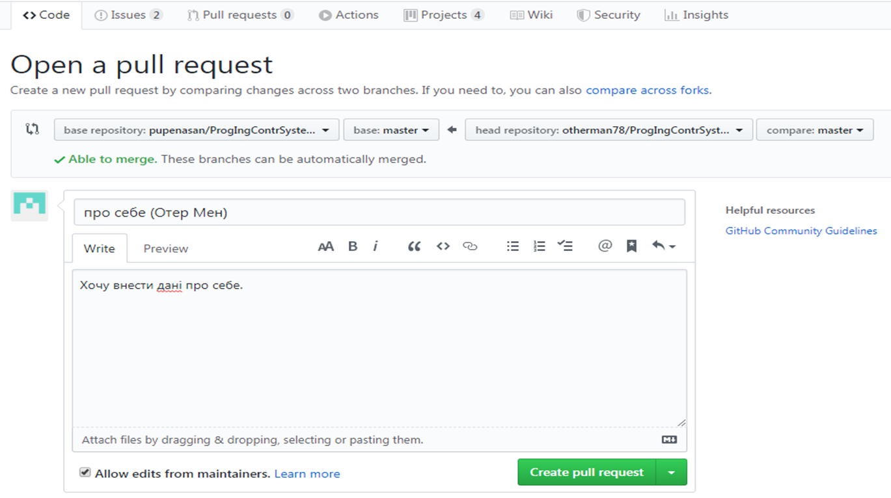
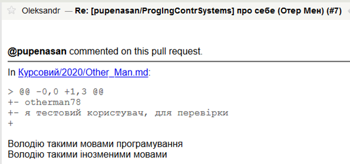
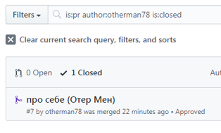
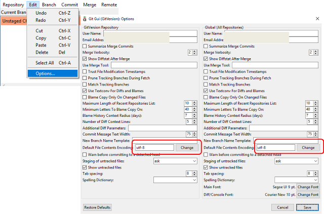
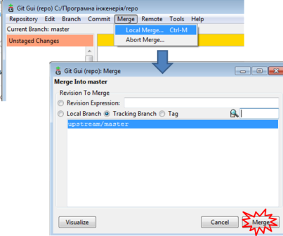

# Лабораторна робота №5. Командна робота в GitHub.

Повторіть лекцію за темою лабораторної роботи [за посиланням](../Лекц/GitHub.md)

## 1. Створення форку та синхронізація з оригінальним сховищем.

У даній частині лабораторної роботи необхідно створити форк репозиторію та навичитися синхронізувати репозиторії: локальний <-> форк <-> оригінальний (upstream)  

###### 1.1.Створення форку з репозиторію дисципліни.

- Перейдіть на репозиторій дисципліни "Програмна інженерія в системах управління" за [посиланням](https://github.com/pupenasan/ProgIngContrSystems).

- Якщо Ви не увійшли в систему GitHub, зайдіть через кнопку  `SignIn`

- У правому верхньому кутку натисніть `Fork` для створення форку репозиторію. Після цього форк створиться у вашому списку репозиторіїв (процедура в один клік)

  Проаналізуйте структуру та зміст репозиторію, зокрема елементи, що показані на рисунку.  

    

Тепер у Вашому форку репозиторію Ви можете вносити будь які зміни і за необхідності пропонувати їх в оригінальне сховище, або синхронізуватися з ним.

###### 1.2.Створення локальнго клону з репозиторію форку.

- натисніть на кнопку `Clone or download` скопіюйте SSH посилання
- зробіть клон репозиторію на локальному ПК за допомогою GitGui або GitBash. Як це робиться через GitBash було показано на лабораторній роботі по Git. На рисунку показано як це робиться через GitGui. Зверніть увагу, що папки `repo`, яка буде робочою папкою, у даному прикладі не повинно існувати до клонування

Повинно появитися вікно для вводу Вашого паролю доступу до GitHub, куди необхідно ввести пароль, який Ви створили на лабораторній роботі по Git.  

-  перевірте створення клону репозиторію, перейшовши до робочої папки 

###### 1.3.Внесення змін до локальнго репозиторію форку. 

- у робочій папці відкрийте папку `Курсовий\2020` (де `2020` - навчальний рік)

- створіть файл за форматом

  `Прізвище_Імя.md`

- відкрийте редактором Markdown, внесіть туди деякі дані про себе, зокрема:

  - ім'я на GitHub
  - інші контактні дані за бажанням 

- збережіть файл

- зробіть комміт в локальному репозиторію з поміткою "Про Прізвище Ім'я", де вкажіть своє прізвище та ім'я 

###### 1.4.Внесення зміт у віддалений репозиторій форку

- зробіть push в віддалений репозиторій (форк) 
- перевірте, що зміни відображаються в GitHub
- перейдіть на оригінальний репозиторій, перевірте що там зміни не були внесені

###### 1.5.Відправлення запиту на пул (pull request) до оригінального (upstreem) репозиторію

- перейдіть в GitHub до Вашого форку (кнопка `Fork` у даному випадку не створить повторно новий форк, а перейде до вже створеного). Оскільки Ви зробили зміни в ньому, GitHub повідомляє що тепер оригінальний та форк репозиторії відрізняються і запропонує порівняти (`Compare`) або запропонувати злиття через запит на пул (`pull request`)  (див. рис.)

     

- натисніть `Compare`, щоб подивитися чим саме відрізняються репозиторії. Ви перейдете на оригінальний репозиторій, де будуть показані зміни відносно вашого форку (див.рис.) 

- якщо зміни сумісні з зливанням (`Able to merge`) зробіть запит на пул кнопкою `Create pull request` , якщо ні - зверніться до викладача

- з'явиться вікно налаштування запиту на пул, де необхідно внести текст запиту (Write) та натиснути `Create pull request` знову  

  

- у результаті у оригінальному репозиторії створиться новий запит на пул, який Ви не можете підтвердити, так як права на зміни у цьому репозиторії у Вас немає (див.рис.). У Вашому форку цього запиту не буде. 

  

- наступний пункт слід робити після очікування відповіді на запит від викладача, поки перейдіть до виконання пункту 2.1.  

###### 1.6. Робота з запитом на пул.

Після перегляду викладачем (співавтором) репозиторію Вашого запиту на пул, він зробить певний коментар і попросить добавити якусь додаткову інформацію в файл. Ця відповідь прийде Вам на пошту, десь приблизно  в такому вигляді:

 

У даному випадку вказується що треба зробити.

- відкрийте в окальному репозиторію файл з інформацією про себе, внесіть туди зміни, що попросив викладач та збережіть
- зробіть комміт з поміткою (""правки про прзвище та імя") та push
- після затвердження викладачем запиту Вам прийде на пошту повідомлення
- після злиття (merge) Вам прийде на пошту повідомлення  

###### 1.7.  Перегляд історії та результатів запиту на пул.

- перейдіть на оригінальний репозиторій і впевніться, що файл дійсно з'явився 

- перейдіть на список запитів на пул (`Pull requests`). За замовченням там відображаються тільки відкриті (`Open`) запити, але можна використати інші фільтри

  

- зайдіть у меню `Author`і виберіть своє ім'я зі списку, далі натисніть `Closed` якщо ваш запит вже закрито. Повинен з'явитися Ваш запит

   

-   натисніть по запиту, щоб відкрити його історію

-  передивіться історію даного запиту (коміти, зміни і т.п.)

###### 1.8. Налаштування відображення кирилічних шрифтів.

Для коректного відображення текстового змісту в `Git Gui` необхідно налаштувати кодування тексту. 

- відкрийте  `Git Gui` у Вашій робочій папці
- зайдіть в меню `Edit->Options` і вкажіть для локального і для всіх репозиторіїв кодування `Utf-8`. 

###### 1.9. Синхронізація з оригінальним репозиторієм   

Разом зі зливанням з основною гілкою викладач внесе певні зміни в папку курсового проекту. Крім того за цей час оригніальний (uplink) репозиторій може змінитися. Щоб синхронізувати ці зміни з локальним репозиторієм, який посилається на форк, необхідно його прописати в конфігуванні (деталі [в лекції по GitHub](../Лекц/GitHub.md)).     

- відкрийте  `Git Gui` у Вашій робочій папці, якщо вона ще не відкрита

- добавте посилання на новий віддалений репозиторій з іменем `upstream`, який буде посилатися на оригінальне сховище, з якого був зроблений форк 

  

- отримайте нові дані з віддаленого `upstream` сховища через команду `fetch`

- зайдіть в меню `Repository -> Vizualise All Branch History` і передивіться наступну інформацію

  - на якому коміті знаходиться `Head` (показано жовтим)
  - які зміни зроблені в останніх комітах, що знаходяться в `upstream`, проаналізуйте, що саме добавив викладач та інші користувачі після того, як ви зробили форк 
  - усю іншу інформацію

- зробіть зливання (merge) з гілкою `upstream/master` 

  

- передивіться чи з'явилися ці зміни у вашій робочій директорії

- зробіть `Push` проекту для його завантаження в віддалений форк 

