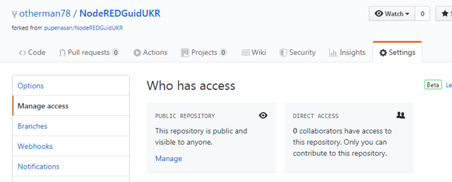

| [<- до лаборних робіт](README.md)   | [на основну сторінку курсу](../README.md) |
| ----------------------------------- | ----------------------------------------- |
| [<- 1 частина](lab5_1GitHubFork.md) |                                           |

# Лабораторна робота №5. Командна робота в GitHub.

Повторіть лекцію за темою лабораторної роботи [за посиланням](../Лекц/GitHub.md)

## 2. Сумісна робота з одним репозиторієм.

У даній частині лабораторної роботи необхідно підключити кілька співавторів до репозиторію і навчитися працювати в одному проекті. 

###### 2.1. Добавлення колег з команди до форку.

- Зайдіть в папку  [курсового проекту](..\Курсовий)  локального репозиторію відкрийте файл `варіанти.md`та знайдіть своїх колег з команди по курсовому проекту. Дізнайтеся їх облікові дані GitHub.

- Зайдіть на Git Hub до репозиторію форку. Зайдіть в налаштування доступу, при проханні вести пароль - введіть пароль доступу до аккаунта. 

  

- натисніть `Invait Collaborator` і запросіть колегу до співавторів репозиторію

- зробіть запрошення для усіх інших колег з команди по курсовому проекту

###### 2.2. Створення власної гілки в репозиторію.

При роботі в команді варто створювати власні тематичні гілки в репозиторію, які при необхідності будуть зливатися з основними гілками, типу `master`. Зливання може проводитися шляхом запитів на пул (pull request). 

- створіть власну гілку в локальному репозиторію (клона форку) з іменем `my_nic`, де my_nic - це Ваше ім'я аккаунта, 

  

- добавте рядок в файл, що створювали в п 1.3 (в папці `Курсовий\2020`) 

  ```
  Добавив до власного форку користувачів:
  - Прізвище Імя і Нік користувача
  - ...
  ```

- зробіть коміт та  `push` до репозиторію форка (remote=origin) та впевніться, що гілка появилася в ньому на GitHub

###### 2.3. Підключення віддаленого репозиторію форка іншого користувача. 

Даний пункт робиться тоді, коли користувач з Вашої групи зробив запрошення до свого форку.

- добавте посилання на віддалений репозиторій з іменем `nicname` (де nicname - ім'я користувача, до чийого репозиторію ви підключаєтеся), аналогічно як це зроблено в п.1.9
- зробіть  `push` до репозиторію форка (remote=origin) та впевніться, що гілка появилася в ньому на GitHub
- подивіться на вкладку `Code` в репозиторії GitHub, він пропонує зробити запит на пул  (pull request) для злиття з гілкою master

###### 2.4. Змінити дозволи для гілки `master`.    

Усі співавтори репозиторію мають за замовченням дозвіл на завантаження змін у будь-яку гілку репозиторію (push). Для того, щоб випадково не зробити зміни в гілці `master` необхідно зробити налаштування обмежень доступу на гілку.

- зайдіть в налаштування правил доступу до гілки та натисніть `Add rule` для добавлення нового правила


- в налаштуваннях паттерну (шаблону) назви гілки вкажіть `master` та означте правила що потребують 2-х підтверджень запиту на пул (pull request) від співавторів перед будь яким зливанням з гілкою `master`. Підтвердіть створення правила кнопкою `create`.

  

###### 2.5. Створення папки для курсового проекту.

Даний та наступні пункти виконуються тоді, коли більша частина користувачів команди зареєструвалися в форках. Виконується тімлідом але перевіряється усіми. 

У вашій команді є `тімлід`, який буде координувати дії усієї команди. У даному випадку він також буде адміністратором основного форку, через який усі зміни в проекті будуть передаватися через запит на пул. 

- Якщо Ви є тімлідом, створіть в папці `Курсовий\2020` (де `2020` - це навчальний рік), папку проекту з іменем, однойменним для команди (ім'я команди треба до цього часу придумати); саме в цю папку будуть добавлятися усі проектні документи та код;

- Якщо Ви є тімлідом, добавте в папку проекту файл README.MD куди вписати:

  - назву курсового проекту;
  - короткий опис проекту;
  - роль кожного члену в команді; 

###### 2.6. Створення папки для курсового проекту.

  Виконується усієми членами команди, в тому числі тімлідом.

- Якщо Ви не є тімлідом, після створення папки, та файлу зробіть push з форку тімліда і злийте з вашою гілкою (ця процедура буде часто відбуватися, так як і синхронізація з оригінальним (upstream) репозиторієм) 
- У папці, що створив тімлід створіть файл у форматі MarkDown з назвою `Прізвище Імя`, у якому напишіть резюме про себе. Зробіть коміт та push до **форку тімліда**.
- Кожен член команди, окрім тімліда повинен зробити запит на пул.          

[<- 1 частина](lab5_1GitHubFork.md)