**Програмна інженерія в системах управління. Лабораторний практикум.** Автор і лектор: Олександр Пупена 

| [<- до лаборних робіт](README.md) | [на основну сторінку курсу](../README.md) |
| --------------------------------- | ----------------------------------------- |
|                                   |                                           |

# Лабораторна робота №5. Основи роботи з Raspberry PI

**Тривалість**: 4 акад. години.

**Мета:** Навчитися створювати проекти та налаштовувати Raspberry PI для роботи в системах IoT. 

**Лабораторна установка**

- Апаратне забезпечення (див. таб. 5.1): ПК, Raspberry PI, датчики, монтажна плата, з'єднувачі
- Програмне забезпечення: Node-RED, balenaEtcher, PuTTY, Samba, VNC, Fritzing , Typora  

Таблиця 5.1. Перелік апаратних засобів, необхідних для лабораторної роботи. 

| Найменування                           | Кількість | Примітка                                        |
| -------------------------------------- | --------- | ----------------------------------------------- |
| Raspberry PI                           | 1         | У комплекті з блоком живлення та картою пам'яті |
| Макетна плата 170                      | 1         | або аналогічна                                  |
| Ультразвуковий датчик відстані HC-SR04 | 1         |                                                 |
| Датчик температури на 1-Wire DS18B20   | 1         |                                                 |
| Світлодіод                             | 1         |                                                 |
| Резистор 1 кОм                         | 1         |                                                 |
| Резистор 10 кОм                        | 1         |                                                 |
| Провід dupont (розетка-вилка)          | 6         | бажано 2 чорні, червоний, зелений і білий       |


## Порядок виконання роботи 

Рекомендується попередньо ознайомитися з матеріалами лекції по RPI за [посиланням](../Лекц/RaspberryPi.md).

### 1. Підготовка образу карти налаштування Raspberry Pi

У даній частині лабораторної роботи проводиться підготовка Raspberry Pi для проведення інших лабораторних робіт та курсового проектування. Встановлення необхідного програмного забезпечення проводиться таким чином щоб не підключати клавіатуру, мишу та монітор до Raspberry PI. 

#### 1.1. Завантаження образу для RPI з Інтернету

- [ ] Завантажте образ з ОС та мінімальним ПЗ для карти RPI (`Raspberry Pi OS with desktop`) за [посиланням](https://www.raspberrypi.org/downloads/raspbian). Виберіть один з варіантів завантаження `Download` або `Download Torrent`. 

#### 1.2. Завантаження утиліти для створення образу

- [ ] Завантажте утиліту `balenaEtcher` для запису образу Raspbian на SD карту за [посиланням](https://www.balena.io/etcher/) або попросіть її у викладача. 

#### 1.3. Запис початкового образу

- [ ] Запустіть `balenaEtche`r на виконання.

                 

рис.5.1.  Запис початкового образу

- Натисніть Select Image та виберіть завантажений в п.1.1 образ Raspbian.
- Натисніть Change для вибору SD карти.
- Натисніть Flash для запису образу, та зачекайте закінчення цього процесу.

#### 1.4. Створення конфігураційного файлу з налаштуваннями WiFi

- [ ] На SD карті в кореневій директорії створіть текстовий файл з наведеним нижче змістом (вказані налаштування працюють тільки в лабораторії А-532 НУХТ). Даний файл автоматично налаштує Raspberry на підключення до WiFi-мережі з іменем записаним в полі `ssid`, та паролем в полі `psk`. Поле `key_mgmt` вказує на тип шифрування.

```bash
ctrl_interface=DIR=/var/run/wpa_supplicant GROUP=netdev
update_config=1
country=UA

network={
	ssid="WF532"
	psk="123456789"
	key_mgmt=WPA-PSK
}
```

- [ ] Збережіть даний файл з іменем та розширенням `wpa_supplicant.conf`.

#### 1.5. Активація способу підключення через SSH

- [ ] На SD карті в кореневій директорії створіть пустий текстовий файл з іменем SSH . Даний файл автоматично активує спосіб підключення до Raspberry через [SSH](https://uk.wikipedia.org/wiki/SSH#%D0%9F%D0%B5%D1%80%D0%B5%D0%B4%D0%B0%D1%87%D0%B0_%D1%84%D0%B0%D0%B9%D0%BB%D1%96%D0%B2_%D0%B7_%D0%B2%D0%B8%D0%BA%D0%BE%D1%80%D0%B8%D1%81%D1%82%D0%B0%D0%BD%D0%BD%D1%8F%D0%BC_SSH).


рис.5.2. Активація способу підключення через SSH

#### 1.6. Увімкнення та пошук в мережі Raspberry

- [ ] Вставте SD карту в Raspberry та ввімкніть його.

- [ ] Разом з викладачем дізнайтесь IP адресу Вашого Raspberry (наприклад через сканування мережі, або переглядаючи перелік вузлів в маршрутизаторі).

#### 1.7. Встановлення програми терміналу PuTTY

- [ ] Завантажте утиліту роботи з терміналом PuTTY з [офіційного сайту](https://www.putty.org/ ) та установіть її на свій ПК, якщо це не було зроблено раніше.

#### 1.8. З'єднання з Raspberry по SSH 

- [ ] Запустіть PuTTY на виконання.

- [ ] У поле `Host Name` (`Ім'я хоста`) введіть IP-адресу Raspberry, яку Ви дізналися в п.1.6 та натисніть кнопку `Open` .


рис.5.3. З'єднання з Raspberry по SSH з Putty

- Відкриється командне вікно, яке служить для діалогу через захищений SSH канал зв'язку з Raspberry Pi.
- Система попросить ввести логін и пароль. 

- [ ] По замовчуванню логін — `pi`, а пароль — `raspberry`. При введенні паролю символи в консолі не відображаються.


рис.5.4. Введення логіну і паролю

- Після введення паролю Вам доступна можливість діалогу через команди SSH. 

  Перелік найбільш вживаних команд можна знайти за [посиланням](../Довідники/командиSSH.md)   

#### 1.9. Зміна параметрів монітора

- [ ] Через термінал PuTTY запустіть команду зміни файлу налаштування параметрів монітора 

```bash
sudo nano /boot/config.txt
```

- [ ] у редакторі змініть поля 

```bash
framebuffer_wight=1280
framebuffer_height=720
```

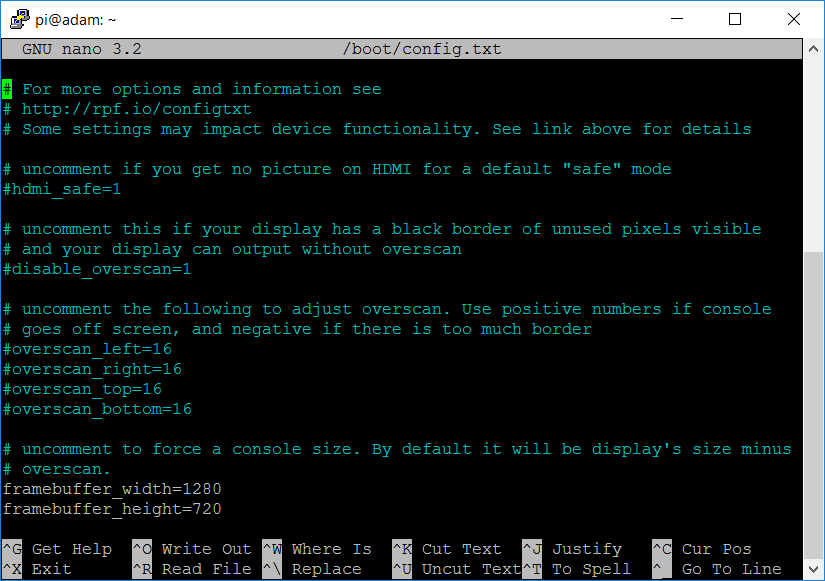

рис.5.5. Зміна параметрів монітора

- [ ] Збережіть файл через комбінацію ctrl+X, Y

#### 1.10. Зміна імені RPI

- [ ] Через термінал PuTTY запустіть команду зміни файлу налаштування параметрів імені

```bash
sudo nano /etc/hostname
```

- [ ] дайте ім'я латинськими літерами щоб воно було унікальним в межах університету; рекомендується давати ім'я в форматі

```
firstnamelastnameRPI
```

де `firstname` - ім'я (латинськими літерами), `lastname` - прізвище (латинськими літерами)

- [ ] Збережіть файл через комбінацію ctrl+X, Y 

#### 1.11. Зміна налаштувань DNS

- [ ] Через термінал PuTTY запустіть команду зміни файлу налаштування параметрів імені

```bash
sudo nano /etc/hosts
```

- [ ] напроти `127.0.0.1` змініть ім'я аналогічно п.1.10

- [ ] Збережіть файл через комбінацію  ctrl+X, Y 

- [ ] перезавантажте RPI через командний рядок 

```bash
sudo reboot
```

#### 1.12. Перевірка підключення через ім'я

- [ ] Після того як Raspberry перевантажиться повторно, підключіться до нього з PuTTY, але вже через ім'я (в полі hostname).

#### 1.13. Встановлення Samba

**Samba** - це [пакет](https://uk.wikipedia.org/wiki/Samba) програм, які дозволяють підключатися до мережних дисків і принтерів на різних операційних системах по протоколу SMB/CIFS. Наприклад, встановлення серверу на RPI дає можливість підключатися до RPI з ОС Windows по його імені.    

- [ ] Через термінал PuTTY запустіть команду встановлення samba з репозиторію

```bash
sudo apt-get install samba
```

#### 1.14. Налаштування samba

- [ ] Через термінал PuTTY запустіть команду зміни файлу налаштування параметрів серверу samba

```bash
sudo nano /etc/samba/smb.conf
```

- [ ] встановіть поле

```bash
win support = yes
```

- [ ] Збережіть файл через комбінацію  ctrl+X, Y 

- [ ] перезапустіть службу

```bash
sudo service smbd restart
```

#### 1.15. Перевірка видимості через ім'я 

- [ ] У командному рядку Windows на ПК розробника зробіть пінг RPI по імені 

```bash
ping firstnamelastnameRPI
```

де `firstnamelastnameRPI` - ім'я RPI, що надане йому в п.1.10

#### 1.16. Активацій сервісу VNC (сервер) на RPI 

- [ ] Запустіть команду  запуску опцій налаштування Raspberry

```bash
sudo raspi-config  
```


рис.5.6. Вікно налаштувань конфігурації RPI

- [ ] Відкрийте розділ 5 `Interfacing Options` та активуйте P3 VNC.


рис.5.7. Активацій сервісу VNC (сервер) на RPI

#### 1.17. Завантаження, запуск та підключення сервісу VNC-клієнта на PC-розробника 

- [ ] Завантажте VNC з [офіційного сайту](https://www.realvnc.com/en/connect/download/viewer/ ) та запустіть його

- [ ] у полі `VNC Conect` введіть ім'я вашого Raspberry та натисніть `Enter` . Під час входу необхідно ввести логін і пароль (логін — `pi`, пароль — `raspberry`).


рис.5.8. Автентифікація VNC на сервері

- [ ] після цього відкриється віддалений робочий стіл вашого Raspberry.


#### 1.18.   Встановлення npm для Manage Pallete

- [ ] Запустіть командний рядок та запустіть команду для встановлення `npm` для Manage Pallete

```bash
sudo apt-get install npm
sudo npm install -g npm
sudo reboot
```

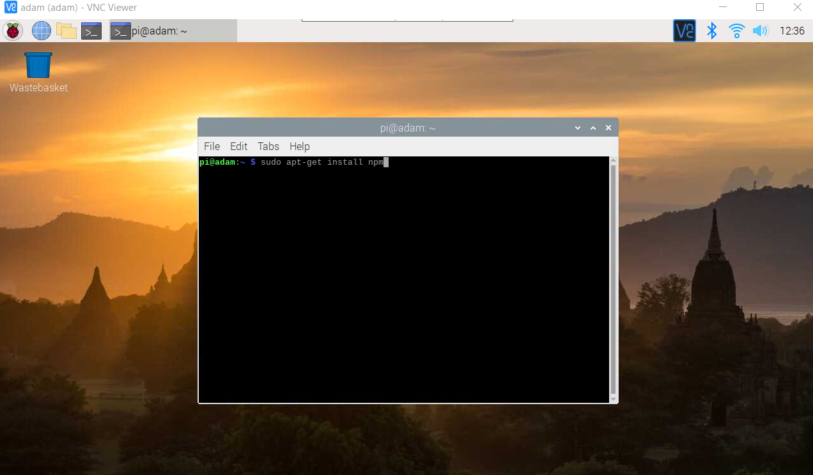

рис.5.9. Встановлення npm для Manage Pallete


### 2.1.  Використання Fritzing


#### 2.1. Завантаження Fritzing

- [ ] Завантажте на ПК безкоштовну бета-версію середовища проектування Fritzing [за даним посиланням](https://www.electroschematics.com/fritzing-software-download/) або офіційну платну версію [з офіційного сайту](https://fritzing.org/download/) 

#### 2.2. Завантаження бібліотеки зображень RPI3

- [ ] Завантажте на ПК бібліотеку RPI3 з іменем `Raspberry Pi 3_3.fzpz` для  Fritzing  за [посиалнням](https://fritzing.org/media/fritzing-repo/projects/r/raspberry-pi-3/fritzing/Raspberry Pi 3_3.fzpz). Обговорення бібліотеки на форумі доступне за [посиланням ](https://fritzing.org/projects/raspberry-pi-3) 

#### 2.3. Запуск, налаштування Fritzing та встановлення бібліотеки RPI3

- [ ] Розпакуйте архів та запустіть `Fritzing.exe`. Імпортуйте файл з іменем `Raspberry Pi 3_3.fzpz` з панелі `Parts`, як це показано на рис.5.10.


рис.5.10. Встановлення бібліотеки RPI3

- [ ] Через меню `Edit->Prefernces` Ви можете вибрати найзручнішу для Вас мову інтерфейсу 

#### 2.4. Розміщення елементів на платі для схеми керування діодом

- [ ] Активуйте режим відображення макетної плати через меню `View->Show BreadBoard`, або натиснувши відповідну вкладку. На панелі Parts перейдіть в розділ Mine, перенесіть туди RPI3

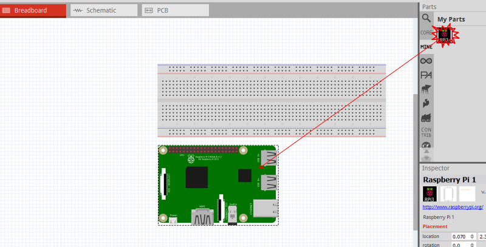

рис.5.11. Розміщення плати та RPI

- [ ] У розділі `CORE` панелі інструментів `Parts` виберіть два елементи:

- `Basic -> Resistor` 

- `Output -> RED LED`

  
  
  рис.5.12. Розміщення елементів на платі для схеми керування діодом

- [ ] У налаштуваннях резистора вкажіть опір 1 Ком (Resistance = 1kΩ).

#### 2.5. Реалізація схеми підключення 

- [ ] Перейдіть на вкладку Shematic  `View->Show Schematic`, або натиснувши відповідну вкладку.
- [ ] Розмістіть на схемі елементи, щоб схема була більш читабельною, використовуючи команди з контекстного меню  `Flip vertical`, `Rotate` і т.п. 
- [ ] З'єднайте елементи на схемі, як показано на рисунку.

  

рис.5.13. З'єднання елементів на схемі

- [ ] У налаштуванні провідників виберіть колір, для підключення `GPIO4` до `LED1` - червоний, для підключення `R1` до `GND` - чорний.

#### 2.6. Коригування схеми підключення на платі

- [ ] Перейдіть на режим відображення макетної плати. З'єднайте контакти, які обозначені пунктиром. Змініть кольори провідників. 


рис.5.14. Скоригована схема підключення

- [ ] Використовуючи `Edit -> Add Note` добавте коментар до схеми `Схема Прізвище Ім''я`, де вкажіть своє прізвище.  

#### 2.7. Збереження проекту та експорт схем

- [ ] Збережіть файл проекту з іменем `Diod_Name`, де замість Name вкажіть своє прізвище латинськими літерами.  

- [ ] У папці проекту Git, яка була створена для лабораторної роботи 3, що має зв'язок з GitHub (наприклад `C:\Users\username\.node-red\projects\project1`) , створіть папку `Lab5` а в ній папку `Schemas`. 

- [ ] Експортуйте у папку `Lab5` кілька файлів з проекту:

- перемкніть на панель макетної плати `Breadboard` та експортуйте список деталей `File -> Export -> List of Parts`
- та експортуйте схему у вигляді PNG `File -> Export -> as Image -> PNG... `
- перемкніть на панель схеми `Schematic` та експортуйте схему у вигляді PNG `File -> Export -> as Image -> PNG... `

### 3. Реалізація та перевірка: підключення та керування діодом

#### 3.1. Збірка та перевірка схеми

- [ ] Вимкніть Raspberry PI, якщо він включений.

- [ ] Подивіться уважно на реальне розміщення контактів GPIO:

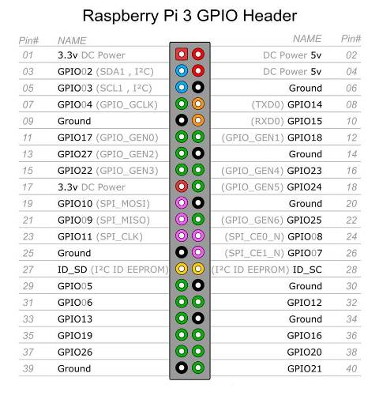 

рис.5.15. Розміщення контактів GPIO на RPI 3


рис.5.16. Розміщення контактів GPIO на RPI 3 (альтернативний вигляд)

- [ ] Попросіть у викладача необхідні елементи, та підключіть їх, відповідно до розробленої схеми. Уважно перевірте підключення.

 

рис.5.17. Підключення світлодіода до RPI 3 (альтернативний вигляд)

#### 3.2. Перевірка схеми викладачем

- [ ] Покличте викладача, щоб він перевірив схему. Якщо схема одобрена, перейдіть до наступного пункту. 

#### 3.3. Увімкнення та первинні налаштування RPI

- [ ] Увімкніть RPI.  За допомогою VNC зайдіть на робочий стіл RPI. 

- [ ] Зайдіть в меню `Налаштування -> Raspberry Pi Configuration` і на вкладці `Interfaces` активуйте Remote GPIO.

   

рис.5.18. Активація GPIO у RPI

#### 3.4. Ручний запуск Node-RED

- [ ] Для запуску Node-RED на RPI3 використовується команда у вікні терміналу 

```bash
node-red-start
```

- [ ] Якщо закрити вікно терміналу (або натиснути Ctrl + C), то Node-RED все одно продовжить працювати, але в фоновому режимі. Щоб зупинити Node-RED, запустіть команду 

```bash
node-red-stop
```

- [ ] Також Node-RED припинить свою роботу після перезавантаження RPI3.

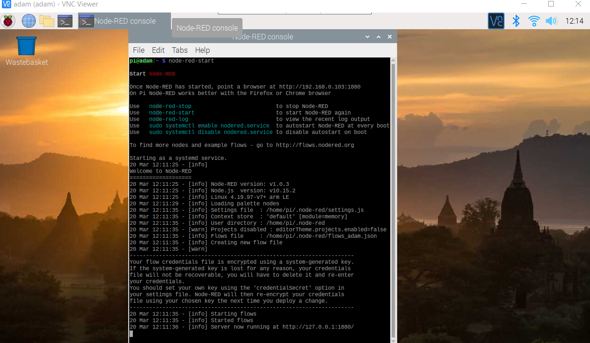

рис.5.19. Ручний запуск Node-RED з консолі

- [ ] Щоб відкрити вікно редактора в браузері необхідно прописати IP-адресу та номер порту 127.0.0.1:1880.

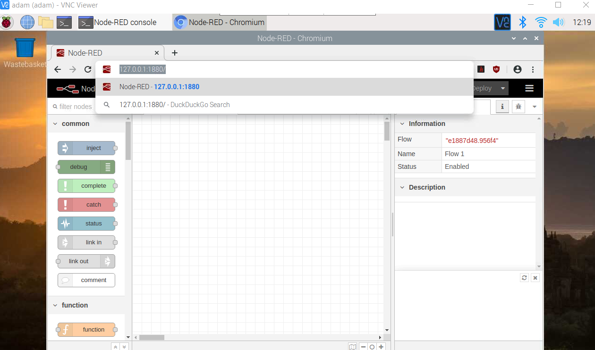

рис.5.20. Відкриття Node-RED в браузері

#### 3.5. Автоматичний запуск Node-RED

Автозапуск Node-RED краще робити за допомогою вбудованого демона systemd. Попередньо встановлена версія робить це за допомогою файлу «nodered.service», а також за допомогою скриптів запуску і зупинки. 

- [ ] Встановіть автозапуск за допомогою наступних команд:

```bash
sudo wget https://raw.githubusercontent.com/node-red/raspbian-deb-package/master/resources/nodered.service -O /lib/systemd/system/nodered.service
sudo wget https://raw.githubusercontent.com/node-red/raspbian-deb-package/master/resources/node-red-start -O /usr/bin/node-red-start
sudo wget https://raw.githubusercontent.com/node-red/raspbian-deb-package/master/resources/node-red-stop -O /usr/bin/node-red-stop
sudo chmod +x /usr/bin/node-red-st*
sudo systemctl daemon-reload
```

Ці команди запускаються користувачем `root` (`sudo`). Вони завантажують три файли , роблять два скрипта виконуваними, а потім перезавантажують демона systemd. 

- [ ] Далі, щоб налаштувати автозапуск Node-RED при кожному завантаженні виконайте команду:

```bash
sudo systemctl enable nodered.service
```


Відключити автозапуск за необхідності можна за допомогою такої команди:

```bash
sudo systemctl disable nodered.service
```

- [ ] Перезавантажте RPI3 і переконайтесь що Node-RED запускається автоматично при старті системи. Якщо ні повторіть попередні пункти.

#### 3.6. Створення програми та перевірка програми для Node-RED

- [ ] Зайдіть на сторінку програмування Node-RED на RPI3. Створіть програму для керування діодом.

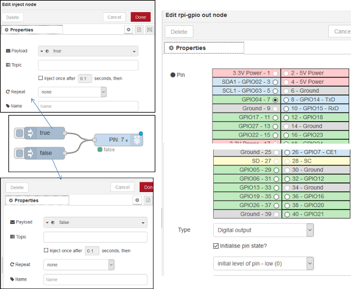 

рис.5.21. Фрагмент застосунку для роботи з входами/виходами GPIO

- [ ] Перевірте роботу програми  натискаючи `Inject TRUE` а потім `Inject FALSE`

#### 3.7. Вивід кнопок включення/виключення на Веб-інтерфейс

- [ ] Встановіть бібліотеку `node-red-dashboard` , якщо вона ще не була встановлена.

- [ ] Самостійно реалізуйте керування кнопками вкл/откл з графічного Веб-інтерфейсу.

### 4. Розробка документації

#### 4.1. Збереження вигляду та коду програми користувача

- [ ] Зробіть копію екрану програми. Використовуючи графічний редактор виріжіть робочу частину програми і збережіть в форматі PNG на ПК в папці  проекту `Lab5`. 

- [ ] Зробіть експорт потоку як форматований JSON та завантажте через кнопку Download. Збережіть в папці проекту  `Lab5` з назвою `diod.json`.


рис.5.22. Експорт потоку

#### 4.2. Завантаження та встановлення Typora (або аналогічного)

- [ ] Завантажте та встановіть MarkDown редактор Typora або аналогічний:

-  завантажте редактор (Typora [для Windows](https://typora.io/#windows)) 

- встановіть редактор

#### 4.3. Створення файлу README.MD 

- [ ] У папці проекту `Lab5` на ПК створіть файл з назвою README.MD. 

Зміст файлів, які так називаються автоматично відображаються в GitHub. Цей файл буде звітом з лабораторної роботи.

#### 4.4. Оформлення лабораторної роботи

- [ ] Повторіть матеріал [лекції](../Лекц/MarkDown.md) по MarkDown.

- [ ] Відкрийте [приклад](RPIMedia\Example\README.MD) оформлення лабораторної роботи та зробіть аналогічне оформлення для зробленої частини.

#### 4.5. Завантаження матеріалів на GitHub

- [ ] Зробіть коміт та завантажте (push) проект на GitHub. 

- [ ] Зайдіть на GitHub в репозиторій проекту. Зайдіть в папку Lab4, там повинен відображатися Ваш звіт. Перевірте, що він дійсно відображається коректно. 

- [ ] За необхідності зробіть виправлення та повторіть коміт та завантаження до GitHub.   


### 5. Використання датчика відстані

У цьому пункті наводяться кроки для підключення ультразвукового датчика відстані HC-SR04, та його використання в Node-RED.

#### 5.1. Підключення датчика відстані до RPI

- [ ] Вимкніть живлення Raspberry PI. 

- [ ] Зберіть нову схему, як показано на рисунку. Уважно перевірте правильність.

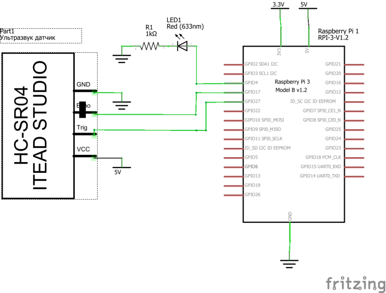

рис.5.23. Принципова схема установки

- [ ] **Зверніть особливу увагу на найменування контактів підключення ультразвукового датчика відстані. На монтажній схемі він зображений повернуто до плати, по факту його зручніше розміщувати повернуто від плати.**

Таблиця 5.2. Контакти датчика відстані підключені до контактів RPI

| RPI             | Датчики HC-SR04 |
| --------------- | --------------- |
| +5V (pin 2)     | Vcc             |
| GPIO27 (pin 13) | Trig            |
| GPIO17 (pin 11) | Echo            |
| Gnd (pin 9)     | Gnd             |


рис.5.24. Схема підключення установки

- [ ] Попросіть викладача перевірити схему і у випадку підтвердження правильності, переходьте до виконання наступного пункту. 

#### 5.2. Встановлення бібліотеки node-red-node-pisrf

- [ ] У node-RED для RPI встановіть бібліотеку node-red для роботи з ультразвуковим датчиком: **node-red-node-pisrf**

#### 5.3. Створення та перевірка програми користувача

- [ ] Видаліть старий фрагмент програми керування світлодіодом.

- [ ] Використовуючи вузол `rpi srf` з розділу інструментів `Raspberry PI` реалізуйте програму, показану на рисунку:


рис.5.25. Фрагмент програми для реалізації роботи з датчиком відстані

- [ ] Зробіть розгортання проекту та первірте роботу. 

- [ ] Активувавши вузол **Debug** можна побачити данні які йдуть від датчика відстані. 

#### 5.4. Виведення на Веб-інтерфейс

- [ ] Виведіть значення на Веб-інтерфейс, використовуючи `dashboard` . 
- [ ] Проаналізуйте в яких одиницях показує значення відстані. 

#### 5.5. Керування яскравістю світлодіода в залежності від відстані до об'єкта 

- [ ] Створіть програму, яка показана на рисунку.


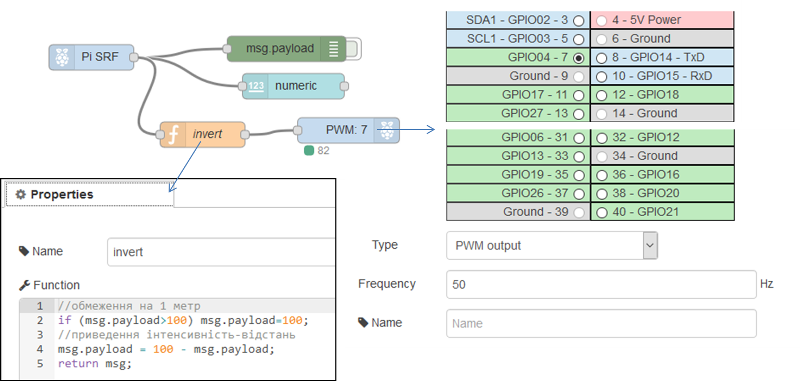

рис.5.26. Фрагмент програми керування яскравістю світлодіода в залежності від відстані до об'єкта 

Ця програма керує яскравістю свічення світлодіоду в залежності від відстані до об'єкту. Від 1 метру тьмяне світіння, чим ближче, тим яскравіше.

- [ ] Зробіть розгортання, підводячи якийсь предмет до датчика наближення перевірте роботу програми.   

#### 5.6. Фіксація у папці проекту 

- [ ] Зробіть копію екрану програми. Використовуючи графічний редактор виріжіть робочу частину програми і збережіть в форматі PNG на ПК в папці  проекту`Lab4` під назвою `Usonic.png`. 

- [ ] Зробіть експорт потоку як форматований JSON та завантажте через кнопку Download. Збережіть в папці проекту  `Lab4` з назвою `Usonic.json`. 

- [ ] Зробіть оформлення у файлі README.md, який Ви редагували до цього.

- [ ] Зробіть коміт та завантажте (push) проект на GitHub. 

- [ ] Зайдіть на GitHub в репозиторій проекту. Зайдіть в папку Lab4, там повинен відображатися Ваш змінений звіт. Перевірте, що він дійсно відображається коректно. 

- [ ] За необхідності зробіть виправлення та повторіть коміт та завантаження до GitHub.    

### 6. Підключення датчика температури по 1-Wire

#### 6.1. Підготовка RPI.

- [ ] Видаліть стару програму на RPI.

- [ ] Вимкніть живлення Raspberry PI.  

- [ ] Відключіть усі проводи з попередньої частини роботи.

#### 6.2. Активування 1-Wire на RPI

- [ ] Увімкніть живлення на RPI. 

- [ ] Зайдіть через VNC на робочий стіл RPI та через налаштування активуйте 1-Wire інтерфейс.


рис.5.27. Активація інтерфейсу 1-Wire на RPI

- [ ] Вимкніть живлення Raspberry PI.

#### 6.3. Підключення датчика температури до RPI через 1-Wire

- [ ] Підключіть датчик температури відповідно до вказаної схеми.

- [ ] Зверніть увагу, що використовується живлення 3,3 В а резистор номіналом 10 кОм.

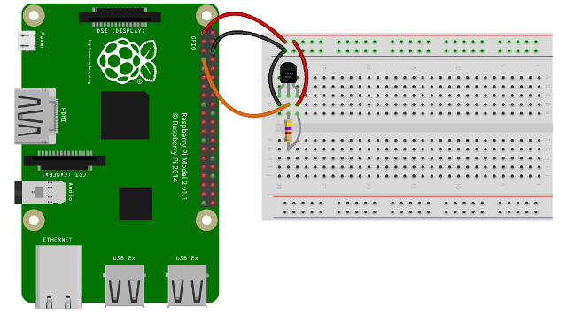

рис.5.28. Схема підключення датчика температури до RPI через 1-Wire

#### 6.4. Встановлення бібліотеки node-red-contrib-sensor-ds18b20

- [ ] Увімкніть RPI. 

- [ ] Інсталюйте в node-red потрібну бібліотеку: `node-red-contrib-sensor-ds18b20` Ця бібліотека спрощує роботу з датчиками температури `ds18b20`

- [ ] перезавантажте систему

#### 6.5. Створення та перевірка програми користувача

- [ ] Створіть програму, наведену на рисунку.  Ідентифікатор датчика температури вибирається зі списку (повинен знайтися автоматично) .

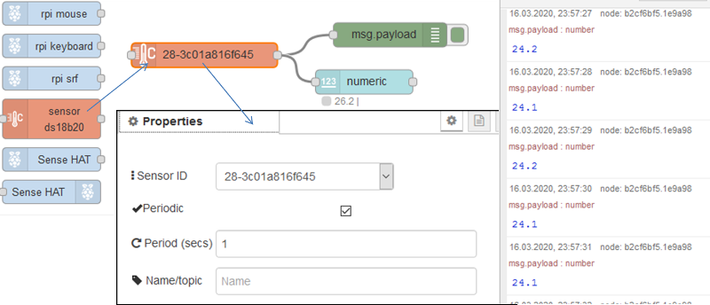

рис.5.29. Фрагмент програми вимірювання температури через 1-Wire

- [ ] Зробіть розгортання та перевірте її роботу.


#### 6.6. Дооформлення роботи

- [ ] Оформіть дану частину аналогічно як в п.6.2. 

## Питання до захисту

1. Перерахуйте кроки які використовувалися в лабораторній роботі для розгортання на RPI потрібної ОС та застосунків.
2. Розкажіть навіщо і яким чином активувався SSH на пристрої RPI .
3. Яке призначення і як в лабораторній роботі використовувалася утиліти Putty?
4. Яке призначення і як в лабораторній роботі використовувався сервіс VNC?
5. Яке призначення і як в лабораторній роботі використовувався пакунок Fritzing?
6. Розкажіть про призначення GPIO.
7. Як забезпечується автоматичний запуск Node-RED як служби?
8. Яке призначення датчиків, які використовувалися в лабораторній роботі?
9. Розкажіть про основні властивості мережі 1-Wire.