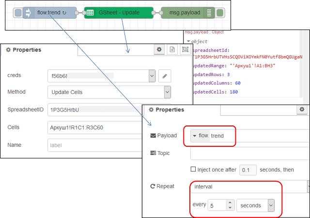

| <- до лаборних робіт](README.md) | [на основну сторінку курсу](../README.md) |
| -------------------------------- | ----------------------------------------- |
|                                  |                                           |

# Лабораторна робота №8. Інтегрування з хмарними застосунками та сервісами.

Рекомендується попередньо ознайомитися з матеріалами лекцій по:

- to do

## Частина 1. Інтегрування з застосунками Google.

У даній частині лабораторної роботи необхідно забезпечити запис значень з Node-RED в електронну таблицю, що обслуговується хмарним електронним застосунком `Google Sheet`. 

###### 0.Створення облікового запису Google.

Якщо у Вас немає облікового запису Google - створіть його [на сайті](https://www.google.com/). Це безкоштовно, потребується тільки поштова скринька і номер телефону. 

###### 1.Створення та налаштування сервісного аккаунту Google (для доступу іншого сервісу) 

Використовуючи рекомендації з довідника з [створення та налаштування сервісного аккаунту Google (для доступу іншого сервісу)](../Довідники/googleauth.md):

- створіть сервісний аккаунт, для якого добавте ключ
- активуйте доступ до хмарного застосунку`Google Sheets` 

**Увага! Нікому не передавайте інформацію про свої ключі , так як їх можна використати для доступу до всіх ваших відкритих застосунків в Google.**

###### 2.Встановлення бібліотеки node-red-contrib-google-sheets

- запустіть Node-RED
- встановіть бібліотеку `node-red-contrib-google-sheets` 

###### 3.Створення таблиці `Google Sheet` 

`Google Sheet` - це хмарний застосунок від Google для роботи з електронними таблицями. За функціональністю і принципами роботи він схожий на `Microsoft Excel`. Усі створені таблиці зберігаються на Гугд Диску (`Google Drive`) 

- Зайдіть на головну сторінку [Google](https://www.google.com/) і зайдіть в застосунок `Google Sheet`(`Таблиці`)


рис.1

Альтернативно можна відразу перейти [на сторінку](https://docs.google.com/spreadsheets)  

- У новому вікні натисніть кнопку "+" (створити) щоб створити нову електронну таблицю
- збережіть документ на Гугл диску

###### 4.Створення фрагменту для наповнення буферу

У даному пункті необхідно створити фрагмент, який буде вміщувати буфер останніх 60-ти значень імітованих змінних `rad ` та `val` а також дати та часу їх зміни. Такий буфер можна організувати різним чином, однак для спрощення були використані властивості масивів в JavaSript як черг та стеків. Кожне нове обчислення записується на верх масиву. Таким чином, спочатку "буфер-масив" буде наповнюватися аж до 60-го елементу. Коли елементів стане більше ніж 60 (тобто 61), нижні елементи виймаються, і масив "зсувається" вниз. І так кожного разу при виклику функції. Для збереження даних масиву між викликами використовується контекст потоку. 

Про всяк випадок, зроблена також перевірка на переповнення масиву: коли кількість елементів повинна бути 60, а вона все одно більша - масив обрізається до 60-ти елементів. Така ситуація не повинна відбуватися, але бажано передбачати такі випадки.   

- Створіть новий потік з назвою "clouds".

- добавте туди фрагмент, який наведений на рисунку, код функції наведений під рисунком 2  


рис.2

```javascript
let now = new Date ();//сьогодні
//trend - 2-мірний масив 3x60, на 60 останніх значень 
//читання з контексту потоку або ініціалізація масиву-буферу
let trend = flow.get ("trend") || [[now.getTime()],[0],[0]];
let l = trend[0].length;    //довжина мавису
//з кожним викликом збільшуємо градуси в радіанах
let rad = trend[1][l-1] + Math.PI/5;   
if (rad>=Math.PI*2) rad=0;//обнуляємо після повного кола
let val = Math.sin (rad);   //вираховуємо синус
//на "верх" масиву добавляємо елементи 
trend[0].push (now.toLocaleString());//дата час
trend[1].push (rad);    //радіани
trend[2].push (val);    //значення синусу
//якщо масив заповнився до 60
if (trend[0].length >60){
    trend[0].shift ();//вилучаємо перший (найстаріший) елемент
    trend[1].shift ();
    trend[2].shift ();
    //після цього масиви повинні зменшитися на 1 елемент (60) 
    //і зсунутися вниз
    //у випадку, якщо раптом елементів більше 60
    //наприклад були добавлені випадково стороннім кодом
    //зробити кількість елементів =60
    trend[0].length = 60;//
    trend[1].length = 60;
    trend[2].length = 60; 
}
flow.set ("trend", trend);//записати в контекст потоку
return msg;
```

- зробіть розгортання потоку
- проаналізуйте контекст потоку, як він наповнюється з кожною секундою, він повинен мати вигляд як на рисунку 2  (не забудьте натискати кнопку оновлення), в

###### 5.Створення фрагменту запису в електронну таблицю значень буферу 

- Користуючись рекомендаціями щодо [роботи з базовими функціями читання та запису Google Sheet](https://pupenasan.github.io/NodeREDGuidUKR/google/googlesheet.html) :
  - надайте доступ до Гугл таблиці створеному раніше сервісному аккаунту
  - добавте наступний фрагмент потоку.



рис.3

- зробіть розгортання потоку
- перейдіть до Гугл таблиці там повинні відображатися дані з буфера і кожні 5 секунд оновлюватися


рис.4

###### 6.Створення діаграми

-   Виділіть три рядки з даними і створіть по ним діаграму залежності значень змінних від часу


рис.4


| <- до лаборних робіт](README.md) | [на основну сторінку курсу](../README.md) |
| -------------------------------- | ----------------------------------------- |
|                                  |                                           |

Цікаві посилання.

http://tbarmann.webfactional.com/presentations/nenpa/google-sheets-updating-charts.pdf

https://developers-dot-devsite-v2-prod.appspot.com/chart/interactive/docs

https://flows.nodered.org/node/node-red-contrib-google-sheets

