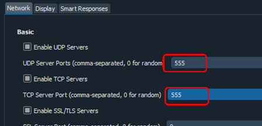
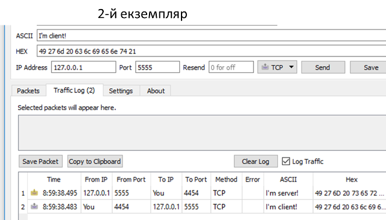
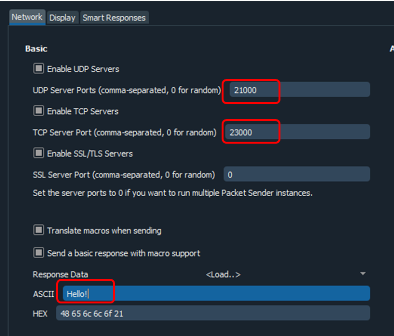
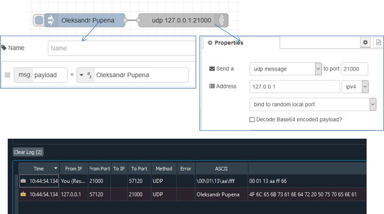
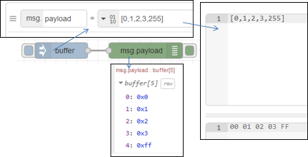
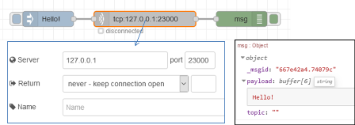
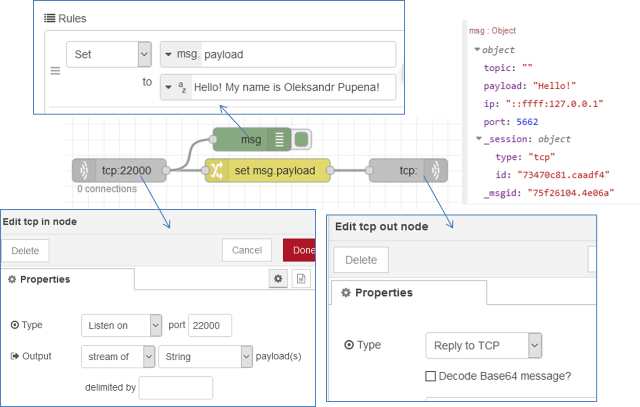
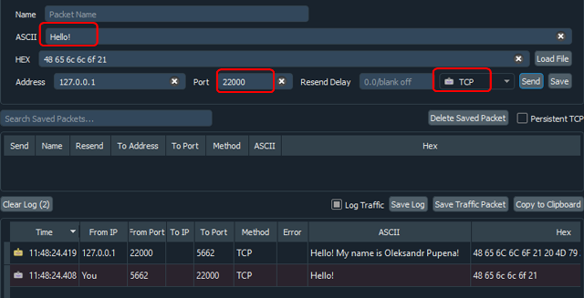
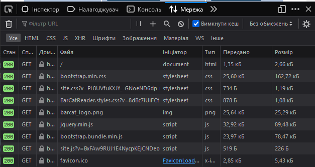
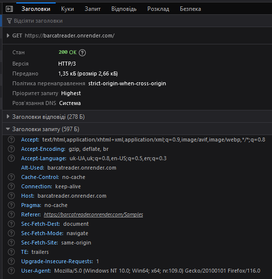

# Лабораторна робота №2. Робота з TCP/UDP та HTTP

Отримайте дані відповідно до варіанту.

| Параметр                                                     | Значення               | Примітка |
| ------------------------------------------------------------ | ---------------------- | -------- |
| Номер вхідного UDP порту для Node-RED (вихідного для `Packet Sender`) | Номер варіанту + 20000 |          |
| Номер вихідного UDP порту для Node-RED (вхідного для `Packet Sender`) | Номер варіанту + 21000 |          |
| Номер вхідного TCP порту для Node-RED (вихідного для `Packet Sender`) | Номер варіанту + 22000 |          |
| Номер вихідного TCP порту для Node-RED (вхідного для `Packet Sender`) | Номер варіанту + 23000 |          |


## 1. Тестові утиліти для роботи з TCP/UDP

### 1.1.Завантаження та встановлення тестових застосунків.

У даній частині практичного заняття використовуються тестові утиліти для TCP та UDP обміну. Ці утиліти безкоштовні.

- [ ] Завантажте та встановіть Packet Sender <https://packetsender.com/>
- [ ] Завантажте та встановіть WireShark <https://www.wireshark.org/>

### 1.2. Робота з Packet Sender 

- [ ] Запустіть два екземпляри утиліти `Packet Sender`
- [ ] У налаштуваннях першого екземпляру у меню `File->Settings` вкажіть порт 5555 для серверного боку, а також активуйте повідомлення-відповідь. 



рис.1.

- [ ] Для 2-го екземпляру вкажіть повідомлення для відправки, протокол `TCP`, порт відповідно до варіанту ( наприклад `5555`) та адресу `127.0.0.1` і натисніть `Send`.
- [ ] Перейдіть на вікно `Traffic Log` і подивіться результат операції.   



рис.2.

### 1.3. Робота з WireShark  

- [ ] За допомогою команди консольної команди `ping` визначте IP-адресу вузла з іменем `example.com`
- [ ] Запустіть WireShark 
- [ ] Виберіть інтерфейс (мережну карту), через який Ви працюєте з Інтернет

За замовченням Ви побачите весь трафік, який проходить через цей інтерфейс

- [ ] У WireShark у полі фільтра запишіть `ip.addr == 93.184.216.34`, де вказана адреса - це адреса  `example.com`. Цей фільтр задає відображення тільки тих пакетів, що відправляються чи отримуються з цієї адреси
- [ ] У Інтернет-браузері відкрийте http://example.com/
- [ ] У WireShark передивіться трафік, знайдіть HTTP-запит та HTTP-відповідь до цього вузлу.

### 1.4. Робота з `Loopback adapter` в WireShark  

- [ ] Перейдіть в меню `Захоплення -> Опції`, виберіть інтерфейс `Loopback adapter`, який захоплює пакети що циркулюють між застосунками на одному ПК. Якщо такого пункту немає (для старих версій) перейдіть до пункту 2.   
- [ ] У полі фільтра вкажіть `tcp.port == 5555`. Цей фільтр задає відображення тільки тих пакетів, що відправляються чи отримуються з даного порту
- [ ] Повторіть відправку пакету з п.1.2. 
- [ ] Знайдіть у WireShark TCP-пакети, які забезпечували передачу пакету з запитом та відповіддю.
- [ ] Закрийте WireShark без збереження пакетів.
- [ ] Закрийте усі екземпляри Packet Sender

## 2. Робота з UDP 

### 2.1. Робота з UDP-IN

- [ ] Запустіть Node-RED
- [ ] Створіть новий потік-вкладку, інші потоки видаліть 
- [ ] Релаізуйте в Node-RED фрагмент, який показаний на рис.3, але **вказавши номер порту відповідно до варіанту**
- [ ] Запустіть утиліту `Packet Sender`, якщо вона ще не запущена
- [ ] У `Packet Sender` виберіть режим UDP, вкажіть потрібний порт і текст, в якому англійськими літерами впишіть своє прізвище і натисніть `Send`


рис.3.

- [ ] Подивіться результат в панелі Debug, зробіть копію екрану з Node-RED

### 2.2. Налаштування вхідних портів `Packet Sender`  

- [ ] У `Packet Sender` виберіть меню `File->Settings`
- [ ] Налаштуйте вхідні порти для `Packet Sender` для TCP та UDP відповідно до варіанту



рис.4.

### 2.3. Робота з UDP-OUT

- [ ] У Node-RED модифікуйте програму, добавивши фрагмент програми для відправки текстового повідомлення по UDP, порт вкажіть відповідно до варіанту, прізвище вкажіть своє 
- [ ] Зробіть розгортання і ініціюйте запит з Node-RED. Перевірте отриманий пакет на Packet Sender і зробіть копію екрану.  



рис.5

## 3. Робота з об'єктом Buffer 

При роботі з бінарними даними в Node-RED використовується об'єкт Buffer.  Детально робота з цим об'єктом описана в [документації](https://nodejs.org/api/buffer.html). У цій частині необхідно перевірити деякі можливості при роботі з буфером. 

### 3.1. Використання Inject з типом Buffer

- [ ] Зробіть наступний фрагмент програми і перевірте його роботу.  



рис.6

### 3.2. Приклади роботи з Buffer

- [ ] Зробіть фрагмент потоку, наведений нижче. 


рис.7

- [ ] Перевірте роботу фрагменту, поступово замінюючи і перевіряючи коди, наведені нижче
- виділення буферу вказаного розміру

```js
msg.payload = Buffer.alloc(16,255); // виділення буферу на 16 байт
return msg;
```

- отримання буферу з вказаного числового масиву

```js
msg.payload = Buffer.from([1, -1, 256, 0xFF]);//отримання буферу з вказаного масиву значень
return msg;
```

- конкатенація буферів

```js
let buf1 = Buffer.from([0,1,2]);
let buf2 = Buffer.from([3,4,5]); 
let buf3 = Buffer.from([6,7]);
msg.payload = Buffer.concat([buf1,buf3,buf2],buf1.length + buf2.length + buf3.length);
return msg;
```

### 3.3. Відправка бінарних даних по UDP

- [ ] Модифікуйте фрагмент програми з рис.5 так, щоб відправлялися бінарні дані з вузла буфер, що показаний на рис.6. 
- [ ] Зробіть ініціювання потоку, подивіться на результат в  `Packet Sender` 

## 4. Робота з TCP 

### 4.1. Реалізація TCP-клієнта в Node-RED 

- [ ] Проконтролюйте налаштування серверу TCP в `Packet Sender` (рис.4).
- [ ] Використовуючи вузол `tcprequest` добавте в програму наступний фрагмент (рис.8)



рис.8.

- [ ] Зробіть ініціювання потоку, використовуючи панель налагодження проконтролюйте щоб прийшла відповідь. Натискаючи на позначку `raw` змініть формат відображення на тип `string`.
- [ ] Зробіть копію екрану.

### 4.2. Реалізація TCP-сервера в Node-RED 

- [ ] Використовуючи вузли `tcpin` та `tcpout` добавте в програму наступний фрагмент (рис.9). Зверніть увагу що там повинне бути вписане Ваше ім'я та налаштування порту.



рис.9.

- [ ] Запустіть `Packet Sender` та відправте повідомлення на вказаний порт. 
- [ ] Проконтролюйте, що у відповідь до `Packet Sender` прийде записане у вузлі `change` повідомлення  

 

рис.10

- [ ] Використовуючи вікно налагодження проаналізуйте зміст `msg`, отриманого з вузла `TCP-IN` (див. приклад рис.9)

## 5. Знайомство з роботою HTTP та використанням інструментів Веб-розробника  

Для перевірки роботи протоколу HTTP, відлагодження та тестування HTML, CSS і JavaScript в завантажених сторінках використовуються різноманітні інструменти Веб-розробника (WEB Developer Tools). Деякі з них є частиною браузерів, таких як Google Chrome або Mozila FireFox. Якщо Ви звикли працювати з Google Chrome, ознайомитися з вкладками і можливостями Ви можете за наступним [посиланням](https://www.quality-assurance-group.com/oglyad-instrumentiv-rozrobnyka-u-najpopulyarnishyh-brauzerah/). У даному практичному завданні показані приклали з використанням інструментів WEB Developer Tools, що вбудовані в Mozilla FireFox. Зокрема, для аналізу і тестування HTTP запитів використовується Монітор мережі, документація українською мовою для якого доступна за [посиланням](https://developer.mozilla.org/uk/docs/Інструменти/Network_Monitor?fbclid=IwAR2UDrojQ7d6Jeu7IHzpmKv50LR-YE6BbE-JQzVtolW3aJs1_kG7WxFQuK4). 

Для перевірки роботи запитів HTTP використовуватимуться сервіси сайту <https://zxing.org/w/decode.jspx>. Ці сервіси дають можливість декодувати штрих-коди та QR-коди що передаються на сайт у вигляді зображення. Слід відмітити, що є багато програм, які можуть це робити в онлайн, дана використовується тільки в якості прикладу.   

### 5.1. Встановлення браузера FireFox

- [ ] У прикладах в лабораторній роботі використовується українська версія FireFox. Для спрощення роботи завантажте та встановіть її за наступним посиланням https://www.mozilla.org/uk/firefox/download/thanks/. При виконанні лабораторної роботи дозволяється використовувати і інші інструменти. 

### 5.2. Перевірка роботи ВЕБ-застосунку https://zxing.org 

- [ ] Відкрийте сторінку в браузері https://zxing.org/w/decode.jspx і перевірте її роботу. Для цього завантажте будь-який файл з зображенням штрих-коду, наприклад [звідси](https://drive.google.com/open?id=1HqK3ItqtxigkonY8VWg2fHVsA_XaEwY2) (див. рис.11).

                               

рис.11

Натисніть «Відправити запит»,  при вдалій обробці запиту буде повернений результат з кодом, подібно до наведеного на рис.12.   

 

рис.12

### 5.3. Робота з Монітором мережі FireFox.

- [ ] Активуйте в браузері FireFox інструмент монітору мережі «Веб-розробка->Мережі» (CTRL+Shift+E), або аналогічний в інших браузерах. Робота з Монітором мережі описана за [посиланням](https://developer.mozilla.org/uk/docs/Інструменти/Network_Monitor?fbclid=IwAR2UDrojQ7d6Jeu7IHzpmKv50LR-YE6BbE-JQzVtolW3aJs1_kG7WxFQuK4). 
- [ ] Виставте опцію «Вимкнути кеш» з панелі інструментів Монітору мережі. Це потрібно щоб не використовувалася інформація в кеші на Вашому ПК. 
- [ ] Відкрийте в браузері сторінку <https://zxing.org>. 
- [ ] Проконтролюйте, щоб мережних запитів було 5. Якщо це не так - зробіть оновлення сторінки браузера іі знову впишіть вказану адресу.
- [ ] Подивіться список мережних запитів, які були зроблені при завантаженні сторінки, зокрема зверніть увагу на наступні значення:
  - скільки запитів було зроблено
  - які методи (спосіб) та типи запитів
  - які були повернуті результати (стани), скористуйтеся [даним ресурсом Вікіпедії](https://uk.wikipedia.org/wiki/Список_кодів_стану_HTTP) для визначення стану

 

 рис.13

### 5.4. Аналіз заголовків 1-го мережного запиту та відповіді.

- [ ] Виберіть перший запис у списку запит і відкрийте панель «Заголовки».
- [ ] Ознайомтеся з призначенням використаних в запиті заголовків з ресурсів Інтернет, наприклад з [Вікіпедії](https://uk.wikipedia.org/wiki/Список_заголовків_HTTP) , сторінкою із [MDN](https://developer.mozilla.org/uk/docs/Web/HTTP/Заголовки/Content-Length) або іншими аналогічними. 
- [ ] Заповніть перші два поля таблиці, наведеної нижче, для пояснення заголовків **в запиті**. Для зручності розшифрування можете скористатися посиланнями в колонці Заголовок.  Інші поля можете розібрати за бажанням.  

Таб.1. Пояснення значень заголовків запиту

| **Заголовок**                                                | **Значення**                                                 | **Пояснення  значень заголовків** |
| ------------------------------------------------------------ | ------------------------------------------------------------ | --------------------------------- |
| [Accept-Encoding](https://developer.mozilla.org/uk/docs/Web/HTTP/Заголовки/Accept-Encoding) | gzip, deflate, br                                            |                                   |
| [Accept-Language](https://developer.mozilla.org/uk/docs/Web/HTTP/Заголовки/Accept-Language) | uk-UA,uk;q=0.8,en-US;q=0.5,en;q=0.3                          |                                   |
| Cache-Control                                                | no-cache                                                     |                                   |
| Connection                                                   | keep-alive                                                   |                                   |
| Host                                                         | zxing.org                                                    |                                   |
| Pragma                                                       | no-cache                                                     |                                   |
| Upgrade-Insecure-Requests                                    | 1                                                            |                                   |
| User-Agent                                                   | Mozilla/5.0 (Windows NT 10.0; …) Gecko/20100101 Firefox/64.0 |                                   |

  

рис.14

- [ ] Заповніть поля таблиці для заголовку Location для пояснення **відповіді** . Для зручності розшифрування можете скористатися посиланнями в колонці Заголовок. 

Таб.2. Пояснення значень заголовків відповіді

| **Заголовок**                                                | **Значення**   | **Пояснення  значень заголовків** |
| ------------------------------------------------------------ | -------------- | --------------------------------- |
| [Location](https://developer.mozilla.org/uk/docs/Web/HTTP/Заголовки/Location) | /w/decode.jspx |                                   |

  

рис.15.

- [ ] Перегляньте вміст відповіді у вкладці «Відповідь» на перший запит. Зробіть висновок щодо результату запиту. Впишіть результати в перший рядок таблиці 3. 

Таб.3. Пояснення до запитів та відповідей

| **№** | **Запит (метод,** **URL**) | **Пояснення до запиту,  ініціатор**                      | **Відповідь (стан –  пояснення )** | **Пояснення до відповіді** |
| ----- | -------------------------- | -------------------------------------------------------- | ---------------------------------- | -------------------------- |
| 1     | GET https://zxing.org/     | Запит на документ, ініціював користувач в рядку браузеру | 301 - ???                          |                            |
| 2     |                            |                                                          |                                    |                            |
| 3     |                            |                                                          |                                    |                            |
| 4     |                            |                                                          |                                    |                            |
| 5     |                            |                                                          |                                    |                            |

### 5.5. Аналіз заголовків інших мережних запитів та відповідей.

- [ ] Аналогічно проаналізуйте другий запит та відповідь на нього. Зверніть увагу на зовнішній вигляд у вікні «Перегляд» у порівнянні з виглядом завантаженої сторінки у браузері. Чим вони відрізняються? 

- [ ] Відкрийте "Корисне навантаження відповіді" на панелі «Відповідь» (у форматі HTML). Для того, щоб зручніше проаналізувати вміст завантаженої сторінки:
  - [ ]  скопіюйте цей текст
  - [ ] відкрийте на іншій закладці браузеру посилання <https://www.freeformatter.com/html-formatter.html> 
  - [ ] помістіть скопійований текст в поле «Option 1: Copy-paste your HTML document here» 
  - [ ] натисніть на кнопку «format HTML». 
- [ ] У вікні «Formatted HTML:» з’явиться відформатований код сторінки в форматі HTML. Проаналізуйте HTML код. Якщо ви до цього не знайомилися з мовою розмітки HTML - можете прочитати [цей урок](http://htmlbook.ru/samhtml/vvedenie-v-html). 

- [ ] Зверніть увагу на тег **link** в заголовку HTML (допомога по призначенню тегу [тут](https://css.in.ua/html/tag/link)), та img (допомога по призначенню тегу [тут](https://css.in.ua/html/tag/img)).


- [ ] Проаналізуйте 3-й та 4-й запити та відповіді. За якої причини з`явилися ці запити? Занотуйте для себе результат для захисту лабораторної.

- [ ] Для розуміння 5-го запиту, прочитайте [цю статтю](https://uk.wikipedia.org/wiki/Favicon).  Занотуйте для себе результат для захисту лабораторної.

### 5.6. Аналіз заголовків та змісту POST.

- [ ] Використовуючи кнопку «Очистити» (зображення відерка) що знаходиться на панелі інструментів Монітору мережі, очистіть список запитів. 
- [ ] Завантажте будь-який файл з зображенням штрих-коду, як робили це в п.5.2. Натисніть «Відправити запит». При вдалій обробці запиту буде повернений результат з кодом. 

- [ ] Використовуючи подробиці мережного запиту [POST](https://developer.mozilla.org/uk/docs/Web/HTTP/Methods/POST) продивіться та проаналізуйте Заголовки. Зробіть копію екранів з заголовками та впишіть пояснення в таблиці 4. Для пришвидшення пошуку призначення заголовків користуйтесь посиланнями, що прив’язані до назв заголовків. Про типи MIME можна прочитати [тут](https://developer.mozilla.org/uk/docs/Web/HTTP/Basics_of_HTTP/MIME_types). 

 Таб.4. Пояснення значень заголовків запиту

| **Заголовок**                                                | **Значення** | **Пояснення  значень заголовків** |
| ------------------------------------------------------------ | ------------ | --------------------------------- |
| [Content-Length](https://developer.mozilla.org/uk/docs/Web/HTTP/Заголовки/Content-Length) |              |                                   |
| [Content-Type](https://developer.mozilla.org/uk/docs/Web/HTTP/Заголовки/Content-Type) |              |                                   |

- [ ] Використовуючи подробиці мережного запиту POST продивіться та проаналізуйте параметри безпеки (вкладка "Безпека").

- [ ] Зробіть копію екрану корисного навантаження запиту.

### 5.7. Аналіз відповіді на POST

- [ ] Відкрийте корисне навантаження відповіді на панелі «Відповідь» (у форматі HTML). 
- [ ] Для того, щоб зручніше проаналізувати вміст завантаженої сторінки:
  - [ ] скопіюйте його в буфер
  - [ ] відкрийте на іншій закладці браузеру посилання <https://www.freeformatter.com/html-formatter.html> 
  - [ ] помістіть скопійований текст в поле «Option 1: Copy-paste your HTML document here» після чого натисніть на кнопку «format HTML». У вікні «Formatted HTML:» з’явиться відформатований код сторінки в форматі HTML. 

- [ ] Знайдіть місце в документі HTML, де виводиться числове значення штрих-коду. 

## 6. Реалізація клієнта HTTP в Node-RED

В даній частині практичного завдання необхідно в Node-RED розробити програму для визначення штрих-коду по зображенню, використовуючи сервіси <https://zxing.org> . Для розуміння цієї частини лабораторної знадобляться результати, отримані в п.5. 

### 6.1. Підготовчі роботи

- [ ] На диску `C:\` створіть директорію «Temp», якщо вона ще не існує. 
- [ ] Скопіюйте в папку `C:\Temp\barcods` файл з зображенням штрих-коду, що використовувався в попередній частині, наприклад взятий [звідси](https://drive.google.com/open?id=1HqK3ItqtxigkonY8VWg2fHVsA_XaEwY2). 

### 6.2. Читання файлу

- [ ] Запустіть Node-RED, якщо він не запущений. 

- [ ] Створіть нову вкладку

- [ ] З [довідника](https://pupenasan.github.io/NodeREDGuidUKR/files/) ознайомтеся з вбудованими функціями роботи з файлами. Ці вузли детально розглядаються на інших заняттях. 
- [ ] З розділу `Storage` палітри вузлів вставте вузол `File in`. 
- [ ] Налаштуйте його таким чином, щоб він зчитував дані з файлу з штрих-кодом та виводив його вміст на панель відлагодження (Debug) див.рис.14.Зверніть увагу, що виведення в `Debug` треба робити як `complete msg object` а не як `msg.payload`.  

  

рис.14.

- [ ] Зробіть розгортання потоку, та з використанням панелі відлагодження подивіться що зміст файлу виводиться як масив байт (рис.14). 

### 6.3. Формування запиту

Для формування запиту необхідно сформувати на вході вузла `HTTP request` його заголовки та тіло. З попередньої частини роботи видно, що для отримання штрих-коду по зображенню необхідно сформувати запит з методом POST, який буде багато-частинним, тобто складатися з розділів, що відокремлюються межами. У даному випадку розділ є тільки один, який включає вміст файлу зображення.  

- [ ] Для пришвидшення виконання роботи імпортуйте в потік підготовлений вузол «Формувати запит», файл імпорту завантажте [звідси](https://drive.google.com/open?id=1d1xujfMU5Z50m6xxTpjJ_f0i_QzuNFhz), скопіюйте текст і імпортуйте в потік через меню імпорту. 
- [ ] Уважно ознайомтеся з вмістом функції. 
- [ ] Модифікуйте програму, як це показано на рис.15. 

 

 рис.15.

- [ ] Зробіть розгортання, активуйте ініціювання повідомлення в `Inject` і подивіться на вміст об’єкту на панелі відлагодження. 
- [ ] Порівняйте результат з заголовками та вмістом запиту POST зпопередньої частини («Знайомство з роботою HTTP»). Що відрізняється? Результат порівняння занотуйте для захисту.

### 6.4. Відправлення запиту.

- [ ] З розділу `network` палітри вузлів вставте вузол `HTTP request`. 
- [ ] Модифікуйте програму, як це показано на рис.16. Зверніть увагу, що для кращого тестування бажано вивести як вхідне так і вихідне повідомлення `HTTP request`. 

 

рис.16.

- [ ] Зробіть розгортання, активуйте Inject, через кілька секунд на панелі відлагодження з’явиться інформація про об’єкт-відповідь. 
- [ ] Порівняйте результат з заголовками та вмістом відповіді POST з попередньої частини («Знайомство з роботою HTTP»).  Результат виконання вважається позитивним, якщо у відповіді буде напис «Decode Succeeded». 
- [ ] Знайдіть числове значення штрих-коду у відповіді.

### 6.5. Розбирання запиту по частинам.

- [ ] Для витягування потрібних елементів з HTML-контенту в Node-RED використовується вузол `HTML`. Ознайомтеся з його роботою з [довідника](https://pupenasan.github.io/NodeREDGuidUKR/parsing/html.html).

- [ ] З розділу `parser` палітри вузлів вставте `HTML`. Модифікуйте програму, як це показано на рис.17. Селектор вибирає елемент HTML з ID=”result” у якого вибирає усі-елементи нащадки з тегом «pre».

 

рис.17 

- [ ] Зробіть розгортання, активуйте `Inject`, через кілька секунд на панелі відлагодження з’явиться інформація про масив вибірки.

- [ ] Добавте вузол-функцію для присвоєння значення `msg.ID` рівним номеру штрих-коду при позитивній відповіді, та `ERROR` при помилці обробки (рис.18).  

 

рис.18.

- [ ] Зробіть розгортання, активуйте `Inject` та перевірте роботу програми.  

### 6.6.Робота з `http-in`, `http-response` та `template`

- [ ] Створіть нову вкладку
- [ ] Зробіть фрагмент програми в Node-RED, показаний нижче:


рис.19.

- [ ] зверніть увагу, що у вузлі template використовується замінник `{payload}`, що вказує на використання в даному місці властивості Payload
- [ ] зробіть розгортання, на іншій вкладці браузера наберіть наступний шлях: `http://127.0.0.1:1880/hello`  

