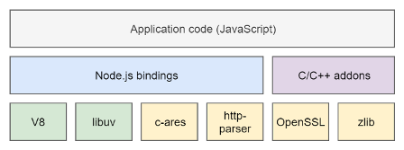
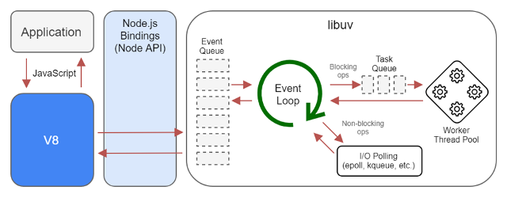
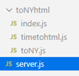
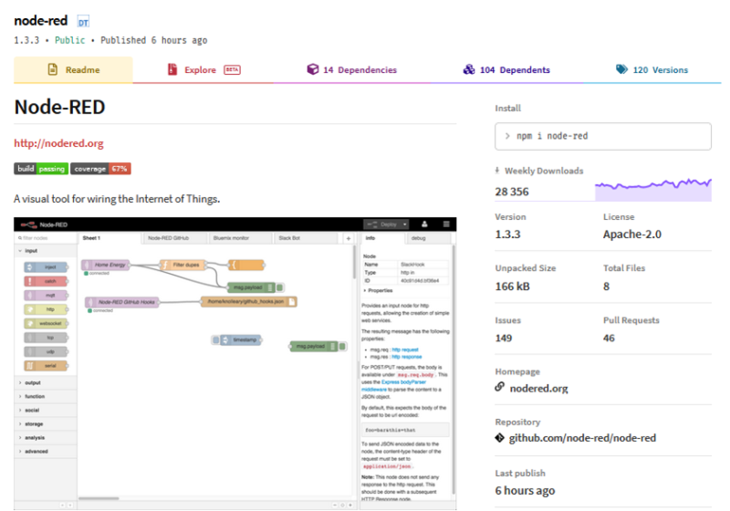
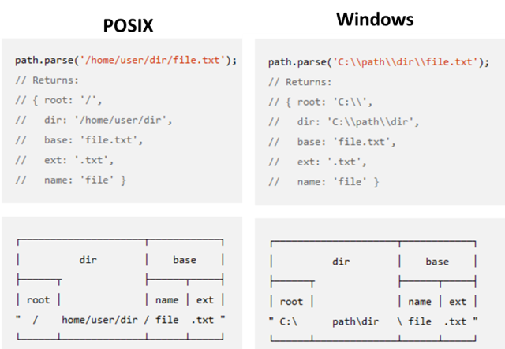

**Програмна інженерія в системах управління. Лекції.** Автор і лектор: Олександр Пупена 

| [<- до лекцій](README.md) | [на основну сторінку курсу](../README.md) |
| ------------------------- | ----------------------------------------- |
|                           |                                           |

# 16. Вступ до Node.js

## 16.1. Структура Node.js

**Node.js** — платформа з відкритим кодом для виконання високопродуктивних мережних застосунків, написаних мовою JavaScript. Засновником платформи є *[Раян Дал](https://uk.wikipedia.org/wiki/Раян_Дал)* (Ryan Dahl). Якщо раніше Javascript застосовувався для обробки даних в браузері користувача, то *node.js* надав можливість виконувати скрипти JavaScript на сервері та відправляти користувачеві результат їх виконання. Платформа *Node.js* перетворила JavaScript на мову загального використання з великою спільнотою розробників. В платформі використовується розроблений компанією Google рушій [V8](https://uk.wikipedia.org/wiki/V8_(рушій_JavaScript)). 



рис.16.1. Компоненти Node.js 

Для забезпечення обробки великої кількості паралельних запитів у Node.js використовується асинхронна модель запуску коду, заснована на обробці  подій в неблокуючому режимі та визначенні обробників зворотніх викликів  (callback). 

Node.js – однопотоковий застосунок, тобто програма виконується в одному потоці, немає можливості паралельного виконання програми. Якщо визивається деяка синхронна функція, яка повинна повернути результат, виконання програми призупиниться до повернення результату. Операції, які дуже швидкі – виконуються в синхронному режимі, всі інші, які потребують довгої обробки – в асинхронному. Одна із ідей використання Node.js – це асинхронний режим обробки подій, тобто в неблокуючому режимі, коли після запуску функції програма продовжує виконуватися, а результат функції передається через функцію зворотного виклику.

На рис.16.2 показана схема роботи виконавчої системи Node.js з підсистемою вводу/виводу. Детальніше про це можна почитати [за цим посиланням](https://itnext.io/an-intro-to-node-js-that-you-may-have-missed-b175ef4277f7 ) або [за цим](https://scoutapm.com/blog/nodejs-architecture-and-12-best-practices-for-nodejs-development). 



рис.16.2. 

Документація на Node.js доступна на [офіційному сайті](https://nodejs.org/api/)

## 16.2. Модулі та `requre`

Для великих проектів, необхідно розділення коду на кілька взаємопов'язаних файлів. У цьому випадку у проекті буде основний файл, який також називають файлом входження, та інші файли, які будуть до нього підключатися. Ці файли називають **модулями**.  Таким чином, модуль – це просто файл (або папка), який може бути підключений до іншого файлу як бібліотека, яка може включати корисні функції та об'єкти. 

У JavaScript можна підключати у якості модулів файли JS, компільовані файли (Node), або файли JSON. Також можна підключати модулі-директорії.

### Вбудовані модулі Node.js

Node.js має набір [вбудованих модулів](https://www.w3schools.com/nodejs/ref_modules.asp) які можуть бути використані без попередньої інсталяції. Модулі можуть завантажувати один одного з використанням директиви `require` , вказавши їх назву. Так, наприклад наступний код завантажує вбудований модуль `http` для використання його для реалізації Веб-серверу.

```javascript
let http = require('http');		//підключення модуля http 
//функція requestListener(), яка викликатиметься при запиті сторінки
//req - обєкт запиту IncomingMessage 
//res - об'єкт відповідь IncomingMessage 
let fn = function (req, res) { 
   //відправка статусу та заголовки відповіді http
   res.writeHead (200, {'Content-Type': 'text/html; charset=utf-8'}); 
   res.write ("Привіт світ!");//відправка тексту
   res.end ();//завершення комплектації відповіді 	
}
let httpserver = http.createServer (fn); //створення обєкту Веб-серверу
httpserver.listen(8080); //увімкнути прослуховування порта 8080
```

Після запуску цього коду, наприклад через `Visual Studio Code`, буде прослуховуватися порт `8080`, зайшовши на нього через http://127.0.0.1:8080/ в браузері повернеться  текст "Привіт світ!".

### Створення власних модулів

Можна створювати власні модулі та підключати їх у свої застосунки. У наступному прикладі створюється модуль, який повертає час, в днях, годинах, хвилинах та секундах, що залишився до нового року.  Для забезпечення доступу до властивостей і методів модуля використовується змінна  `exports`. 

```javascript
exports.toNY = function () {
    let now = new Date();
    let ny = new Date(now.getFullYear()+1, 0, 1, 0,0,0);
    let sec = Math.floor((ny.getTime()-now.getTime())/1000);
    let ret = {};
    const dhours = 24*60*60; 
    ret.days = Math.floor(sec/dhours);
    ret.hours = Math.floor((sec % dhours)/3600);
    ret.mins = Math.floor((sec % 3600)/60);
    ret.secs = sec % 60;
    return ret;
};
```

Модуль можна зберегти за назвою `toNY.js` 

Тепер у іншому файлі, наприклад `server.js` для використання цих експортованих функцій необхідно його підключити через  `require` . Зауважте, що необхідно використовувати `./` для пошуку модуля, це означає, що модуль розташований у тій же папці, що і файл Node.js.

```javascript
let nymodule = require('./toNY.js');
console.log (nymodule.toNY());
```

Можна не вказувати розширення `.js`.

### Об'єкт `module` 

Усі змінні, функції і об'єкти видимі в межах модуля і не стають автоматично доступні при підключенні до іншого модуля. Їх необхідно експортувати.  Робота з модулем проводиться через об'єкт [`module`](https://nodejs.org/api/modules.html#modules_the_module_object). Кожен модуль має змінну `module`, через яку можна отримати доступ до властивостей і методів, що керують модулями, ось деякі з них. 

```javascript
console.log (module.path);	//виведе шлях модуля
console.log (module.filename);//виведе повне ім'я файлу з шляхом розміщення 
console.log (module.parent);//модуль який підключив даний модуль через require
console.log (module.paths);//пошукові шляхи для модулів 
console.log (module.children[0].filename);//виведе повне ім'я файлу першого підлюченого дочірнього модуля
```

Так, наприклад, `module.parent` можна використовувати для перевірки чи запускається файл як самостійний, чи як підключений модуль.  

Властивість '`exports`' даного об'єкту задає експортовані об'єкти. До '`exports`' можна звертатися  без вказівки `module` . Таким чином `exports` можна сприймати як об'єкт, який експортується модулем.    

### Модуль-директорія та `index.js`

Бібліотечні модулі також можуть підключати у свою чергу інші модулі. Наприклад, бібліотечний файл-модуль `toNY.js` експортує час до Нового Року у форматі об'єкту, а необхідно зробити окрему бібліотеку, яка буде експортувати час до Нового Року у форматі тексту html.  Цей модуль назвемо  `timetohtml.js`, він матиме вигляд:      

```javascript
let nymodule = require('./toNY.js');//підключення модуля toNY.js 
exports.gettimehtml = function() {
    let toNY = nymodule.toNY();
    return ("До нового року залишилося:" + '<BR/\>' +
    toNY.days.toString() + ' днів <BR/\>'+ 
    toNY.days.toString() + ' днів <BR/\>' + 
    toNY.hours.toString() + ' годин<BR/\>' + 
    toNY.mins.toString() + ' хвилин<BR/\>' + 
    toNY.secs.toString() + ' секунд')
};
```

Таким чином для виводу часу у форматі html необхідно буде підключити `timetohtml.js`, який у свою чергу підключає  `toNY.js` . У цьому випадку, до проекту треба підключати не один файл, а кілька об'єднаних файлів, які зручно тримати в одній папці. Крім того, у застосунку можуть знадобитися обидві експортовані функції, тому можна зробити модуль, який би експортував обидві функції. 

У даному прикладі ці два файли необхідно перенести в окрему папку, наприклад `toNYhtml`. І підключати в якості модуля всю директорію, у даному випадку це матиме наступний вигляд:

```javascript
let toNYhtml = require('./toNYhtml');	
```

При такому записі шукатимуться спочатку файли `toNYhtml.js` та `toNYhtml.json`, потім файл `index.js` у папці  `toNYhtml`. Таким чином при підключені папки усі експортовані функції та об'єкти модуля треба прописувати в `index.js`. У наведеному прикладі можна перейменувати `timetohtml.js` в `index.js`, а можна створити новий файл для експорту потрібних функцій. У нашому прикладі зробимо файл, що просто експортує усі потрібні функції з усіх інших файлів:

```javascript
exports.toNY = require('./toNY.js').toNY;
exports.gettimehtml = require('./timetohtml.js').gettimehtml;
```

Тепер, застосунок, що виводить дату та час на ВЕБ-сторінку, буде включати головний файл `serer.js` який підключає модуль-папку і матиме вигляд:

```javascript
let toNYhtml = require('./toNYhtml');//підключення модуля-папки	
let http = require('http');		
let fn = function (req, res) { 
   res.writeHead (200, {'Content-Type': 'text/html; charset=utf-8'});
   console.log (toNYhtml.toNY());//виводити в консоль як об'єкт
   res.write (toNYhtml.gettimehtml());//вивести в форматі html
   res.end ();
}
let httpserver = http.createServer (fn); 
httpserver.listen(8080); 
```

Усі файли організовують наступну структуру: 

 

рис.16.3. Приклад структури модулів.

## 16.3. Менеджер пакунків NPM

### Вступ до NPM

**npm** (Node Package Manager) - це [менеджер пакунків](https://uk.wikipedia.org/wiki/Система_керування_пакунками) для мови програмування JavaScript. Для середовища виконання Node.js це менеджер пакунків за замовчуванням. Включає в себе:

- клієнт командного рядка, який називається також `npm`, 
- онлайн-базу даних публічних та  приватних пакунків, яка називається **реєстром npm** або репозиторієм npm; 

Реєстр доступний через клієнт, а доступні пакунки можна переглядати та шукати через веб-сайт  npm.  Це дозволяє користувачам користуватися модулями JavaScript та  розповсюджувати їх. 

Головна сторінка реєстру знаходиться за посиланням [https://registry.npmjs.com/](https://registry.npmjs.com/) . Реєстр NPM - це база даних `Couch DB`. Кожен пакунок в реєстрі доступний за іменем за адресою:

```http
https://registry.npmjs.com/<назва пакунку>
```

наприклад

```http
https://registry.npmjs.com/node-iplocate
```

Пакунки в реєстрі знаходяться у форматі [CommonJS](https://uk.wikipedia.org/wiki/CommonJS) і включають в себе файли метаданих у форматі JSON. Там також знходяться посилання на архіви пакунків та на залежності. 

Реєстр не має процедури перевірки, а це означає, що знайдені там пакунки можуть бути низькоякісними або небезпечними.  Натомість npm спирається на звіти користувачів, щоб видаляти пакунки,  якщо вони порушують політику безпеки (є незахищеними, зловмисними або  низькоякісними). npm показує статистику, включаючи кількість завантажень та кількість  пакунків, щоб допомогти розробникам оцінювати якість пакунків. Ось, наприклад, на рис.16.4 показано як виглядає опис пакунку для Node-RED.

Все, що знаходиться в реєстрі NPM  - відкрито для всіх. Тим не  менше можна створити власний реєстр і налатувати взаємодію клієнта з ним.



рис.16.4. Опис пакунку Node-RED в репозиторії.

### Клієнт командного рядка `npm` 

Клієнт командного рядка має багато команд для роботи з пакунками. Перелік доступних команд, та як з ними працювати можна подивитися через вбудовану довідникову систему

```bash
npm help
Usage: npm <command>
where <command> is one of:
    access, adduser, audit, bin, bugs, c, cache, ci, cit,
    clean-install, clean-install-test, completion, config,
    create, ddp, dedupe, deprecate, dist-tag, docs, doctor,
    edit, explore, fund, get, help, help-search, hook, i, init,
    install, install-ci-test, install-test, it, link, list, ln,
    login, logout, ls, org, outdated, owner, pack, ping, prefix,
    profile, prune, publish, rb, rebuild, repo, restart, root,
    run, run-script, s, se, search, set, shrinkwrap, star,
    stars, start, stop, t, team, test, token, tst, un,
    uninstall, unpublish, unstar, up, update, v, version, view,
    whoami

npm <command> -h  коротка допомога по <command>
npm -l            відображає повну інформацію по командам
npm help <term>   шукає допомогу по <term> в довідниковій системі
npm help npm      викликає довідникову систему
```

### Опис пакунку `package.json`

Для того, щоб npm міг керувати пакунками, які включають в себе взаємозалежні модулі, необхідно ці залежності прописати в спеціальному файлі, який називається `package.json`. У файлі package.json кожна залежність може означити діапазон дійсних версій, використовуючи схему семантичної версії, що дозволяє розробникам  автоматично оновлювати свої пакети, одночасно уникаючи небажаних змін.

Файл `package.json` має знаходитися в папці модуля, і включати в себе наступну мінімально необхідну інформацію:

- `name` - ім'я модуля
- `version` - версія

Наприклад, для наведеного вище прикладу, для означення пакунку для модуля `toNYhtml` необхідно в цій папці створити створити`package.json`, у який написати наступне: 

```json
{
    "name": "tonyhtml",
    "version": "0.0.1"
}
```

Можна також з командного рядку (знаходячись у папці модуля) викликати клієнтський застосунок `npm` з командою `init`, який заповнить цей файл введеною у діалоговому режимі інформацією. Після заповнення через

```bash
npm init
```

означення пакунка може  мати наступний вигляд:

```json
{
  "name": "tonyhtml",
  "version": "0.0.1",
  "description": "Визначення часу до нового року",
  "main": "index.js",
  "scripts": {
    "test": "echo \"Error: no test specified\" && exit 1"
  },
  "author": "",
  "license": "ISC"
}
```

Поле `main` задає файл входження пакунку, тобто той, який буде підключатися для формування об'єктів експорту. За замовченням це  `index.js`.

Версійність пакетів означується парою з трьох цифр `МАЖОРНА.МІНОРНА.ПАТЧ`. Більш детально про семантичне версіювання читайте за посиланням [https://semver.org/lang/uk/](https://semver.org/lang/uk/)

У реальних пакунках полів набагато більше, але розгляд їх виходить за рамки цієї лекції.  

### Пошук пакунків

Для пошуку пакунків використовується команда `npm search` (або `s`). Ось, наприклад, пошуковий запит на пакунок за ключовими словами `location from ip`

```bash
npm search location from ip
```

Серед знайдених пакунків можна вибрати один і відкрити опис за посиланням

```http
https://www.npmjs.com/package/<назва пакунку>
```

наприклад

```http
https://www.npmjs.com/package/node-iplocate
```

### Встановлення та оновлення пакунків та  `package-lock.json` 

Встановлення необхідного пакунку проводиться за допомогою команди `npm insttall`. Встановлення модулів проводиться в папку `node_modules` тієї папки, в якій запускається команда. Так, наприклад, якщо для наведеного вище прикладу перейти в папку `tonyhtml`, і там запустити наступну команду

```bash
npm install node-iplocate 
```

то в папці модуля з'явиться папка `node_modules` а також файл `package-lock.json` . Файл `package-lock.json` автоматично генерується для будь яких операцій, де npm модифікує дерево `node_modules`, або ` package.json`. Він описує точне дерево, яке було сформовано таким чином, що наступні установки можуть генерувати однакові дерева, незалежно від проміжних оновлень залежності. 

Використання цього модулю тепер доступне в файлах папки `tonyhtml`. 

```bash
const iplocate = require("node-iplocate");
iplocate("193.28.200.2", null, function(err, results) {
    console.log(JSON.stringify(results, null, 2));
});
```

Слід звернути увагу, що при інсталяції пакунку, `npm` спочатку шукає папку `node_modules` або  ` package.json` в локальній директорії, потім на рівень вище і т.д, поки не знайде корінь проекту. І тільки якщо такої директорії і ` package.json`  не знайдено, створює цю папку. 

Команда `npm install` без додаткових уточнень в назві пакунку встановить останню стабільну версію. Для встановлення конкретної версії, треба використовувати додаткові параметри, наприклад 

```bash
npm install node-iplocate@1.0.1
```

встановить версію 1.0.1.

Перегляд пакунків проводиться командою  `npm list`

```bash
npm list
npm list node-iplocate
```

Видалення пакунку проводиться командою `npm uninstall`, наприклад

```bash
npm uninstall node-iplocate
```

Для перевірки та оновлення модулів використовується команда `npm update` .    

### Видалення пакунків 

Видалення пакунка без оновлення package.json 

```bash
npm uninstall <package-name>
```

Видалення пакунка та оновлення зав'язків в package.json 

```bash
npm uninstall <name> --save
```

Видалення пакунка та оновлення зав'язків в `devDependencies` в `package.json`

```bash
npm uninstall <name> --save-dev
```

### Глобальні модулі

Пакунки можна інсталювати та керувати ними (наприклад, видаляти, оновлювати) глобально для всієї системи. Для цього використовується опція `-g`. Так, наприклад для інсталювання пакету глобально необхідно викликати наступну команду:

```bash
npm -g install node-iplocate
```

Таким чином є два способи встановлення пакунків - на рівні проекту, та на рівні всієї системи. Так, наприклад `NodeRed` встановлює для себе свої версії пакунків директорію `.node-red`. 

### Публікація пакунку

Для публікації пакунку в публічному реєстрі використовується відповідна команда

```bash
npm publish 
```

Для можливості публікації необхідно зареєструватися, а до цього добавити себе як користувача в глобальний реєстр:

```bash
npm adduser 
```

## 16.4. Основні модулі Node.js

### Змінні модуля та глобальні об'єкти 

**Змінні модуля** доступні в межах кожного модуля (область видимості модуля):

- __dirname – ім'я директорії плинного модуля, те саме що і path.dirname()  
- __filename - ім'я файлу плинного модуля. Це абсолютний шлях поточного файлу модуля з розв’язаними символічними посиланнями
- exports – коротка форма module.exports
- module – змінна-посилання на модуль
- require() – для імпорту

**Глобальні об'єкти** – це об'єкти, що вбудовані в JS або в середовище. У Node.js є об'єкт **global**, але можна звертатися напряму до його властивостей та методу. Крім того в global можна писати свої змінні. Ці об'єкти доступні напряму і не потребують об'явлення Require. 

Нижче наведені деякі глобальні об'єкти:  

- Class: Buffer – робота з бінарними даними
- setInterval, setTimeout , clearImmediate, clearInterval, clearTimeout – робота з таймерами
- console – робота з консоллю
- global – для роботи з глобальною областю
- performance – для роботи з метриками (показниками продуктивності) 
- process – доступ до властивостей Node.js process
- TextDecoder, TextEncoder – робота з текстовим кодуванням
- URL, URLSearchParams – робота з URL посиланнями 

### os

Модуль `os` призначений для отримання системної інформації.

```js
const os = require('os');   //підключення модуля роботи з os 
console.log(os.platform()); //платформа
console.log(os.arch());     //архітектура 
console.log(os.cpus());     //інформація про ЦПУ
console.log(os.freemem());  //вільна пам'ять 
console.log(os.totalmem()); //скільки пам'яті
console.log(os.homedir());  //коренева директорія
console.log(os.uptime());   //час роботи системи
```

### path

Модуль `path` представляє утиліти для роботи з шляхами до файлів і директорій. 

За замовченням операції модулю залежать від ОС, де виконується Node.js. Наприклад для Windows розділювачем шляхів є символ `\`  а для систем POSIX (наприклад Linux) – `/`. Якщо необхідно вказати конкретний формат використовується `path.win32` або `path.posix`. 

На рис.16.5 показані різні представлення шляхів у залежності від ОС.



рис.16.5. Різне представлення шляхів для різних ОС.

```js
const os = require('os');
const path = require('path');

console.log(path.sep); // виведе \ 
let homedir = os.homedir();
console.log(homedir); 
// для Windows виведе C:\Users\username
console.log (path.parse(homedir));
```

```js
//path.basename повертає останню частину шляху з розширенням чи без нього
console.log (path.basename('/foo/bar/baz/asdf/quux.html'));// 'quux.html'
console.log (path.basename('/foo/bar/baz/asdf/quux.html','.html')); // 'quux'
//delimiter - повертає розділювач шляхів (';' - Windows, ':' - POSIX)
console.log (path.delimiter); //виведе ; у Windows
//dirname - повертає шлях до кінцевого обєкту в шляху (файлу чи папки)
console.log (path.dirname('/foo/bar/baz/asdf/quux')); // /foo/bar/baz/asdf
console.log (path.extname('index.html')); //повертає розширення .html
//format ({dir, root, base, name, ext}) - поверає рядок шляху
console.log (path.format({root:'C:\\tmp\\', base:'file.txt'}));// C:\tmp\file.txt
console.log (path.format({dir:'C:\\tmp', name:'file', ext:'.txt'}));// C:\tmp\file.txt

//join - обєднує усі сегменти шляху разом з використанням платформового розділювача
console.log (path.join(homedir,'f1','sf1','file.txt'));// C:\Users\username\f1\sf1\file.txt
console.log (path.normalize('C:/temp\\\\foo\\bar\\../1.txt'));// нормалізує до C:\temp\foo\1.txt

//resolve - перетворення шляху в абсолютний шлях
console.log(path.resolve());//без параметрів - плинна директорія
console.log(path.resolve(homedir, '..',  'newuser'));// C:\Users\newuser
console.log(homedir.split(path.sep)); //[ 'C:', 'Users', 'username' ]
```

### fs 

Модуль `fs` призначений для роботи з файлами (читання, запис, зміна). Він має як синхронні так і асинхронні методи. Він може працювати як через Buffer для бінарних файлів так і через string для текстових файлів. У свою чергу зміст можна зчитувати цілком, або через потік.

```js
const fs = require('fs');
try {
  //вказане кодування тому повертає string
  const content = fs.readFileSync('file1.txt', 'utf8');
  console.log(content); //виводить: 'Це зміст текстового файлу.'
} catch (e) { console.log(e)}
try {
  //не вказане кодування тому повертає Buffer
  const content = fs.readFileSync('file1.txt');
  console.log(content); //виводить: 'd0 a6 d0 b5 20 d0 b7 d0 bc d1 96..'
} catch (e) { console.log(e)}
//асинхронний варіант читання
fs.readFile('file1.txt', 'utf8', (err, data) => {
  if (err) throw err
  console.log(data);
})
//усі синхронні операції варто добавляти в try..catch
fs.writeFileSync('file1.txt', 'Цей текст запишеться у файл\n', 'utf8');
fs.appendFileSync('file1.txt', 'Цей текст добавиться у файл\n', 'utf8');
console.log (fs.readdirSync('./', 'utf8'));//список файлів та директорій у плинній директорії
fs.copyFileSync('file1.txt', 'destination.txt'); 
```

### events

Асинхронність в JS досягається через виклик функцій-обробників, які викликаються за виконанням певної події. У простому випадку в асинхронну функцію передають функцію зворотного виклику.  Але є і інші способи, наприклад з використанням принципів подіє-орієнтованого програмування, при якому об’єктом генеруються події які обробляються спеціальними обробниками цих подій. 

У модулі events є клас Emitter. Екземпляри цього класу (об'єкти-**емітери**) генерують різноманітні події, на які можна підписатися і вказати функції, які будуть викликатися при виникненні цих подій. Таким чином всередині об'єкту йде генерація подій, а ззовні їх обробка.  

Багато класів в інших модулях наслідують емітери для формування подіє-орієнтованого підходу. 

```js
const Emitter = require('events');//імпортувати клас емітер
let emitter = new Emitter(); //створити новий емітер
let eventName = 'greet';
//спочатку зв'язати подію eventName з функцією зворотного виклику 
emitter.on( //on - метод для зв'язуання, "слухати" 
  eventName, //подія 
  function(){console.log('Hello all!')} //функція обробки
);
emitter.on(eventName, function(){
    console.log("Привіт усі!")
});
//emit - метод для генерування події 
emitter.emit(eventName);//перший параметр - назва події
//передача параметрів еміттеру
let emitter1 = new Emitter();
emitter1.on(eventName, function(data){
    console.log(data);
});
//другий параметр методу emit - параметри функції обробника
emitter1.emit(eventName, "Привіт світ!");

```

### http

Модуль `http` використовується для роботи з клієнтськими та серверними http-запитами. Нижче наведений фрагмент коду для роботи з клієнтським http.

```js
const http = require('http');
//опції запиту
const options = {
  hostname: 'www.example.org',
  port: 80, path: '/',
  method: 'GET', headers: {}
};
//створення обробки запиту 
const req = http.request(options, (res) => {
  console.log(`STATUS: ${res.statusCode}`);
  console.log(`HEADERS: ${JSON.stringify(res.headers)}`);
  res.setEncoding('utf8');
  //у res є події:'end', 'data'  
  res.on('data', (chunk) => { //обробник події 'data' -   
    console.log(`BODY: ${chunk}`);
  });
});
// у req є події: 'response', 'socket', 'error'
req.on('error', (e) => { 
  console.error(`problem with request: ${e.message}`);
});
req.end();
```

Нижче наведений фрагмент запиту з серверним http. 

```js
const http = require('http');
const host = '127.0.0.1';
const port = 7001;
//створення серверу
const server = http.createServer((req, res) => {
  if (req.method === 'GET') {
    switch (req.url) {
      case '/':
      case '/home': {
        res.statusCode = 200;
        res.setHeader('Content-Type', 'text/plain;charset=utf-8');
        res.end('Домашня сторінка\n');//завершити з'єднання 
        break}
      default: {
        res.statusCode = 404;
        res.setHeader('Content-Type', 'text/plain;charset=utf-8');
        res.end('Не знайдено\n');
        break}}}})  
//запуск прослуховуваня
server.listen(port, host, () => {
  console.log(`Server listens http://${host}:${port}`)
})
```

Для спрощення розробки серверних застосунків можна використовувати фреймворки, наприклад **Express**  


Корисні посилання за темою:

https://learn.javascript.ru/screencast/nodejs

https://nodejs.org/api/

https://www.youtube.com/watch?v=3aGSqasVPsI

https://nodejs.org/uk/docs/

https://www.w3schools.com/nodejs/nodejs_intro.asp

https://medium.com/devschacht/node-hero-6a07ef8d822d 

https://metanit.com/web/nodejs/

## Запитання для самоперевірки

1. Розкажіть про основні принципи функціонування виконавчої системи Node.js.
2. Що таке модулі? Як вони підключаються?
3. Як створювати власні модулі?
4. Які можливості надає менеджер пакунків?
5. Яке призначення package.json?
6. Назвіть основні команди клієнту командного рядку npm.
7. Розкажіть про змінні модуля та глобальні обєкти.
8. Розкажіть про модуль `os`.
9. Розкажіть про модуль `path`.
10. Розкажіть про модуль `fs`.
11. Розкажіть про модуль `events`.
12. Розкажіть про модуль `http`.

| [<- до лекцій](README.md) | [на основну сторінку курсу](../README.md) |
| ------------------------- | ----------------------------------------- |
|                           |                                           |

