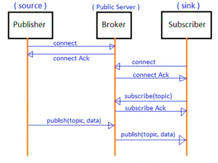
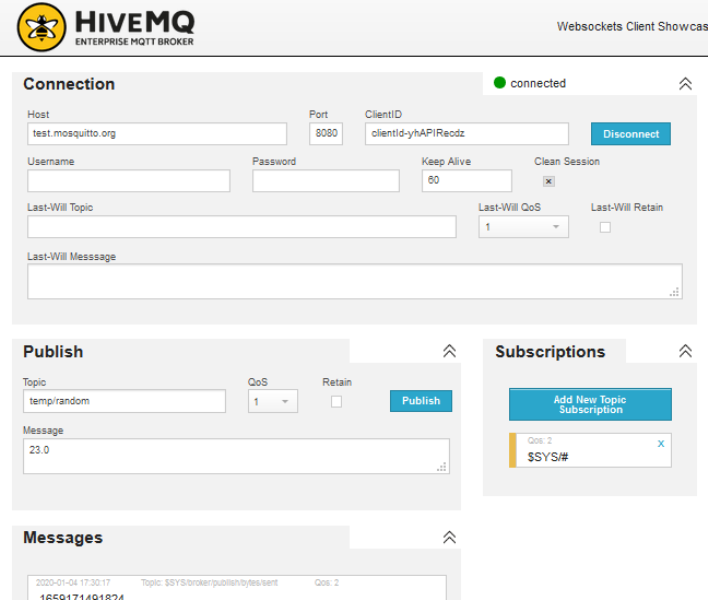
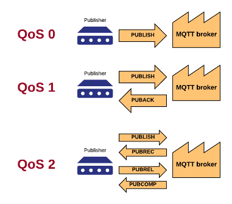
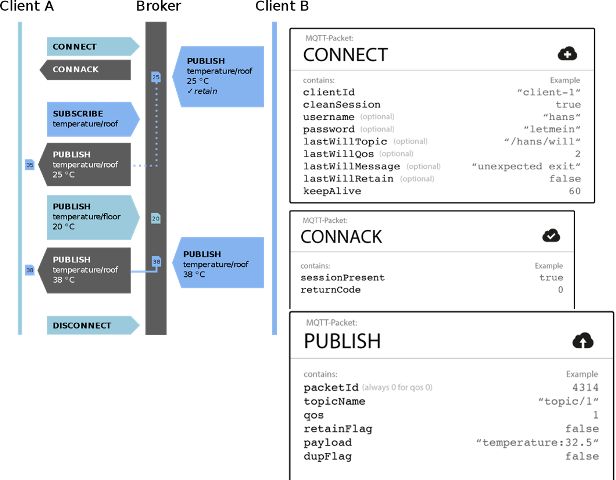
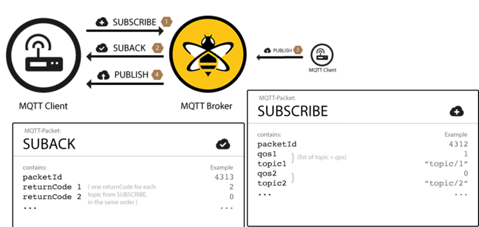
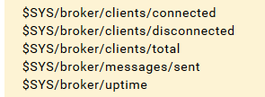

**Програмна інженерія в системах управління. Лекції.** Автор і лектор: Олександр Пупена 

| [<- до лекцій](README.md) | [на основну сторінку курсу](../README.md) |
| ------------------------- | ----------------------------------------- |
|                           |                                           |

# 5. Передача даних в архітектурі IoT: MQTT

## 1. Загальні принципи функціонування MQTT

У структурі Інтернету речей засоби взаємодіють між собою через мережу Інтернет безпосередньо, або через комунікаційні шлюзи. При такому обміні може і не бути явно виділеного серверу, куди треба передавати дані, адже IoT передбачає зв\'язок «речей» між собою а не з централізованим «концентратором» даних. Тому поряд з використанням HTTP API та WebSocket, в IoT є спеціальні протоколи Інтернету речей, такі як AMQP, MQTT, STOMP та інші, які не передбачають зв\'язок типу клієнт-сервер. У цих протоколах одні засоби розміщують повідомлення в буфері або стеці, інші -- зчитують їх. MQTT є одним з таких.

MQTT свого часу був внутрішнім і пропрієтарним протоколом для IBM протягом багатьох років. У 2010 р він був випущений у версії 3.1 в якості безкоштовного продукту, у 2013 р. -- стандартизований і прийнятий в консорціум OASIS, у 2014 р. -- OASIS опублікував його публічно як версію MQTT 3.1.1. MQTT також є стандартом ISO (ISO / IECPRF 20922).

Протокол MQTT базується на стеці TCP/IP. У ньому використовується модель публікації-підписки (publish-subscribe, або pub/sub). Клієнт, що передає повідомлення, називається ***видавцем*** (***publisher***); клієнт, який отримує повідомлення - ***абонентом*** (***subscriber***). У центрі знаходиться ***MQTT-брокер*** (***MQTT broker***), який несе відповідальність за обмін повідомленнями між клієнтами і фільтрацію даних (див.рис.5.1). Таким способом йде відокремлення клієнта, що відправляє повідомлення, від іншого клієнта, який отримує повідомлення. На відміну від традиційної моделі клієнт-сервер, клієнти що публікують і підписуються на повідомлення не обізнані про будь-які фізичні ідентифікатори інтерфейсів пристроїв або застосунків (на зразок IP-адреси, або TCP/UDP порту). Вони знають тільки про розміщення в мережі брокера, через який відбувається обмін. У MQTT може бути багато видавців і багато абонентів.

рис.5.1. Принцип обміну MQTT повідомленнями через брокер

Абонент, підписуючись під отримування повідомлень від видавців використовує різноманітні фільтри, які забезпечують:

-   **фільтрацію за темами** (**Topic Filters**) - за задумом, клієнти підписуються на ***теми*** (***topic***) і певні гілки тем, тому не отримують не потрібні їм дані. Кожне опубліковане повідомлення повинно містити тему (topic), і брокер несе відповідальність за повторну передачу цього повідомлення абонентам або ігнорування його;

-   **фільтрація по вмісту** - брокери мають можливість перевіряти і фільтрувати опубліковані дані. Таким чином, будь-які дані, які не зашифровані, можуть керуватися брокером до того, як зберегти їх або передати іншим клієнтам;

-   **фільтрація за типом** - клієнт, що прослуховує потік даних, на які він підписаний, може також застосовувати свої власні фільтри. Вхідні дані можуть аналізуватися, і в залежності від цього потік даних обробляється далі або ігнорується.

Підписник може підписатися на кілька тем. Одна із особливостей моделі видавець/Підписник полягає в тому, що перед початком передачі клієнти повинні знати тему гілки і формат даних, але не взаємне розміщення один одного. Це дуже корисно при розгортанні IoT, оскільки IP-адреса клієнтів може бути динамічною або/та приватною.

MQTT є часово-незалежним протоколом. Це значить, що повідомлення, опубліковане одним клієнтом-видавцем, може бути прочитане абонентом в будь-який час. Підписник може перебувати в місці з низьким енергоспоживанням або обмеженою пропускною здатністю і відповісти на повідомлення через кілька хвилин або годин.

Брокери можуть бути розгорнуті на будь якому загально-доступному усім клієнтам ресурсі, і мати виділену і відому їм адресу. При реалізації IoT з використанням хмарних платформ, функцію брокера бере на себе відповідний сервіс. Керовані хмарою брокери MQTT зазвичай можуть поглинати мільйони повідомлень на годину і підтримувати десятки тисяч видавців.

MQTT не залежить від формату даних. Корисне навантаження (payload) може містити будь-який тип даних, тому і видавці, і абоненти повинні розуміти і погоджувати формат даних. У корисному навантаженні можна передавати текстові повідомлення, дані зображення, звукові дані, зашифровані дані, двійкові дані, об\'єкти JSON або практично будь-яку іншу структуру. Тим не менше, текстові і двійкові дані JSON є найбільш поширеними типами даних корисного навантаження.

Максимально допустимий розмір пакета в MQTT становить 256 Мб, що дозволяє отримати надзвичайно велике корисне навантаження. Зверніть увагу, однак, що це також залежить від обмеження клієнтів, хмарних сервісів (якщо використовуються) і брокера. Наприклад, хмарний сервіс IBM Watson дозволяє обробляти дані розміром до 128 Кб, а Google підтримує 256 Кб. З іншого боку, опубліковане повідомлення може включати корисне навантаження нульової довжини, тобто поле корисного навантаження не є обов\'язковим. Доцільно звірити відповідність розмірів корисного навантаження з хмарним провайдером або конкретною реалізацією брокеру.

У Інтернеті є безкоштовні MQTT брокери, використовуючи які можна обмінюватися між пристроями IoT не маючи власного серверу або виділеного хмарного сервісу для MQTT. Серед найбільш відомих MQTT брокерів є:

-   [http://test.mosquitto.org](http://test.mosquitto.org/gauge/)

-   <http://www.mqtt-dashboard.com>

Тут слід наголосити, що використання публічних брокерів в Інтернет може стати в нагоді для навчання або тестів, однак з точки зору промислового використання є небезпечним і ненадійним. Для побудови проектів диспетчеризації необхідно розгортати власний брокер (є безкоштовні версії) або користуватися відповідними хмарними сервісами IoT.

Також для перевірки обміну по MQTT можна скористатися тестовими MQTT-клієнтами, наприклад онлайн-клієнт **[HiveMQ](http://www.hivemq.com/demos/websocket-client)** або офлайновий [**MQTT-explorer**](http://mqtt-explorer.com/). На рис.5.2 показаний зовнішній вигляд вікна клієнта HiveMQ для перевірки відправки (publish) та отримування повідомлень (subscription), у даному випадку той же клієнт може бути як видавцем так і абонентом. У полі «hosts» вказується DNS-ім'я або IP-адреса брокера, також вказується порт та власний ідентифікатор. Для відправки вказується тема (Topic) та корисне навантаження (Message), для отримування тема підписки.

рис.5.2. Вікно тестового MQTT-клієнта.

## 2. Деталі архітектури MQTT

MQTT може зберігати повідомлення в брокері необмежено довго. Цей режим роботи керується відповідним прапорцем. Збережене на брокері повідомлення відправляється будь-якому клієнту, який підписується на цю тематичну гілку MQTT. При підписці, повідомлення негайно відправляється новому абоненту, що дозволяє йому отримати статус або сигнал з теми без очікування. Може виникнути ситуація, що Підписник може очікувати годину або навіть дні, перш ніж видавець опублікує нові дані.

MQTT означує додатковий об\'єкт під назвою ***Остання воля і заповіт*** (***LWT***). LWT - це повідомлення, яке вказує клієнт брокеру на етапі підключення. LWT містить назву теми «Останньої волі» (Last-Will Topic), QoS (Last-Will QoS) і фактичне повідомлення (Last-Will Message, див.рис.5.2). Якщо клієнт неправильно відключається від брокерського з\'єднання (наприклад, тайм-аут keep-alive, помилка введення-виведення, або клієнт закриває сеанс без відключення), тоді брокер зобов\'язаний транслювати повідомлення LWT всім іншим підписаним на цю тему клієнтам.

Незважаючи на те, що MQTT заснований на TCP, з\'єднання можуть обриватися, особливо в разі бездротових датчиків. Пристрій може втратити живлення, зв\'язок, або може відбутися поломка, і сеанс перейде в напіввідкритий стан (тобто з одного боку вважається що з'єднання є, а з іншого воно відсутнє). У цьому випадку TCP-сервер брокера буде вважати, що з\'єднання як і раніше є надійним і очікувати дані. Щоб вийти з цього напіввідкритого стану, MQTT використовує систему ***keep-alive* (**утримування**)**. Використовуючи цю систему, як брокер MQTT, так і клієнт мають гарантію того, що з\'єднання залишається працездатним, навіть якщо протягом деякого часу не було передачі. Значення часу утримування задається клієнтом при підключенні (див.рис.5.2). Після отримання чергового будь-якого пакету, таймери keep-alive скидаються на клієнті і сервері і починають відлік. Якщо протягом часу keep-alive клієнти не мають даних для відправки, вони повинні відправити пакет PINGREQ брокеру, який, в свою чергу, підтверджує повідомлення за допомогою PINGRESP. Якщо протягом півтора часу keep-alive пакет не буде отримано, брокер закриє з'єднання і відправить LWT-пакет всім клієнтам. Максимальний час keep-alive -- 18 годин 12 хвилин 15 секунд.

MQTT дозволяє також підтримувати постійні сеанси (persistent session). Постійний сеанс зберігає на стороні брокера наступне:

-   всі підписки клієнта;

-   всі повідомлення з QoS рівним 1 або 2, які не були підтверджені клієнтом;

-   всі нові повідомлення з QoS рівним 1 або 2, пропущені клієнтом;

-   всі повідомлення з QoS рівним 2, але не підтверджені клієнтом внаслідок втрати зв'язку.

Для цього клієнт при підключенні вказує свій client\_id (див.рис.5.2). Клієнт може запитувати постійний сеанс, проте брокер може відхилити запит і примусово перезапустити новий сеанс. При з\'єднанні з брокером клієнт використовує прапорець cleanSession (див.рис.5.2) для вказівки відсутності необхідності постійного сеансу. Клієнт може визначити, чи зберігся попередній сеанс за допомогою повідомлення-відповіді CONNACK.

Постійні сеанси повинні використовуватися для клієнтів, які повинні отримувати всі повідомлення, навіть коли немає зв\'язку. Вони не повинні використовуватися в ситуаціях, коли клієнт тільки публікує (записує) дані в теми.

Більше інформації про MQTT можна прочитати [за посиланням](https://www.hivemq.com/mqtt-essentials/).

## 3 Рівні якості обслуговування MQTT

У MQTT є три рівня якості обслуговування передачі повідомлень (див.рис.5.3):

-   **QoS-0 (незавірена передача)** -- це мінімальний рівень QoS, який можна назвати «відправити і забути». Це найефективніший процес доставки без підтвердження одержувачем повідомлення і без повторної передачі повідомлення відправником при втраті даних;

-   **QoS-1 (гарантована передача)** - цей режим гарантує доставку повідомлення хоча б один раз одержувачу. Повідомлення може бути доставлено кілька разів, і одержувач на кожне з них відправить назад підтвердження з відповіддю PUBACK;

- **QoS-2 (гарантований сервіс)** - це найвищий рівень QoS, який забезпечує переконання в доставці і інформування відправника і одержувача, що повідомлення було передано правильно. Цей режим генерує більше трафіку через багатокрокове рукостискання між відправником і отримувачем.

  

рис.5.3. Рівні обслуговування MQTT

QoS в MQTT визначається і контролюється відправником, і у кожного відправника може бути своя політика. Типові випадки використання:

-   QoS-0 слід використовувати, коли повідомлення не потрібно зберігати в черзі. QoS-0 найкраще підходить для дротового підключення, або коли система сильно обмежена в пропускної здатності;

-   Qos-1 слід використовувати за замовчуванням; QoS1 набагато швидше, ніж QoS2, і значно знижує вартість передачі;

-   QoS-2 - для критично важливих застосунків; крім того, для випадків, коли повторна передача дубльованого повідомлення може привести до помилок.

## 4 Встановлення з'єднання та обмін повідомленнями в MQTT

MQTT базується на з'єднаннях клієнтів з сервером-брокером. Кожен клієнт ідентифікує себе з використанням унікального імені, за яким брокер може регулювати правила підключення. Для безпечності з'єднання може також використовуватися ідентифікація користувача та пароль. Також можна використовувати шифровану передачу поверх TLS/SSL

З\'єднання з використанням MQTT починається з того, що клієнт відправляє повідомлення CONNECT брокеру. Тільки клієнт може ініціювати сеанс, і жоден клієнт не може безпосередньо зв\'язатися з іншим клієнтом. У відповідь на повідомлення CONNECT брокер завжди буде відсилати CONNACK і код статусу. Після встановлення з\'єднання, воно починає працювати.

рис.5.4. Послідовність встановлення обміну по MQTT для передачі

У табл.5.1 наведені дані для з'єднання п процедурі CONNECT MQTT.

Таблиця 5.1.Значення полів при з'єднанні клієнта з брокером.

| **Поле**        | **Обов’язкове  поле** | **Опис**                                                     |
| --------------- | --------------------- | ------------------------------------------------------------ |
| clientID        | Так                   | Ідентифікує клієнта не сервері. Кожний  клієнт має унікальний ідентифікатор, від 1 до 23 байт UTF-8. |
| cleanSession    | Ні                    | 0: сервер повинен відновити сеанс  з клієнтом; клієнт і сервер повинні зберегти стан сеансу після відключення;  1: клієнт і сервер повинні відмінити попередній сеанс і почати новий |
| username        | Ні                    | Ім’я, що використовується сервером для  автентифікації       |
| password        | Ні                    | пароль                                                       |
| lastWillTopic   | Ні                    | тема (topic)  гілки для публікації повідомлення «останньої волі» |
| lastWillQos     | Ні                    | рівень QoS (0…2) повідомлення «останньої волі»               |
| lastWillMessage | Ні                    | Корисне навантаження (payload) повідомлення  «останньої волі» |
| lastWillRetain  | Ні                    | Чи зберігається повідомлення  «останньої волі» після публікації |
| keepAlive       | Ні                    | Інтервал часу в секундах  keep-alive (утримування)           |

При відповіді CONNACK, сервер (брокер) буде повертати код відповіді, які наведені в таблиці 2.

Таблиця 5.2. Коди відповідей клієнта.

| **Код відповіді** | **Опис**                                                     |
| ----------------- | ------------------------------------------------------------ |
| 0                 | Успішне з’єднання                                            |
| 1                 | У з’єднанні відмовлено : неприйнятна версія протоколу MQTT   |
| 2                 | У з’єднанні відмовлено : ідентифікатор клієнта – це правильний UTF-8,  однак не дозволений сервером |
| 3                 | У з’єднанні відмовлено : сервер не досяжний                  |
| 4                 | У з’єднанні відмовлено : невірне ім’я користувача чи пароль  |
| 5                 | У з’єднанні відмовлено : клієнт не авторизований для з’єднання |

Клієнт MQTT може публікувати повідомлення, як тільки він підключається до брокера. MQTT використовує фільтрування повідомлень на брокері на основі тем. Кожне повідомлення має містити тему, яку брокер може використовувати для пересилання повідомлення зацікавленим клієнтам. Як правило, кожне повідомлення має корисну інформацію, яка містить дані для передачі у форматі байтів MQTT.

Клієнт, що публікує дані (видавець) вирішує, які дані він хоче відправити: двійкові, текстові, XML або JSON. Повідомлення публікації (PUBLISH**)** у MQTT має кілька атрибутів, які вказані в таблиці 5.3:

Таблиця 5.3. Атрибути повідомлення PUBLISH

| **Поле**   | **Обов’язкове  поле** | **Опис**                                                     |
| ---------- | --------------------- | ------------------------------------------------------------ |
| packetID   | Так                   | Унікально ідентифікує пакет у змінному  заголовку. Для QoS-0 завжди 0. |
| topicName  | Так                   | Тема гілки для публікації (наприклад, Drive/Speed)           |
| qos        | Так                   | рівень QoS (0..2)                                            |
| retainFlag | Так                   | прапорець, який вказує чи буде дане повідомлення зберігатися як останнє  хороше; якщо новий клієнт підпишеться під дану гілку він автоматично отримає  це повідомлення |
| payload    | Ні                    | корисне навантаження                                         |
| dupFlag    | Так                   | прапорець, що вказує на те, що повідомлення є дублікатом і відправлено  повторно |

Коли клієнт надсилає повідомлення до MQTT брокера для публікації, брокер читає повідомлення, підтверджує його (відповідно до рівня QoS) і обробляє. Обробка брокером включає в себе визначення того, які клієнти підписалися на тему та надсилання їм повідомлення.

Клієнт, який спочатку публікує повідомлення, турбується тільки про доставку повідомлення PUBLISH брокеру. Як тільки брокер отримує повідомлення PUBLISH, він зобов\'язаний доставити його всім абонентам. Видавець не отримує жодних відгуків щодо того, хто цікавиться опублікованим повідомленням, чи скільки клієнтів отримали повідомлення від брокера.

Щоб отримувати повідомлення на потрібні теми, клієнт надсилає до брокера MQTT повідомлення SUBSCRIBE (див.рис.5.5). Це повідомлення містить унікальний ідентифікатор пакета та список підписок на теми (перелік topicID). Кожна підписка складається з теми та рівня QoS. Тема в повідомленні підписки може містити підстановки, які дозволяють підписатися на теми за вказаним шаблоном, а не на одну конкретну тему. Якщо для одного клієнта існує паралельне підключення, брокер доставляє повідомлення, яке має найвищий рівень QoS для цієї теми.

Таблиця 5.4. Атрибути повідомлення SUBSCRIBE

| **Поле** | **Обов’язкове поле** | **Опис**                                |
| -------- | -------------------- | --------------------------------------- |
| packetID | Так                  | унікальний ідентифікатор пакету         |
| topic_1  | Так                  | перша гілка, на яку підписується клієнт |
| qos_1    | Так                  | рівень QoS (0..2) для першої гілки      |
| topic_2  | Ні                   | друга гілка, на яку підписується клієнт |
| qos_2    | Ні                   | рівень QoS (0..2) для другої гілки      |
| …        |                      |                                         |

рис.5.5. Підписка на повідомлення по MQTT

Для підписки на декілька тем в одному повідомленні можуть використовуватися знаки підстановки. Детальніше про це читайте в наступному параграфі. Щоб підтвердити кожну підписку, брокер надсилає Клієнту повідомлення про підтвердження SUBAK. Це повідомлення містить ідентифікатор пакета оригінального повідомлення SUBSCRIBE (щоб чітко ідентифікувати повідомлення) та список кодів повернення.

0 - Успішно, Maximum QoS 0

1 - Успішно, Maximum QoS 1

2 - Успішно, Maximum QoS 2

128 - Відмова

Для відписки від теми використовується пакет Unsubscribe

## 5. Теми повідомлень та використання шаблонів MQTT

У MQTT слово «тема» («topic») відноситься до рядка UTF-8, який брокер використовує для фільтрування повідомлень для кожного зв\'язаного клієнта. Тема складається з одного або декількох рівнів. Кожен рівень теми розділений косою рискою («/» - роздільник рівня теми).

Клієнтові не потрібно створювати потрібну тему, перш ніж її публікувати або підписатися на неї. Брокер приймає кожну дійсну тему без попередньої ініціалізації. Кожна тема повинна містити щонайменше 1 символ, рядок теми може мати пробіли. Теми є чутливими до регістру.

Коли клієнт підписується на тему, він може підписатися на конкретну тему опублікованого повідомлення, або використовувати шаблони для підписки на кілька тем одночасно. ***Шаблони*** (***Wildcards***) можуть використовуватися лише для підписки на теми, а не для публікації повідомлення. Існує два різних типи шаблонів: single-level (однорівневий) та multi-level (багаторівневий).

Як випливає з назви, однорівневий шаблон замінює один рівень теми. Символ «+» є однорівневим символом у темі.

Будь-яка тема відповідає вказаній в однорівневому шаблоні, якщо вона містить довільний рядок замість символу підстановки («+») в шаблоні. Наприклад, підписка на

*myhome/groundfloor/+/temperature*

може дати наступні результати (зелена галочка -- відповідність фільтру):

Багаторівневий шаблон охоплює багато рівнів тем і позначається символом «\#». Для того, щоб брокер визначив, які теми співпадають, багаторівневий підзаголовок слід розміщувати як останній символ у темі, перед яким передує коса риска.

Коли клієнт підписується на тему з багаторівневим шаблоном, він отримує всі повідомлення тем, які починаються з шаблону перед символом підстановки, незалежно від того, яка довга назва цієї теми. Якщо ви вказали лише багаторівневий шаблон як тему (\#), ви отримуєте всі повідомлення, які надсилаються брокеру MQTT.

Як правило, клієнти можуть публікувати теми MQTT з будь якими назвами, за виключенням тих, що починаються з символу «\$». Такі теми зарезервовані для внутрішньої статистики брокера MQTT, тому клієнти не можуть публікувати повідомлення з такими назвами тем. Наразі немає офіційної стандартизації на використання тем з «\$». Зазвичай, використовується теми з «\$SYS», але реалізація брокерів змінюється. Для прикладу, нижче за тему вибрано повний шлях до деяких системних тем, доступних для брокеру mosquito:

Більше інформації про MQTT можна прочитати [за посиланням](https://www.hivemq.com/mqtt-essentials/).

## Питання для самоперевірки.

1. Розкажіть про загальні принципи функціонування протоколу MQTT.
2. Розкажіть про призначення брокера.
3. Як отримувач даних ідентифікує необхідні дані в MQTT?
4. Які вимоги до наявності доступу по адресі (IP або DNS) до брокерів, видавців та підписників?
5. Що включає в себе повідомлення MQTT?
6. Розкажіть про призначення QoS.
7. Розкажіть про повідомлення LWT.
8. Навіщо може використовуватися clientID?
9. На що впливає retainFlag?
10. Розкажіть про призначення та принципи використання шаблонів тем повідомлень MQTT.  

| [<- до лекцій](README.md) | [на основну сторінку курсу](../README.md) |
| ------------------------- | ----------------------------------------- |
|                           |                                           |