**Програмна інженерія в системах управління.**

# Системи керування версіями: Git, GitHub

Основи Git. Галуження в git. Git на сервері. Розподілений Git. Сервер GitHub. Інструменти Git. Налаштування Git.

## Системи керування версіями.

Система керування версіями (***СКВ,*** source code management, SCM) - це система, що записує зміни у файл або набір файлів протягом деякого часу таким чином, що можна повернутися до певної версії пізніше. Це може бути як програмний код так і будь-які інші файли.

Системи керування версіями зазвичай використовуються при розробці програмного забезпечення для відстеження, документування та контролю над поступовими змінами в електронних документах: у сирцевому коді застосунків, кресленнях, електронних моделях та інших документах, над змінами яких одночасно працюють декілька людей. Кожна версія позначається унікальною цифрою чи літерою, зміни документу занотовуються. Зазвичай також зберігаються дані про автора зробленої зміни та її час. Інструменти для керування версіями входять до складу багатьох інтегрованих середовищ розробки.

СКВ дозволяє повернути вибрані файли до попереднього стану, повернути весь проект до попереднього стану, побачити зміни, побачити, хто останній змінював щось і спровокував проблему, хто вказав на проблему і коли, та багато іншого.

Існують три основні типи систем керування версіями: локальні, з централізованим сховищем та розподіленим (деценралізованим).

Багато людей в якості одного з методів контролю версій застосовують копіювання файлів в окрему директорію (можливо навіть директорію з відміткою за часом, якщо вони достатньо розумні). Даний підхід є дуже поширеним завдяки його простоті, проте він, схильний до появи помилок. Можна легко забути в якій директорії ви знаходитеся і випадково змінити не той файл або скопіювати не ті файли, які ви хотіли. Щоб справитися з цією проблемою, програмісти розробили локальні СКВ, що мають просту базу даних, яка зберігає всі зміни в файлах під керуванням версіями (рис.1). Сховище (база даних) з набором файлів та змін, які відбувалися над ними, що керуються СКВ називається ***репозиторієм***. По суті репозиторій як правило є одним проектом, над яким проводяться операції як з єдиним набором файлів.

Одним з найбільш поширених інструментів СКВ була система під назвою RCS, яка досі поширюється з багатьма комп'ютерами сьогодні.

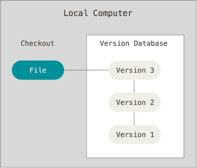

Рис.1. Локальні системи керування версіями.

СКВ дає можливість:

-   зберігати код;

-   запам'ятовувати історію змін до коду, та дозволяти у будь-який момент побачити хто саме зробив зміни, коли зробив зміни;

-   відкотитися до будь-якої версії коду у будь-який момент;

-   об'єднувати зміни різних версій, станів та розробників;

Наступним важливим питанням, з яким стикаються люди, є необхідність співпрацювати з іншими розробниками. Щоб справитися з цією проблемою, були розроблені централізовані системи керування версіями (ЦСКВ). Такі системи як CVS, Subversion і Perforce, мають єдиний сервер, який містить всі версії файлів, та деяке число клієнтів, які отримують файли з центрального місця.


Рис. 2. Централізовані системи керування версіями.

Такий підхід має безліч переваг, особливо над локальними СКВ. Наприклад, кожному учаснику проекту відомо, певною мірою, чим займаються інші. Адміністратори мають повний контроль над тим, хто і що може робити. Набагато легше адмініструвати ЦСКВ, ніж мати справу з локальними базами даних для кожного клієнта. Але цей підхід також має деякі серйозні недоліки. Найбільш очевидним є єдина точка відмови, яким є централізований сервер. Якщо сервер виходить з ладу протягом години, то протягом цієї години ніхто не може співпрацювати або зберігати зміни над якими вони працюють. Якщо жорсткий диск центральної бази даних на сервері пошкоджено, і своєчасні резервні копії не були зроблені, то втрачається абсолютно все --- вся історія проекту, крім одиночних знімків проекту, що збереглися на локальних машинах людей. Локальні СКВ страждають тією ж проблемою --- щоразу, коли вся історія проекту зберігається в одному місці, ви ризикуєте втратити все.

У розподілених системах керування версіями (РСКВ, Distributed Version Control System) клієнти не просто отримують останній знімок файлів репозиторія: натомість вони є повною копією сховища разом з усією його історією. Таким чином, якщо ламається який-небудь сервер, через який співпрацюють розробники, будь-який з клієнтських репозиторіїв може бути скопійований назад до серверу, щоб відновити його. Кожна копія дійсно є повною резервною копією всіх даних. Крім того, багато з цих систем дуже добре взаємодіють з декількома віддаленими репозиторіями, так що можна співпрацювати з різними групами людей, застосовуючи різні підходи в межах одного проекту одночасно. Це дозволяє налаштувати декілька типів робочих процесів, таких як ієрархічні моделі, які неможливі в централізованих системах.

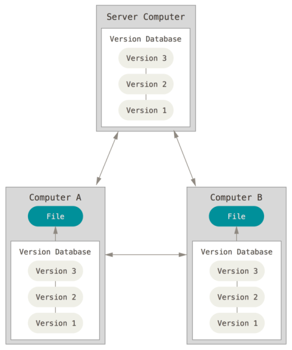

Рис 3. Розподілені системи керування версіями.

## Система керування версіями GIT.

***Git*** --- розподілена система керування версіями файлів та спільної роботи. Проект створив Лінус Торвальдс для керування розробкою ядра Linux, а сьогодні підтримується Джуніо Хамано (англ. Junio C. Hamano). Git є однією з найефективніших, надійних і високопродуктивних систем керування версіями, що надає гнучкі засоби нелінійної розробки, що базуються на відгалуженні і злитті гілок. Програма є вільною і випущена під ліцензією GNU GPL версії 2.

Система спроектована як набір програм, спеціально розроблених з врахуванням їхнього використання у скриптах. Це дозволяє зручно створювати спеціалізовані системи керування версіями на базі Git або користувацькі інтерфейси. Система має ряд користувацьких інтерфейсів: наприклад, **gitk** та **git-gui** розповсюджуються з самим Git. Віддалений доступ до репозиторіїв Git забезпечується git-демоном (службою), SSH або HTTP сервером.

### Встановлення та початкове конфігурування Git 

Для керування Git можна використовувати різні варіанти клієнтів, зокрема Git-SCM <https://git-scm.com/downloads>. Крім оригінальних клієнтів командного рядка, є безліч клієнтів з графічним інтерфейсом користувача з різними можливостями. Командний рядок --- єдине місце, де можна виконувати всі команди Git, оскільки більшість графічних інтерфейсів для простоти реалізують тільки деяку підмножину функціональності Git. Для інсталяції Git під Windows достатньо перейти за посиланнями <http://git-scm.com/download/win> і завантаження почнеться автоматично.

#### Конфігурування (config)

Після інсталяції Git необхідно провести початкові налаштування. До Git входить утиліта що має назву git config, яка дозволяє отримати чи встановити параметри, що контролюють усіма аспектами того, як Git виглядає чи працює. Ці параметри можуть бути збережені в різних місцях. У системах Windows, Git шукає файл .gitconfig в каталозі \$HOME (C:\\Users\\\$USER для більшості користувачів). Він також все одно шукає файл /etc/gitconfig, хоча відносно кореня MSys, котрий знаходиться там, де ви вирішили встановити Git у вашій Windows системі, коли ви запускали інсталяцію. Є також системний конфігураційний файл C:\\ProgramData\\Git\\config. Цей файл може бути зміненим лише за допомогою git config -f \<файл\> адміністратором.

Перше, що необхідно зробити після інсталяції Git - встановити ім'я користувача та адресу електронної пошти. Це важливо, тому що кожен коміт в Git використовує цю інформацію, і вона незмінно включена у комміти, які ви робите:

```bash
$ git config --global user.name "John Doe"
$ git config --global user.email johndoe@example.com
```

Знову ж таки, якщо ви передаєте опцію \--global, ці налаштування потрібно зробити тільки один раз, тоді Git завжди буде використовувати цю інформацію для всього, що ви робите у цій системі. Якщо ви хочете, перевизначити ім'я або адресу електронної пошти для конкретних проектів, ви можете виконати цю ж команду без опції \--global в каталозі необхідного проекту. Багато з графічних інструментів допомагають зробити це при першому запуску.

Якщо ви хочете подивитися на свої налаштування, можете скористатися командою

```bash
$ git config –-list
```

, щоб переглянути всі налаштування, які Git може знайти.

#### Виклик допомоги (help)

Для отримання допомоги по конкретній команді, можна викликати:

```bash
$ git help <command>
```

або

```bash
$ git <command> -h
```

### Основи роботи з Git для локального репозиторію

Більшість дій можна виконувати на локальній файловій системі без використання інтернет підключення. Вся історія змін зберігається локально і при необхідності вивантажується у віддалений репозиторій. На відміну від Subversion, де без підключення до інтернету можна лише редагувати файли, але зберегти зміни в вашу базу даних неможливо (оскільки вона відключена від репозиторія), будь-який знімок спочатку робиться локально, а потім вивантажується у віддалений репозиторій.

Git, на відміну від Subversion і подібних до неї систем, не зберігає інформацію як список змін (патчів) для файлів. Замість цього Git зберігає дані набором знімків. Кожного разу при фіксації поточної версії проекту Git зберігає зліпок того, як виглядають всі файли проекту. Але якщо файл не змінювався, то дається посилання на раніше збережений файл (див. рис. 4). Git схожий на своєрідну файлову систему з інструментами, які працюють поверх неї.

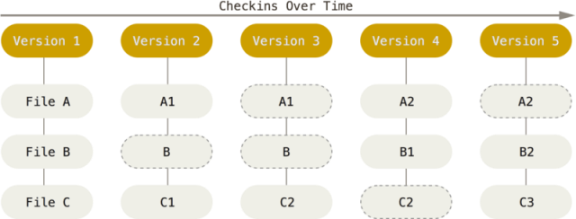

Рис. 4. Дані як зліпки стану проекту в часі

Усі зміни користувачем проводяться у файлах ***робочої директорії*** (Working Directory). По суті, робоча директорія -- це місце розміщення плинної редагованої версії усіх файлів проекту (див.рис.5). У робочій директорії знаходиться папка «.git», яка вміщує ***репозиторій проекту***, тобто базу даних всієї необхідної інформації для контролю версій: зліпки файлів, розмір, час створення і останньої зміни. За необхідності фіксації файлів робочої папки вони передаються і зберігаються в репозиторію, при необхідності редагування конкретної версії -- витягуються з репозиторію.

У своїй базі Git зберігає все по контрольним сумам (хешам) файлів. Перед кожним збереженням файлів Git, використовуючи спеціальний алгоритм (SHA-1) за змістом файлу обчислює хеш (контрольну суму). Отриманий хеш стає унікальним індексом файлу в Git. Використовуючи хеш Git легко відслідковує зміни в файлах.

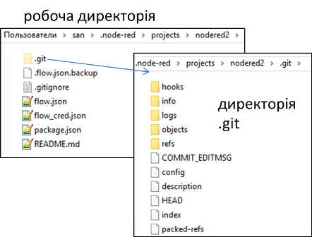

Рис. 5. Робоча директорія

При редагуванні файлів в робочій директорії вони змінюються, тобто не відповідають їх версії в репозиторію. Коли змінювані (***modified***) файли є сенс зафіксувати в репозиторії, спочатку їх індексують (***stage***). Під час індексації, у файл індекса, який також називають областю додавання (***staging area***), що  зазвичай знаходиться в директорії Git, розміщується інформація про те, що саме буде зафіксовано у наступному знімку (див.рис.6). Після індексації усіх необхідних файлів, фіксація проводиться командою ***commite***, а файли вважаються зафіксованими або «збереженими в коміті» (***commited***).

Таким чином, у випадку, якщо окрема версія файлу вже є в директорії Git, цей файл вважається збереженим у коміті. Якщо він зазнав змін і перебуває в індексі, то він індексований. Якщо ж його стан відрізняється від того, який був у коміті, і файл не знаходиться в індексі, то він називається зміненим. У [Основи Git](https://git-scm.com/book/uk/v2/ch00/ch02-git-basics-chapter) ви дізнаєтесь більше про ці стани, а також про те, як використовувати їхні переваги або взагалі пропускати етап індексу.

> 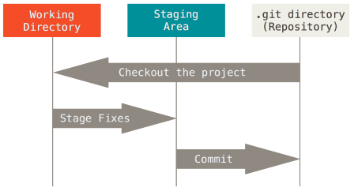
>
> Рис. 6. Області збереження в Git.

#### Створення порожнього локального репозиторію (init)

Для роботи з проектом, що наразі не перебуває під СКВ, спочатку треба перейти до теки цього проекту. У командному рядку Windows для цього можна використати команду cd:

```bash
$ cd /c/user/my_project
```

та виконати:

```bash
$ git init
```

Це створить новий підкаталог .git, який містить всі необхідні файли репозиторія --- скелет Git-репозиторія. На цей момент, у даному проекті ще нічого не відстежується. Якщо необхідно додати існуючі файли під керування версіями (на відміну від порожнього каталогу), слід проіндексувати ці файли і зробити перший коміт. Це можна зробити за допомогою декількох команд git add, що означують файли, за якими необхідно слідкувати, після яких треба виконати git commit:

```bash
$ git add *.c
$ git add LICENSE.txt
$ git commit -m 'Перша версія проекту'
```

У цьому прикладі було проіндексовано усі файли з розширенням \*.c та файл LICENSE.txt, після чого вони були зафіксованими в коміті.

Після цих команд на машині буде локальний Git репозиторій та робоча директорія з усіма файлами цього проекту. При кожній зміні файлів в робочій не обов'язково їх відправляти в репозиторій. Зазвичай, це робиться коли треба зафіксувати певну версію проекту для можливості повернення до неї.

Кожен файл робочої директорії може бути в одному з двох станів (рис.7): ***контрольований*** (***tracked***) чи ***неконтрольований*** (***untracked***). Контрольовані файли --- це файли, що були в останньому знімку. Вони можуть бути не зміненими (***unmodified***), зміненими (***modified***) або індексованими (staged). Якщо стисло, контрольовані файли --- це файли, про які Git щось знає. Неконтрольовані файли --- це все інше, будь-які файли у вашій робочій директорії, що не були у вашому останньому знімку та не існують у вашому індексі. Якщо ви щойно зробили клон репозиторія, усі ваші файли контрольовані та не змінені, адже Git щойно їх отримав, а ви нічого не редагували.

По мірі редагування файлів, Git бачить, що вони змінені, адже їх змінили після останнього коміту. Впродовж роботи розробник вибірково індексує ці змінені фали та потім зберігає всі індексовані зміни, та цей цикл повторюється.

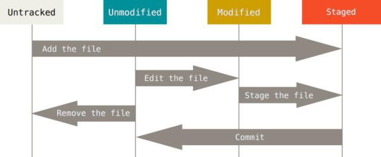

Рис. 7. Стан файлів Git в робочій директорії

#### Перевірка стану репозиторію (status)

Перевірку стану можна зробити через команду git status , або через git status -s для короткої версії статусу

Для того, щоб Git не звертав уваги на деякі файли в робочій директорії, можна створити файл .gitignore, що містить шаблони, за яким файли ігноруються.

#### Добавлення до індексу (add)

Добавлення нових або змінених файлів до індексу робиться з використанням команди

```bash
$ git add <файли>
```

Команда git add приймає шлях файлу або директорії. Якщо це директорія, команда додає усі файли в цій директорії включно з піддерикторіями. git add багатоцільова команда --- її слід використовувати щоб почати контролювати нові файли, щоб додавати файли, та для інших речей, наприклад позначання конфліктних файлів як розв'язаних.

#### Перегляд змін (diff)

Команда git diff показує які саме зміни були внесені у змінені файли відносно останнього коміту.

#### Створення відбитку (commit)

Для внесення індексованих файлів в коміт, використовується команда

```bash
$ git commit
```

Додавання опції -a до команди git commit, змушує Git автоматично додати кожен файл, що вже контролюється, до коміту, що дозволяє вам пропустити команди git add.

Щоб видалити файл з Git, вам треба прибрати його з контрольованих файлів (вірніше, видалити його з вашого індексу) та створити коміт. Це робить команда git rm, а також видаляє файл з вашої робочої директорії, щоб наступного разу він не відображався неконтрольованим. Якщо ви просто видалите файл з вашої робочої директорії, він з'явиться під заголовком "Changes not staged for commit" (тобто, *неіндексованим*) виводу команди git status. Потім, якщо ви виконаєте git rm, файл буде індексованим на видалення.

#### Перейменування (mv)

Для перейменування файлу у Git, можна виконати наступну команду:

```bash
$ git mv стара_назва нова_назва
```

Для перегляду історії комітів використовується команда git log , яка має багато опцій для налаштувань.

### Основи роботи з галуженнями

Як вже зазначалося, Git зберігає дані не як послідовність змін, а як послідовність знімків. Коли фіксуються зміни (див.рис.7), Git зберігає об'єкт фіксації, що містить вказівник на знімок файлу, ім'я та поштову адресу автора, набране при коміті повідомлення та вказівники на попередні фіксації (parent). При першій фіксації (98ca9 на рис.7), посилання на попередню буде нульовим. Кожна інша фіксація буде містити посилання на попередню (стрілками вказується саме посиалння на попередній коміт а не послідовність). Таким чином формується одна гілка з усією історією фіксацій.


Рис.7. Фіксації та їх батьки.

Гілка в Git це просто легкий вказівник, що може пересуватись, на одну з цих фіксацій шляхом поступового переходу між ними. Загальноприйнятим ім'ям першої гілки в Git є ***master***. При ініціалізації (створенні) репозиторія, за замовчуванням, Git створює тільки цю гілку. Коли ви почнете робити фіксації, вам надається гілка master, що вказує на останню зроблену фіксацію. Таким чином, щоразу, коли відбувається фіксація, вказівник «переміщується» вперед на останню фіксацію автоматично.

Галуження (***branches***) --- це відмежування від основної лінії розробки для продовження своєї частини роботи та уникнення конфліктів з основною лінією. Git дозволяє створити декілька гілок і перемикатися між ними. Це корисно, оскільки дозволяє працювати декільком розробникам над своїм функціоналом не заважаючи іншим і не псуючи основну гілку. Гілки у Git дуже просто використовувати. Приклад використання галужень в проекті показаний на рис.8.

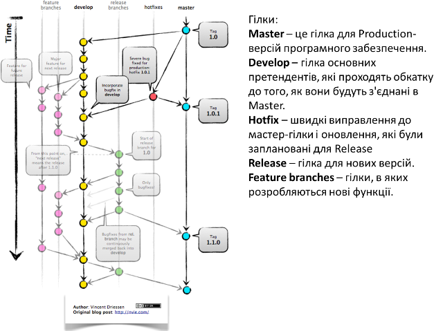

рис.8.Використання галужень в проекті

З певного моменту код розгалуджуєтья, над кожною гілкою можна працювати окремо, наприклад кільком розробникам, а тоді гілки об'єднуються назад у головну гілку, де всі можуть бачити і використовувати зроблені зміни.

Гілка в Git просто є вказівником на одну із фіксацій. При кожній новій фіксації гілка в Git рухається автоматично (тобто перемикається на конкретну фіксацію). Гілка є простим файлом, який містить 40 символів контрольної суми SHA-1 фіксації. Тобто коли створюється нова гілка, створюється новий файл-вказівник, який вказує на конкретну фіксацію.

#### Створення нової гілки (branch \<name\>) 

Наприклад, створюється нова гілку під назвою testing. Це робиться за допомогою команди git branch:

```bash
$ git branch testing
```

У результаті цього створюється новий вказівник на фіксацію, в якій ви зараз знаходитесь.

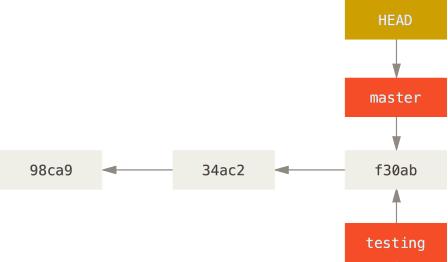

рис.9. Дві гілки вказують на одну послідовність фіксацій

У певний момент часу Git знаходиться на одній із гілок. Для цього він зберігає особливий вказівник під назвою ***HEAD*** - це просто вказівник на активну локальну гілку. Команда git branch тільки створює нову гілку --- вона не переключає на неї, а залишається на активній.

#### Переключення на гілку (checkout)

Щоб переключитися на існуючу гілку, треба виконати команду git checkout. Наприклад для переключення на нову гілку testing:

```bash
$ git checkout testing
```

Це пересуває HEAD, щоб він вказував на гілку testing.

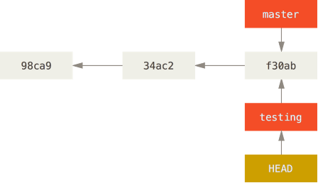

рис.10. HEAD вказує на поточну гілку

Після чергової фіксації, гілка testing пересунулась уперед, а гілка master досі вказує на фіксацію, що був у момент виконання git checkout для переключення гілок.

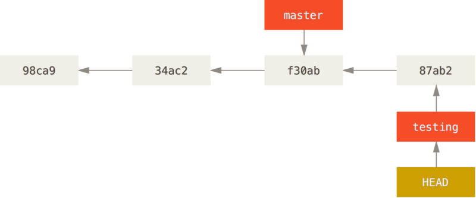

рис.11. Гілка testing пересувається уперед при фіксації

Після переключення назад до гілки master:

```bash
$ git checkout master
```

вказівник HEAD пересувається назад на гілку master, та повертаються файли у робочій папці до стану знімку, на який вказує master. Це також означає, що якщо зараз робляться нові зміни, вони будуть походити від ранішої версії проекту (рис.12).

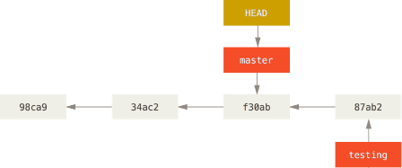

рис.12. HEAD пересувається, коли ви отримуєте (checkout)

Важливо зауважити, що коли переключаються гілки в Git, файли у робочій директорії змінюються. Якщо переключитися до старшої гілки, робоча папка буде повернута до того стану, який був на момент останнього фіксування у тій гілці. Якщо Git не може зробити це без проблем, він не дасть переключитися взагалі.

Якщо зробити декілька змін та зафіксувати:

```bash
$ git commit -a -m 'Зробив інші зміни'
```

то історія проекту розійшлася (diverged) по двом різним гілкам. Ви створили гілку, дещо в ній зробили, переключились на головну гілку та зробили там щось інше. Обидві зміни ізольовані в окремих гілках. Ви можете переключатись між цими гілками та злити їх разом, коли вони будуть готові. І все це робиться за допомогою простих команд branch, checkout та commit.

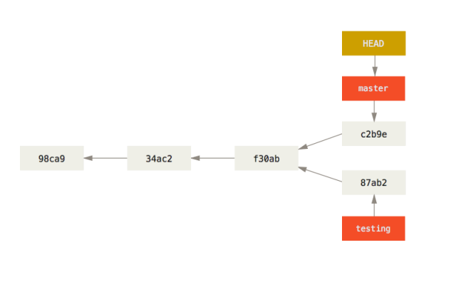

рис.13. Розходження історій

#### Зливання(об'єднання) гілок (merge)

Зливання (об'єднання, ***merge***, мердж) гілок покажемо на прикладі. Припустимо є три гілки mster, iss53 і hotfix (рис.14).


рис.14. Приклад з 3-ма гілками

Для злиття (merge) гілки hotfix до master використовується команда git merge. Перед цим за допомогою checkout йде переключення на гілку master

```bash
$ git checkout master
$ git merge hotfix
Updating f42c576..3a0874c
Fast-forward
 index.html | 2 ++
 1 file changed, 2 insertions(+)
```

Зверніть увагу на фразу "fast-forward" у цьому злитті. Через те, що коміт C4, який зливався, належав гілці hotfix, що була безпосередньо попереду поточного коміту C2, Git просто переміщує вказівник вперед. Іншими словами, коли ви зливаєте один коміт з іншим, і це можна досягнути слідуючи історії першого коміту, Git просто переставляє вказівник, оскільки немає змін-відмінностей, які потрібно зливати разом - це називається "перемоткою" ("fast-forward"). Тепер це має вигляд як на рис.15

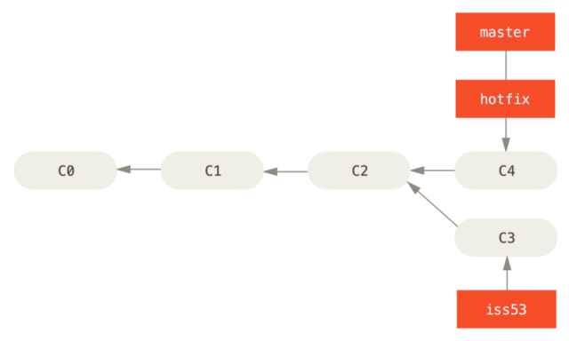

рис.15. master перемотаний на hotfix

#### Видалення гілок (branch -d)

Для видалення гілки hotfix використовується команда git branch з опцією -d:

```bash
$ git branch -d hotfix
Deleted branch hotfix (3a0874c).
```

Deleted branch hotfix (3a0874c).

Зауважте, що тепер зміни з гілки hotfix відсутні в гілці iss53. Якщо вам потрібні ці зміни підчас роботи над iss53, ви можете злити master з iss53 командою git merge master, або просто почекати до того моменту коли ви будете інтегровувати iss53 в master.

Припустимо, що необхідно злити iss53 з гілкою master. Все що потрібно це перемкнутися на робочу гілку і виконати команду git merge:

```bash
$ git checkout master
Switched to branch 'master'
$ git merge iss53
Merge made by the 'recursive' strategy.
index.html |    1 +
1 file changed, 1 insertion(+)
```

Виглядає трошки інакше, ніж те, що було з гілкою hotfix. У цьому випадку історія змін двох гілок почала відрізнятися в якийсь момент. Оскільки коміт поточної гілки не є прямим нащадком гілки, в яку зливаються зміни, Git мусить робити триточкове злиття, користуючись двома знімками, що вказують на гілки та третім знімком - їх спільним нащадком.

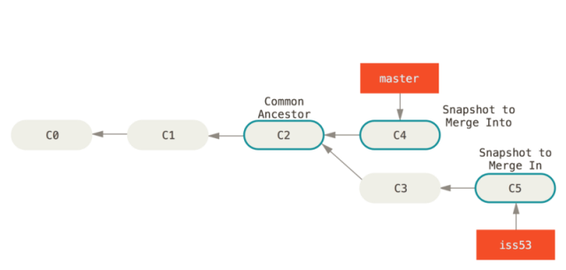

рис.16. Три відбитки типового злиття

Замість того, щоб просто пересунути вказівник гілки вперед, Git створює новий знімок, що є результатом 3-точкового злиття, і автоматично створює новий коміт, що вказує на нього. Його називають комітом злиття (merge commit) та його особливістю є те, що він має більше одного батьківського коміту.

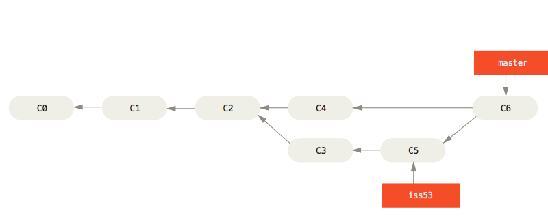

рис.17. Коміт злиття

Варто зауважити, що Git сам визначає найбільш підходящого спільного нащадка, якого брати за основу зливання.

Трапляється, що цей процес не проходить гладко. Якщо ви маєте зміни в одному й тому самому місці в двох різних гілках, Git не зможе їх просто злити. Якщо підчас роботи над iss53 ви поміняли ту саму частину файлу, що й у гілці hotfix, ви отримаєте конфлікт, що виглядає приблизно так:

```bash
$ git merge iss53
Auto-merging index.html
CONFLICT (content): Merge conflict in index.html
Automatic merge failed; fix conflicts and then commit the result.
```

У цьому випадку Git не створив автоматичний коміт зливання. Він призупинив процес допоки ви не вирішите конфлікт. Для того, щоб переглянути знову які саме файли спричинили конфлікт, спочатку треба переглянути git status:

Все, що має конфлікти, які не були вирішені є в списку ***незлитих*** (***unmerged***) файлів. У кожен такий файл Git додає стандартні позначки-вирішенння для конфліктів, отже ви можете відкрити ці файли і вирішити конфлікти самостійно. Якщо ви хочете використовувати графічний інструмент для розв'язання конфліктів, виконайте команду git mergetool, яка запустить графічний редактор та проведе вас по всьому процесу.

#### Перегляд гілок (branch)

Перегляд усіх гілок доступний через команду

```bash
$ git branch
  iss53
* master
  testing
```

Зверніть увагу на символ \* перед master: це вказівник на вашу поточно вибрану гілку (тобто ту, на котру вказує HEAD). Це означає, що якщо ви зараз захочете зробити коміт, master оновиться вашими новими змінами. Щоб побачити ваші останні коміти - запустіть git branch -v:

```bash
$ git branch -v
  iss53   93b412c fix javascript issue
* master  7a98805 Merge branch 'iss53'
  testing 782fd34 add scott to the author list in the readmes
```

Опції \--merged та \--no-merged корисні для фільтрування списку гілок залежно від того чи вони були злиті з поточною гілкою.

#### Тегування (tag)

Команда git tag використовується, щоб створити сталу закладку на окремий момент в історії коду. Зазвичай, це використовується для речей, на кшталт видань (release). Отримати список доступних теґів у Git можна через команду git tag (з опціональним -l чи \--list), наприклад:

```bash
$ git tag
v0.1
v1.3
```

Детальніше інформацію про тегування можна отримати [за посиланням](https://git-scm.com/book/uk/v2/%D0%9E%D1%81%D0%BD%D0%BE%D0%B2%D0%B8-Git-%D0%A2%D0%B5%D2%91%D1%83%D0%B2%D0%B0%D0%BD%D0%BD%D1%8F).

#### Скидання (reset)

Деталі [за посиланням](https://git-scm.com/book/uk/v2/%D0%86%D0%BD%D1%81%D1%82%D1%80%D1%83%D0%BC%D0%B5%D0%BD%D1%82%D0%B8-Git-%D0%A3%D1%81%D0%B2%D1%96%D0%B4%D0%BE%D0%BC%D0%BB%D0%B5%D0%BD%D0%BD%D1%8F-%D1%81%D0%BA%D0%B8%D0%B4%D0%B0%D0%BD%D0%BD%D1%8F-reset).

### Робота з віддаленим репозиторієм

Задля співпраці з будь-яким проектом Git, необхідно знати, як керувати віддаленими сховищами. ***Віддалені сховища*** (***Remote repositories***) --- це версії вашого проекту, що розташовані в Інтернеті, або десь у мережі. Їх може бути декілька, кожне зазвичай або тільки для читання, або для читання та змін. Співпраця з іншими вимагає керування цими віддаленими сховищами, надсилання (pushing) та отримання (pulling) даних до та з них, коли ви хочете зробити внесок. Керування віддаленими сховищами потребує знань про додавання віддалених сховищ, видалення сховищ, що більше не потрібні, керування різноманітними віддаленими гілками та визначення слідкування за ними, і багато іншого. У цій секції, ми пройдемо ці вміння керування віддаленими сховищами.

Цілком можливо, що ви працюватимете з "віддаленим" сховищем, що, насправді, міститься на тій саме машині, що ви за нею працюєте. Слово "віддалений" не обов'язково означає, що сховище зберігається десь в мережі чи Інтернеті --- лише що воно деінде. Взаємодія з таким віддаленим сховищем все одно включатиме звичні операції push, pull і fetch --- як і з будь-яким іншим віддаленим сховищем.

#### Додавання нового віддаленого сховища (remote add).

Щоб додати нове віддалене Git сховище під заданим ім'ям, на яке ви можете легко посилатись, виконайте git remote add \<ім'я\> \<посилання\>:

```bash
$ git remote add pb https://github.com/paulboone/ticgit
$ git remote -v
```

Тепер ви можете використати рядок pb в командному рядку замість повного посилання. Наприклад гілка master в ньому буде доступна локально як pb/master.

#### Отримання нових даних з віддаленого сховища (fetch).

Щоб отримати дані з ваших віддалених проектів, ви можете виконати:

```bash
$ git fetch <remote>
```

Команда `git fetch`, під час виконання, отримує всі оновлення, яких ви ще не маєте, але, зовсім не змінює вашу робочу директорію. Вона просто отримує дані для того, щоб ви могли самотужки злити зміни. Існує команда `git pull`, яка, по своїй суті та в більшості випадків, є послідовним виконанням команд `git fetch` та `git merge`. Якщо у вас є відслідковувана гілка (див [відслідковувані гілки](#tracking_branch) ), — створена та самостійно налаштована, чи як результат `clone` чи `checkout`, команда `git pull` буде звертатися до відслідковуваних сервера та віддаленої гілки, отримувати оновлення і тоді робити спробу зливання. Переважно простіше користуватися `fetch` та `merge` явно, оскільки магічний `git pull` часом може збивати з пантелику.

#### Отримання нових даних з віддаленого сховища зі зливанням (pull).

Команда `git pull` є загалом комбінацією `git fetch` та `git merge`, тобто Git отримає зміни зі заданого віддаленого сховища, а потім одразу спробує злити їх до поточної гілки.

#### Клонування віддаленого сховища (clone).

Для отримання копії існуючого Git репозиторія --- наприклад, проекту, в якому ви хочете прийняти участь --- вам потрібна команда git clone. Замість отримання просто робочої копії, Git отримує повну копію майже всіх даних, що є у сервера. Коли виконується git clone кожна версія кожного файлу в історії проекту витягується автоматично. Насправді, якщо щось станеться з диском вашого серверу, ви зазвичай можете використати майже будь-який з клонів на будь-якому клієнті щоб повернути сервер до стану на момент клонування.

Щоб клонувати репозиторій через протокол HTTP треба використати команду git clone \<url\>. Наприклад, якщо ви бажаєте зробити клон бібліотеки Git libgit2, ви можете це зробити так:

```bash
$ git clone https://github.com/libgit2/libgit2
```

Це створить директорію під назвою libgit2, проведе ініціалізацію директорії .git, забере всі дані для репозиторія, та приведе директорію до стану останньої версії. Якщо ви зайдете до щойно створеної директорії libgit2, ви побачите, що всі файли проекту на місці, готові для використання.

Якщо ви бажаєте зробити клон репозиторія в директорію з іншою назвою, ви можете передати її як другий параметр команди:

```bash
$ git clone https://github.com/libgit2/libgit2 mylibgit
```

Ця команда робить те саме, що й попередня, тільки цільова директорія називається mylibgit.

При необхідності використання протоколу SSH, команда клонування буде мати такий синтаксис:

```bash
$ git clone user@server:шлях_до_репозиторія.git.
```

Команда git clone насправді є чимось на кшталт обгортки над декількома іншими командами. Вона створює нову директорію, переходить до неї та виконує git init, щоб зробити порожнє сховище Git, додає віддалене сховище (git remote add) з URL, яке ви надали їй (типово називає його origin), виконує git fetch з нього, а потім отримує останній коміт до вашої робочої директорії за допомогою git checkout.

Якщо ви зробили клон сховища, команда автоматично додає це віддалене сховище під ім'ям "origin". Отже, git fetch origin отримує будь-яку нову працю, що її виклали на той сервер після того, як ви зробили його клон (або востаннє отримували зміни з нього). Важливо зауважити, що команда git fetch лише завантажує дані до вашого локального сховища ---вона автоматично не зливає їх з вашою роботою, та не змінює вашу поточну працю. Вам буде потрібно вручну її злити, коли ви будете готові.

Якщо ваша поточна гілка налаштована слідкувати за віддаленою гілкою, ви можете виконати команду git pull щоб автоматично отримати зміни та злити віддалену гілку до вашої поточної гілки. Це може бути легшим та зручнішим методом для вас. Та команда git clone автоматично налаштовує вашу локальну гілку master слідкувати за віддаленою гілкою master (хоча вона може називатись і по іншому) на віддаленому сервері, з якого ви зробили клон. Виконання git pull зазвичай дістає дані з серверу, з якого ви зробили клон, та намагається злити її з кодом, над яким ви зараз працюєте.

#### Перегляд налаштованих віддалених серверів (remote).

Щоб побачити, які віддалені сервера налаштовувані в Git, ви можете виконати команду git remote. Вона виводить список коротких імен кожного віддаленого сховища, яке ви задали. Якщо ви отримали своє сховище клонуванням, ви маєте побачити хоча б origin   ---таке ім'я Git дає серверу, з якого ви зробили клон. Ви також можете дати опцію -v, яка покаже вам посилання, які Git зберігає та використовує при читанні та записі до цього сховища.

#### Надсилання змін до віддалених сховищ (push)

Коли ви довели свій проект до стану, коли хочете ним поділитись, вам треба надіслати (push) ваші зміни нагору (upstream). Це робиться простою командою:

```bash
git push <назва сховища> <назва гілки> 
```

Якщо ви бажаєте викласти свою гілку master до вашого серверу origin (клонування зазвичай налаштовує обидва імені для вас автоматично), ви можете виконати наступне для надсилання всіх зроблених комітів до сервера:

```bash
$ git push origin master
```

Ця команда спрацює тільки в разі, якщо ви зробили клон з серверу, до якого у вас є доступ на запис, та ніхто не оновлював його після цього. Якщо хтось інший зробив клон та надіслав щось назад перед вами, вашій спробі буде слушно відмовлено. Вам доведеться спершу отримати їхню працю й вбудувати її до вашої до того, як вам дозволять надіслати свої зміни.

#### Оглядання віддаленого сховища (remote show)

Якщо ви бажаєте більше дізнатись про окреме віддалене сховище, ви можете використати команду

```bash
git remote show <назва сховища>
```

Ця команда показує, до яких гілок автоматично надсилаються ваші зміни, коли ви виконуєте git push, доки перебуваєте на певної гілці. Вона також показує, яких віддалених гілок з серверу у вас нема, які віддалені гілки, що у вас є, були видалені з серверу, і декілька локальних гілок, що можуть автоматично зливатися з віддаленими гілками, за якими стежать, коли ви виконуєте git pull.

Якщо ви виконаєте цю команду з окремим ім'ям, наприклад origin, ви отримаєте щось на кшталт:

```bash
$ git remote show origin
* remote origin
  Fetch URL: https://github.com/schacon/ticgit
  Push  URL: https://github.com/schacon/ticgit
  HEAD branch: master
  Remote branches:
    master                               tracked
    dev-branch                           tracked
  Local branch configured for 'git pull':
    master merges with remote master
  Local ref configured for 'git push':
    master pushes to master (up to date)
```

Вона виводить посилання для віддаленого сховища, а також інформацію про слідкування за гілками. Команда ґречно розповідає вам, що якщо ви на гілці master та виконаєте команду git pull, вона автоматично зіллє гілку master з віддаленою після того, як отримає всі дані з віддаленого сховища. Також видано список усіх віддалених посилань, які були забрані.

#### Перейменування віддалених сховищ (remote rename)

Ви можете виконати git remote rename, щоб перейменувати віддалене сховище. Наприклад, щоб перейменувати pb на paul, ви можете зробити це за допомогою git remote rename:

```bash
$ git remote rename pb paul
$ git remote
origin
paul
```

Варто зазначити, що це змінює і всі назви ваших віддалених гілок. Що раніше мало назву pb/master, тепер називається paul/master.

#### Видалення віддалених сховищ (remote remove)

Якщо ви з якоїсь причини бажаєте видалити віддалене сховище --- ви перемістили сервер або більше не використовуєте якесь дзеркало, або можливо хтось припинив співпрацю --- ви можете використати git remote remove або git remote rm:

```bash
$ git remote remove paul
$ git remote
origin
```

На рис.18 показаний приклад з основними командами для роботи з віддаленим репозиторієм. Спочатку усі зміни проводяться з локальним репозиторієм. Потім за необхідності внести зміни в проект у віддаленому репозиторії виконується команда «push».

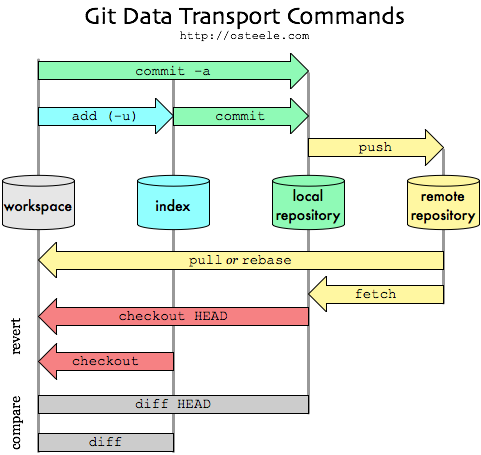

рис.18. Коміт злиття

#### Віддалені гілки

Віддалені посилання — це посилання (вказівники) у ваших віддалених сховищах: гілки, теґи тощо. Для повного списку віддалених посилань виконайте `git ls-remote [remote]`, або `git remote show [remote]` для детальної інформації про віддалені гілки. Проте, найпоширеніше застосування — це віддалено-відслідковувані гілки.

Віддалено-відслідковувані гілки — це вказівники на стан віддалених  гілок. Локально ці вказівники неможливо змінити, але їх змінює Git, коли ви  виконуєте мережеві операції, щоб вони точно відповідали стану  віддаленого сховища. Вважайте їх закладками, що нагадують вам про стан віддалених  репозиторіїв на момент вашого останнього зв’язку з ними.

Віддалені гілки мають такий запис: `<віддалене сховище>/<гілка>`. Наприклад, якщо ви хочете побачити як виглядала гілка `master` з віддаленого сховища `origin`, коли ви востаннє зв’язувалися з ним, перейдіть на гілку `origin/master`. Припустимо, ви працювали з колегами над одним завданням і вони вже виклали свої зміни. У вас може бути своя локальна гілка `iss53`, але гілці на сервері відповідатиме віддалена гілка `origin/iss53`.

Розгляньмо приклад. Скажімо, ви працюєте з Git сервером, що доступний у вашій мережі за адресою `git.ourcompany.com`. Коли ви склонуєте з нього, команда `clone` автоматично іменує його `origin`, стягує всі дані, створює вказівник на те місце, де зараз знаходиться `master` і локально іменує це посилання `origin/master`, щоб ви могли з чогось почати працювати.

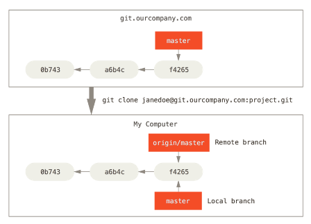

Якщо ви виконали якусь роботу на локальній гілці `master`, і водночас, хтось виклав зміни на `git.ourcompany.com` в `master`, тоді ваші історії прогресують по-різному. Доки ви не синхронізуєтесь з сервером, вказівник `origin/master` не буде рухатись.

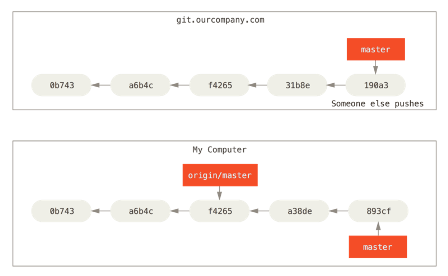

Щоб відновити синхронність, виконайте команду `git fetch origin`. Ця команда шукає який сервер відповідає імені “origin” (у нашому випадку `git.ourcompany.com`), отримує дані, яких ви ще не маєте і оновлює вашу локальну базу даних, переміщаючи вказівник `origin/master` на нову, більш актуальну, позицію.


Щоб продемонструвати роботу з кількома віддаленими серверами і як  виглядають віддалені гілки для віддалених проектів, уявімо, що ви маєте  ще один внутрішній Git сервер, котрий використовує лиш одна з ваших  спринт команд. Cервер розташований за адресою `git.team1.ourcompany.com`. Ви можете додати його як нове віддалене посилання до вашого поточного проекту за допомогою команди `git remote add`, як розповідалося в [Основи Git](https://git-scm.com/book/uk/v2/ch00/ch02-git-basics-chapter). Дайте йому ім’я `teamone`, і це буде вашим скороченням для повного URL.

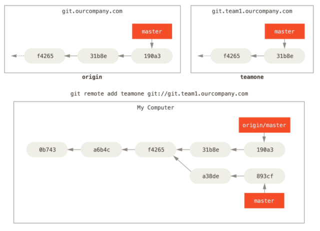

Тепер виконайте `git fetch teamone` щоб витягнути з `teamone` всі оновлення. Оскільки `teamone` на даний момент є підмножиною `origin`, то Git не отримує нових даних і нічого не оновлює, а просто ставить віддалено-відслідковувану гілку `teamone/master` вказувати на коміт, на котрому зараз знаходиться гілка `master` для сервера `origin`.


#### Відслідковувані гілки {#tracking_branch}

Перемикання на локальну гілку з віддалено-відслідковуваної автоматично  створює так звану відслідковувану гілку “tracking branch” (а гілка, за  якою вона стежить називається “upstream branch”). Відслідковувані гілки — це локальні гілки, що мають безпосередній  зв’язок з віддаленою гілкою. Якщо ви знаходитеся на відслідковуваній гілці і потягнете зміни,  виконуючи `git pull`, Git відразу знатиме з якого сервера брати та з якої гілки зливати зміни.

```bash
$ git branch master --track origin/master
```

Коли ви клонуєте репозиторій, Git автоматично створює гілку `master`, яка слідкує за `origin/master` Проте, ви можете налаштувати й інші відслідковувані гілки — такі, що  слідкують за іншими віддаленими посиланнями, або за гілкою, відмінною  від `master`. Як у випадку, що ви бачили в прикладі, виконуючи `git checkout -b <гілка> <назва віддаленого сховища>/<гілка>`. Це досить поширена дія, Git має опцію `--track` для скороченого запису:

```bash
$ git checkout --track origin/serverfix
Branch serverfix set up to track remote branch serverfix from origin.
Switched to a new branch 'serverfix'
```

Насправді, це настільки поширено, що навіть для цього скорочення є  скорочення. Якщо назва гілки, яку ви намагаєтеся отримати (а) не існує і (б) має таку саму назву, як і гілка тільки з одного віддаленого  сховища, то Git створить стежачу гілку:

```bash
$ git checkout serverfix
Branch serverfix set up to track remote branch serverfix from origin.
Switched to a new branch 'serverfix'
```

Щоб дати локальній гілці назву, що відрізняється від серверної, виконайте попередню повну команду, вказуючи бажане ім’я гілки:

```bash
$ git checkout -b sf origin/serverfix
Branch sf set up to track remote branch serverfix from origin.
Switched to a new branch 'sf'
```

Тепер локальна гілка `sf` буде автоматично витягувати зміни з `origin/serverfix`.

Якщо ж у вас вже є локальна гілка і ви хочете прив’язати її до  віддаленої, чи змінити віддалену (upstream) гілку, можете  використовувати опції `-u` чи `--set-upstream-to` до команди `git branch`.

```bash
$ git branch -u origin/serverfix
Branch serverfix set up to track remote branch serverfix from origin.
```

Скорочене звертання до upstream Коли відслідковувана гілка налаштована, ви можете використовувати скорочений запис `@{upstream}` чи `@{u}`. Тобто, при бажанні, знаходячись на `master`, що слідкує за `origin/master`, користуйтеся чимось на зразок `git merge @{u}` замість повного `git merge origin/master`.

Опція `-vv` до `git branch` дозволяє дізнатися, які у вас налаштовані відслідковувані гілки. Результатом буде список локальних гілок та інформація про них,  включаючи, які гілки відслідковуються та деталі про те, чи вони  випереджають чи відстають від локальних (чи те й інше).

```bash
$ git branch -vv
  iss53     7e424c3 [origin/iss53: ahead 2] forgot the brackets
  master    1ae2a45 [origin/master] deploying index fix
* serverfix f8674d9 [teamone/server-fix-good: ahead 3, behind 1] this should do it
  testing   5ea463a trying something new
```

Тут ми бачимо, що гілка `iss53` слідкує за `origin/iss53` та випереджає її (“ahead”) на два, тобто ми маємо локально два коміти, які ще не надіслані на сервер. Також ми бачимо, що `master` слідкує за `origin/master` та її стан є актуальним. Далі бачимо, що `serverfix` слідкує за гілкою `server-fix-good` з сервера `teamone` та випереджає його на три й відстає на один, тобто існує один коміт на  сервері, який ми ще не злили та три коміти локально, які ми ще не  надіслали. Насамкінець бачимо, що локальна гілка `testing` не слідкує за жодною віддаленою.

Варто зауважити, що ці числа відображають стан віддалених гілок на  час останнього оновлення з кожного сервера. Сама по собі команда не сягає серверів, вона просто відображає те, що  збережено про ці сервери локально. Якщо ж ви хочете отримати найостаннішу інформацію про випередження чи  відставання гілок, оновіть спочатку всі віддалені посилання. Можете це зробити ось як:

```bash
$ git fetch --all; git branch -vv
```

Книжка українською по Git [https://git-scm.com/book/uk/v2](https://git-scm.com/book/uk/v2?fbclid=IwAR0GVMcHP89ApW4WLZL0Idu8VNWFN7B93fH2GQFG3Res_H6-kShIM64K-2M)

Детально про GitHub Ви можете прочитати [за посиланням](https://git-scm.com/book/uk/v2/GitHub-%D0%A1%D1%82%D0%B2%D0%BE%D1%80%D0%B5%D0%BD%D0%BD%D1%8F-%D1%82%D0%B0-%D0%BD%D0%B0%D0%BB%D0%B0%D1%88%D1%82%D1%83%D0%B2%D0%B0%D0%BD%D0%BD%D1%8F-%D0%BE%D0%B1%D0%BB%D1%96%D0%BA%D0%BE%D0%B2%D0%BE%D0%B3%D0%BE-%D0%B7%D0%B0%D0%BF%D0%B8%D1%81%D1%83).

