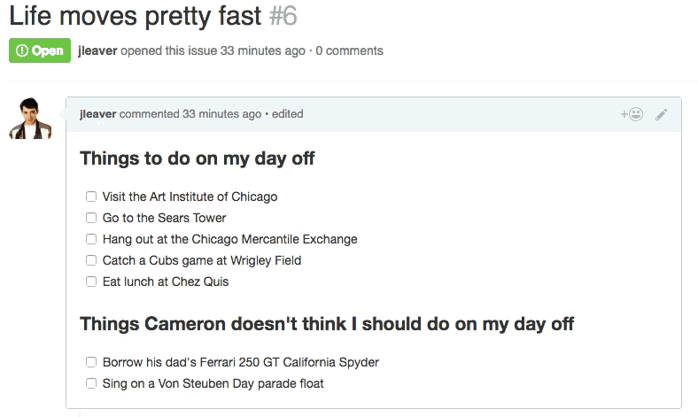

**Програмна інженерія в системах управління.**

# Організація роботи в GitHub

## Організація роботи з використанням обговорення питань (issues)

### Призначення питань для обговорення

**Питання для обговорення** (**issues**) можна використовувати для відстеження ідей, удосконалень, завдань або помилок при роботі в GitHub. 

Можна збирати відгуки користувачів, повідомляти про помилки в програмному забезпеченні та впорядковувати завдання, які необхідно виконати відповідно до обговорюваного питання у сховищі. Питання для обговорень можуть виступати більше ніж просто в якості місця для повідомлення про помилки в програмному забезпеченні. Можна пов’язати запит на пул із питанням, щоб показати, що виправлення триває, і автоматично закрити питання, коли хтось підтверджує або закриває запит на пул. 

Щоб бути в курсі останніх коментарів щодо обговорюваного питання, можна підписатися для отримування сповіщення про останні коментарі. Щоб швидко знайти посилання на нещодавно оновлені питання, на які ви підписалися, відвідайте інформаційну панель (dashboard). 

Використовуючи обговорення питань можна:

- відстежити та розставляти пріоритети своєї роботи, використовуючи дошки проектів (project boards). 
- створювати нові питання для обговорення для відстеження зворотного зв'язку з коментарями до питання або розгляду запиту на пул. 
- створювати шаблони питань, щоб допомогти авторам ставити змістовні питання для обговорень. 
- передавати відкриті питання до інших сховищ. 
- закріплювати важливі питання, щоб полегшити їх пошук, запобігаючи повторним створенням питань та зменшуючи рівень шуму. 
- відстежувати дублікати питань, використовуючи збережені відповіді. 
- повідомляти про коментарі, що порушують [Керівні принципи спільноти GitHub](https://help.github.com/en/articles/github-community-guidelines). 

Питання також можуть бути [присвоєні іншим користувачам](https://help.github.com/en/articles/assigning-isissue-and-pull-requests-to-other-github-users), [позначені мітками](https://help.github.com/en/articles/applying-labels-to-isissue-and-pull-requests) для швидшого пошуку та [згруповані разом за віхами](https://help.github.com / uk / статті / створення-та-редагування важливих етапів-для-питань-і-тягнути-запити).

### Створення питання для обговорення

У публічному сховищі будь який користувач може створити питання для обговорення, якщо це не заборонено налаштуваннями. Можна створити питання із існуючого запиту на пул, або безпосередньо з коментарю в обговоренні іншого питання або запиту на пул.  При використанні для відстеження та пріоритизації робіт проектних дошок, питання для обговорення можна перетворювати з нотаток на дошках. 

### Список завдань

Використовуючи формат MarkDown можна створювати списки завдань як набір опцій в коментарях до обговорень питань та запитів на пул. Користувачі будуть вибирати опції простим вибором мишою.  У списку питань для обговорень та запитів на пул відображатимуться прогрес виконання завдань (помічених опцією).

Можна також змінювати послідовність опцій звичайним перетягуванням. 

### З'єднання запитів на пул та питань для обговорень

https://help.github.com/en/github/managing-your-work-on-github/linking-a-pull-request-to-an-issue

 

[Додатково про issue](https://help.github.com/en/github/managing-your-work-on-github/about-issues)

[Managing your work on GitHub](https://help.github.com/en/github/managing-your-work-on-github)