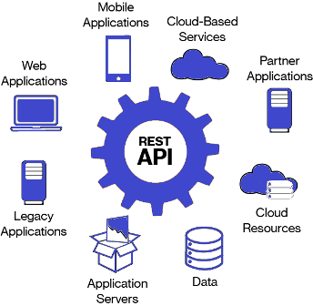
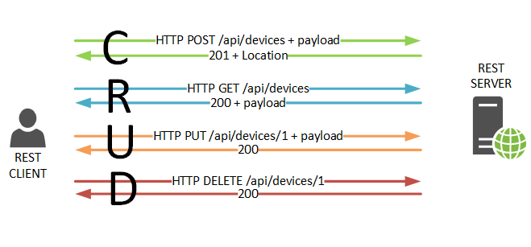
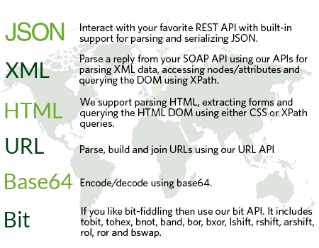

### 1. Основи HTTP

https://www.youtube.com/embed/RlccXUx4LVw

https://www.youtube.com/embed/7DitlqcesKI

https://www.youtube.com/embed/esi6YZRvJzk

https://uk.wikipedia.org/wiki/HTTP
https://habr.com/post/215117/

---

### 2. WEB API

**Прикладний програмний інтерфейс (інтерфейс програмування застосунків, інтерфейс прикладного програмування)** (*Application Programming Interface*, *API*) — набір означень підпрограм, протоколів взаємодії та засобів для  створення програмного забезпечення. Спрощено - це набір чітко означених  методів (функцій) для взаємодії різних компонентів. API надає розробнику засоби для швидкої розробки програмного забезпечення оскільки можна  скористуватися готовими об’єктами (функціями) іншого програмного  забезпечення через означені в останньому правила взаємодії. API може  бути для веб-базованих систем, операційних систем, баз даних, апаратного забезпечення, програмних бібліотек.

При використанні прикладного програмного інтерфейсу в контексті  веб-розробки, як правило, API означується набором повідомлень-запитів  HTTP та структурою повідомлень-відповідей. Повідомлення можуть мати  різний формат, як правило цн XML або JSON. Доступ відбувається до з  однієї або декількох загальнодоступних кінцевих точок (endpoints).  

Кінцеві точки є важливими аспектами взаємодії з веб-інтерфейсами на  стороні сервера, оскільки вони вказують, де знаходяться ресурси, доступ  до яких може отримати стороння програма. Зазвичай доступ здійснюється  через URI, до якого надсилаються HTTP-запити, і звідки очікується  відповідь. Кінцеві точки повинні бути статичними, інакше правильне  функціонування програмного забезпечення, яке взаємодіє з нею, не може  бути гарантоване. Якщо місце розташування ресурсу змінюється (і разом з  ним кінцева точка), то раніше написане програмне забезпечення буде  перервано, оскільки потрібний ресурс більше не може бути знайдено в  одному місці. Оскільки постачальники API все ще хочуть оновлювати свої  веб-API, багато хто з них запровадили систему версій в URI, яка вказує  на кінцеву точку, наприклад, Clarifai API: кінцева точка для функцій  позначення в Web API має такий URI: "https: //api.google.com/v1/tag/ ".  "/ V1 /" частина URI визначає доступ до першої версії веб-API. Якщо  Clarifai вирішить оновити до другої версії, вони можуть це зробити,  зберігаючи при цьому підтримку стороннього програмного забезпечення, яке використовує першу версію.


Веб-інтерфейси Web 2.0 часто використовують взаємодії на основі таких технологій як REST та SOAP. У той час як прикладний програмний  інтерфейс у Web історично був практично синонімом для веб-служби,  останнім часом тенденція змінилась (так званий Web 2.0) на відхід від  Simple Object Access Protocol (SOAP) на основі веб-сервісів і  сервіс-орієнтованої архітектури (SOA) до більш прямих передач  репрезентативного стану (REST) стилів веб-ресурсів та  ресурсно-орієнтованої архітектури (ROA).  RESTful Веб-інтерфейси  зазвичай базуються на основі методів HTTP для доступу до ресурсів за  допомогою URL-кодуваних параметрів та використання JSON або XML для  передачі даних. На відміну від цього, протоколи SOAP стандартизуються  W3C і мандату на використання XML як формату корисного завантаження, як  правило, над HTTP. Крім того, веб-API на базі SOAP використовує  перевірку XML для забезпечення структурної цілісності повідомлень,  використовуючи XML-схеми, забезпечені документами WSDL. Документ WSDL  точно визначає повідомлення XML та транспортні прив'язки веб-служби.

При використанні деяких Web API,  що мають певні обмеження для використання або потребують ідентифікації  програмного забезпечення, що викликається, необхідно вказувати API key. **Application programming interface key** (**API key**)  - це код, який передається комп'ютерними програмами, викликаючи  прикладний програмний інтерфейс (API) на веб-сайті, для ідентифікації  викликаючої програми, її розробника чи її користувача. API key  використовуються для відстеження та керування використанням API,  наприклад, для запобігання зловмисному використанню або зловживання API  (як це визначено, можливо, умовами надання послуг). API key часто  виступає і як унікальний ідентифікатор, так і секретний маркер (токен)  для автентифікації, і, як правило, має набір прав доступу до пов'язаного з ним API. API key можуть базуватися на універсально унікальному  ідентифікаторі (UUID) щоб забезпечити унікальність кожного користувача.

---

### 3. Основи REST




REST означує ряд архітектурних принципів проектування Web-сервісів,  орієнтованих на системні ресурси, включаючи способи обробки і передачі  станів ресурсів по HTTP різноманітними клієнтськими додатками,  написаними різними мовами програмування. За останні кілька років REST  стала переважаючою моделлю проектування Web-сервісів. Фактично REST  зробила настільки великий вплив на Web, що практично витіснила розробку  інтерфейсу, заснованого на SOAP і WSDL, через значно більш простий стиль проектування.

Технологія REST не привернула велику увагу в 2000 році, коли Рой  Філдінг (Roy Fielding) вперше представив її в Каліфорнійському  університеті в Ірвайні в своїй дисертації "Архітектурні стилі і дизайн  мережевих архітектур програмного забезпечення", де аналізувався набір  принципів архітектури програмного забезпечення, що використовує Web як  платформу розподілених обчислень. Однак сьогодні, через багато років,  виникли і продовжують розвиватися численні інфраструктури для REST, яку, серед іншого, планується інтегрувати в стандарт Java ™ 6 JSR-311.

Надалі передбачається, що конкретна реалізація Web-сервісів REST слідує чотирьом базовим принципам проектування:

• Явне використання HTTP-методів.
 • Незбереження стану.
 • Надання URI, аналогічних структурі каталогів.
 • Передача даних в XML, JavaScript Object Notation (JSON) або в обох форматах.

У наступних розділах розглядаються ці чотири принципи.

---

### 4. Явне використання HTTP-методів

Однією з ключових характеристик Web-сервісу RESTful є явне використання  HTTP-методів згідно з протоколом, означеним в RFC 2616. Наприклад, HTTP  GET означений як метод генерування даних, використовуваний клієнтським  додатком для вилучення ресурсу, отримання даних з Web-сервера або  виконання запиту в надії на те, що Web-сервер знайде і поверне набір  відповідних ресурсів.

REST пропонує розробникам використовувати HTTP-методи явно відповідно до означення протоколу. Цей основний принцип проектування REST  встановлює однозначну відповідність між операціями create, read, update і delete (CRUD) і HTTP-методами. Згідно з цим відповідності:

- Для створення ресурсу на сервері використовується POST.
- Для отримання ресурсу використовується GET.
- Для зміни стану ресурсу або його поновлення використовується PUT.
- Для видалення ресурсу використовується DELETE.

Недоліком проектування багатьох Web API є використання HTTP-методів  не за прямим призначенням. Наприклад, URI запиту в HTTP GET зазвичай  означує один конкретний ресурс, або ж рядок запиту в URI запиту містить  ряд параметрів, що означують критерії пошуку сервером набору відповідних ресурсів. Принаймні саме так описаний метод GET в HTTP/1.1 RFC. Однак  часто зустрічаються непривабливі Web API, що використовують HTTP GET для виконання різного роду транзакцій на сервері (наприклад, для додавання  записів в базу даних). У таких випадках URI запиту GET використовується  некоректно або, принаймні, не використовується в REST-стилі (RESTfully). Якщо Web API використовує GET для запуску віддалених процедур, запит  може виглядати приблизно так:

```http
GET /adduser?name=Robert HTTP/1.1
```

Це невдалий дизайн, оскільки вищезгаданий Web-метод за допомогою  HTTP-запиту GET підтримує операцію, що змінює стан. Інакше кажучи,  HTTP-запит GET має побічні ефекти. У разі успішного виконання запиту в  сховище даних буде додано новий користувач (в нашому прикладі - Robert). Проблема тут в основному семантична. Web-сервери призначені для  відповідей на HTTP-запити GET шляхом вилучення ресурсів відповідно до  URI запиту (або критерію запиту) і повернення їх або їхні уявлення у  відповіді, а не для додавання запису в базу даних. З точки зору  передбачуваного використання і з точки зору HTTP / 1.1-сумісних  Web-серверів таке використання GET є неналежним.

Крім семантики ще однією проблемою є те, що для видалення, зміни або  додавання запису в базу даних або для зміни будь-яким чином стану на  стороні сервера GET привертає різні засоби Web-кешування (роботи) і  пошукові механізми, які можуть виконувати ненавмисні зміни на сервері  шляхом простого обходу посилання. Найпростішим способом вирішення цієї  загальної проблеми є вставлення імен та значень параметрів URI запиту в  XML-теги. Ці теги (XML-представлення створюваного об'єкта) можна  відправити в тілі HTTP-запиту POST, URI якого є батьком об'єкта (див.  Листинги 1 і 2).

**Лістинг 1. До**

```http
GET /adduser?name=Robert HTTP/1.1
```

##### Лістинг 2. Після

```http
POST /users HTTP/1.1
Host: myserver
Content-Type: application/xml
<?xml version="1.0"?>
<user>
  <name>Robert</name>
</user>
```

Це зразок RESTful-запиту: HTTP-запит POST використовується коректно, а тіло запиту містить корисне навантаження. На приймаючій стороні в запит може бути доданий ресурс, що міститься в тілі, підлеглий ресурсові,  визначеному в URI запиті; в даному випадку новий ресурс повинен  додаватися як нащадок /users. Таке ставлення включення (containment) між новим логічним об'єктом і його батьком, вказане в запиті POST,  аналогічно відношенню підпорядкування між файлом і батьківським  каталогом. Клієнтська програма встановлює відношення між логічним  об'єктом і його батьком і означує URI нового об'єкта в запиті POST.

Потім клієнтська програма може отримати уявлення ресурсу,  використовуючи новий URI, який вказує, що принаймні логічно ресурс  розташований в /users (див. Лістинг 3).

##### Лістинг 3. HTTP-запит GET

```http
GET /users/Robert HTTP/1.1
Host: myserver
Accept: application/xml
```

Це правильне застосування запиту GET, оскільки він служить тільки для отримання даних. GET - це операція, яка повинна бути вільною від  побічних ефектів. Дана властивість відома також під назвою *[ідемпотентність](https://uk.wikipedia.org/wiki/Ідемпотентність)*.

Аналогічний [рефакторинг](https://uk.wikipedia.org/wiki/Рефакторинг) Web-методу необхідно виконати в тих ситуаціях, коли HTTP-запит GET підтримує операцію update (див. Лістинг 4).

##### Лістинг 4. **Операція update в HTTP-запиті GET**

```http
GET /updateuser?name=Robert&newname=Bob HTTP/1.1
```

Це запит змінює атрибут (або властивість) name ресурсу. Хоча для  такої операції можна використовувати рядок запиту і в лістингу 4  наведена найпростіша з них, модель "рядок запиту як сигнатура методу" не працює для більш складних операцій. Оскільки нашою метою є явне  використання HTTP-методів, із зазначених вище причин більш  RESTful-сумісним є підхід, при якому для поновлення ресурсу  застосовується HTTP-запит PUT замість HTTP-запиту GET (див. Лістинг 5).

##### Лістинг 5. HTTP-запит PUT

```http
PUT /users/Robert HTTP/1.1
Host: myserver
Content-Type: application/xml
<?xml version="1.0"?>
<user>
  <name>Bob</name>
</user>
```

Використання запиту PUT для заміни вихідного ресурсу забезпечує  набагато більш прозорий інтерфейс, сумісний з принципами REST і з  означенням HTTP-методів. Запит PUT в лістингу 5 є явним в тому сенсі, що він вказує на оновлюваний ресурс, означуючи його в URI запиту, і  передає нове уявлення ресурсу від клієнта на сервер в тілі запиту PUT,  замість того щоб передавати атрибути ресурсу у вигляді слабо пов'язаного набору імен і значень параметрів в URI запиту. Запит в лістингу 5  перейменовує ресурс з Robert на Bob і змінює його URI на /users/Bob. У  Web-сервісі REST використання старого URI в наступних запитах ресурсу  призведе до виникнення стандартної помилки 404 Not Found.

Загальноприйнятим підходом, відповідних рекомендацій REST по явному  застосуванню HTTP-методів, є використання в URI іменників замість  дієслів. У Web-сервісі RESTful дієслова POST, GET, PUT і DELETE вже  означені протоколом. В ідеалі для реалізації узагальненого інтерфейсу і  явного виклику операцій клієнтськими додатками Web-сервіс не повинен  означувати додаткові команди або віддалені процедури, наприклад /adduser або /updateuser. Цей загальний принцип можна застосувати також до тіла  HTTP-запиту, який призначений для передачі стану ресурсу, а не імені  віддаленого методу або віддаленої процедури, що викликається.

---

### 5. Незбереження стану

Для  задоволення постійно зростаючих вимог до продуктивності Web-сервіси REST повинні бути масштабованими. Для формування топології сервісів, що  дозволяє при необхідності перенаправляти запити з одного сервера на  інший з метою зменшення загального часу реакції на виклик Web-сервісу,  зазвичай застосовують кластери серверів з можливістю розподілу  навантаження і аварійного перемикання на резерв, проксі-сервери і шлюзи. Використання проміжних серверів для поліпшення масштабованості вимагає, щоб клієнти Web-сервісів REST відправляли повні самодостатні запити, що містять всі необхідні для їх виконання дані, щоб компоненти на  проміжних серверах могли перенаправляти, маршрутизувати і розподіляти  навантаження без локального збереження стану між запитами.

При обробці повного самодостатнього запиту серверу не потрібно  витягувати стан або контекст програми. Застосунок (або клієнт)  Web-сервісу REST включає в HTTP-заголовки і в тіло запиту всі параметри, контекст і дані, необхідні серверному компоненту для генерування  відповіді. У цьому сенсі незбереження стану (statelessness) покращує  продуктивність Web-сервісу і спрощує дизайн і реалізацію серверних  компонентів, оскільки відсутність стану на сервері усуває необхідність  синхронізації сеансових даних із зовнішнім застосунком.

На рисунку 1 показаний сервіс, що зберігає стан, в якому застосунок  може запитати наступну сторінку в багатосторінковому наборі результатів, вважаючи, що сервер зберігає послідовність переходів застосунку з цього набору результатів. У цій моделі зі збереженням стану сервіс нарощує і  зберігає змінну previousPage, щоб бути в змозі відповідати на запити  наступних сторінок.

**Рисунок 1. Модель зі збереженням станів**


Подібні сервіси, що зберігають стан, виходять дуже складними.  У  середовищах такого типу розробники скриптів на серверах стикаються з  типовою проблемою пошуку причин виникнення виняткових ситуацій, що може  коштувати розробникам декількох днів пошуків в складному графі об'єктів, що визначають стан сервера. Крім того, синхронізація сеансів збільшує  накладні витрати, що негативно позначається на продуктивності сервера.

На противагу цьому, серверні компоненти що не зберігають стан більш  прості в проектуванні, написанні та розподілі між серверами зі  збалансованим навантаженням. Сервіс, що не зберігає стан,  не тільки  краще працює, але і покладає основну відповідальність за збереження  стану на клієнтську програму. У Web-сервісі RESTful сервер відповідає за генерування відповідей і за надання інтерфейсу, що дозволяє  клієнтському застосунку самому зберігати свій стан. Наприклад, при  запиті багатосторінкового набору результатів клієнтський застосунок  повинен включати в запит номер конкретної сторінки, а не просто  запитувати наступну сторінку (див. Рисунок 2).

**Рисунок 2. Модель без збереження стану**


Web-сервіс, що не зберігає стану, генерує відповідь, що містить  посилання на номер наступної сторінки в наборі і дозволяє клієнтові  самостійно подбати про збереження цього значення

---

### 6. Відображення URI, аналогічних структурі каталогів

З точки зору звернення до ресурсів з клієнтського за стосунку URI, що  надаються, означують наскільки інтуїтивним буде Web-сервіс REST і чи  буде він використовуватися так, як припускав розробник. Третя  характеристика Web-сервісу RESTful повністю присвячена URI.

URI-адреси Web-сервісу REST повинні бути інтуїтивно зрозумілими.  Розглядайте URI як якийсь самодокументований інтерфейс, що майже не  вимагає пояснень або звернення до розробника для його розуміння і для  отримання відповідних ресурсів. Тому структура URI повинна бути простою, передбачуваною і зрозумілою.

Один із способів досягти такого рівня зручності використання -  побудова URI за аналогією зі структурою каталогів. Такого роду URI є  ієрархічними, що походить із одного кореневого шляху, розгалуження якого відображають основні функції сервісу. Згідно з цим означенням, URI - це не просто рядок зі слешами як роздільниками, а скоріше дерево з  встановленими вище і нижче лежачими гілками, з'єднаними в вузлах.  Наприклад, в сервісі обговорень різних тем (від Java до паперу) можна  визначити структурований набір URI такого вигляду:

```http
http://www.myservice.org/discussion/topics/{topic}
```

Корінь /discussion має нижчий вузол /topics. Нижче розташовуються  назви тем (наприклад, gossip (чутки), technology (технологія) і т.д.),  кожна з яких вказує на свою гілку обговорення. В рамках цієї структури  можна легко викликати гілки обговорення простим введенням чогось після  /topics/.

У деяких випадках каталого-подібна  структура особливо добре  підходить для шляхів до ресурсів. Як приклад можна назвати ресурси,  впорядковані за датою. Для них дуже добре підходить ієрархічний  синтаксис.

Наступний приклад інтуїтивно зрозумілий, оскільки заснований на правилах:

```http
 http://www.myservice.org/discussion/2008/12/10/{topic}
```

Перший фрагмент шляху - чотири цифри року, другий - дві цифри дня і  третій - дві цифри місяця. Подібне пояснення може здатися дещо  спрощеним, але це саме той рівень простоти, який нам потрібен. Люди і  комп'ютери можуть легко генерувати подібні структуровані URI, оскільки  вони засновані на правилах. Вказівка фрагментів шляху у відповідних  позиціях згідно синтаксису робить URI уніфікованими, оскільки існує  закономірність їх створення:

```http
 http://www.myservice.org/discussion/{year}/{day}/{month}/{topic}
```


---

### 7. Передача XML, JSON або обох



Представлення ресурсу, як правило, відображає поточний стан ресурсу (і його  атрибутів) на момент його запиту клієнтським додатком. Представлення  ресурсів в цьому сенсі є просто знімками в конкретні моменти часу. Ці  представлення повинні бути такими ж простими, як представлення запису в  базі даних, що складається з відображення між іменами стовпців і  XML-тегами, де значення елементів в XML містять значення рядків. Якщо  система має модель даних, то згідно з цим визначенням представлення  ресурсу є знімком стану атрибутів одного з об'єктів моделі даних  системи. Це ті об'єкти, які буде обслуговувати Web-сервіс REST.

Останній набір обмежень, тісно пов'язаний з дизайном Web-сервісів  RESTful, відноситься до формату даних, якими обмінюються додаток і  сервіс при роботі в режимі запит/відповідь або в тілі HTTP-запиту. Тут  особливо важливі простота, читабельність і зв'язаність.

Об'єкти моделі даних зазвичай якось пов'язані, і ці відносини між  об'єктами (ресурсами) моделі даних повинні відображатися в способі їх  подання для передачі клієнтського додатку. У сервісі обговорень приклад  представлень пов'язаних ресурсів може включати в себе кореневу тему  обговорення і її атрибути, а також вбудовані посилання на відповіді,  надіслані в цю тему.

**Лістинг 6. XML-представлення гілки обговорення**

```xml
<?xml version="1.0"?>
<discussion date="{date}" topic="{topic}">
  <comment>{comment}</comment>
  <replies>
    <reply from="joe@mail.com" href="/discussion/topics/{topic}/joe"/>
    <reply from="bob@mail.com" href="/discussion/topics/{topic}/bob"/>
  </replies>
</discussion>
```

Нарешті, щоб надати клієнтським застосункам можливість запитувати  конкретний найбільш підходящий їм тип вмісту, проектують сервіс так, щоб він використовував вбудований HTTP-заголовок Accept, значення якого є  MIME-типом. Деякі загальновживані MIME-типи, які використовуються  RESTful-сервісами, перераховані в таблиці 1.

**Таблиця 1. Загально-вживані MIME-типи, що використовують RESTful-сервіси**

| MIME-тип | Тип змісту            |
| -------- | --------------------- |
| JSON     | application/json      |
| XML      | application/xml       |
| XHTML    | application/xhtml+xml |

Це дозволить використовувати сервіс клієнтським застосунком,  написаним на різних мовах і працюючим на різних платформах і пристроях.  Використання MIME-типів і HTTP-заголовку Accept є механізм узгодження  вмісту (content negotiation), що дозволяє клієнтським застосункам  вибирати відповідний для них формат даних і мінімізувати зв'язність  даних між сервісом і застосунком, що його використовує.

---

### 8. Заключення

Технологія REST - це спосіб проектування Web-сервісів, менше залежний від  закритого проміжного програмного забезпечення (наприклад, серверу  застосунків), ніж моделі SOAP і WSDL. У певному сенсі REST, завдяки  акценту на ранні інтернет-стандарти URI і HTTP, є поверненням до епохи  Web, коли ще не було великих серверів додатків. Як ви побачили з  розгляду принципів проектування RESTful-інтерфейсу, XML поверх HTTP є  потужним інтерфейсом, що дозволяє внутрішнім застосункам (наприклад,  призначеним для користувача інтерфейсів, заснованим на технології Ajax  (Asynchronous JavaScript + XML)), легко підключатися і звертатися до  ресурсів і споживати їх. Фактично саме хороша сумісність Ajax і REST  стала причиною сьогоднішньої популярності REST.

Подання системних ресурсів через RESTful API - це гнучкий спосіб  забезпечення різних додатків даними в стандартному форматі. Це допомагає виконати вимоги до інтеграції, що мають вирішальне значення для  створення систем, що дозволяють легко комбінувати дані (машапів), а  також для побудови на основі набору базових RESTful-сервісів більших  конструкцій.