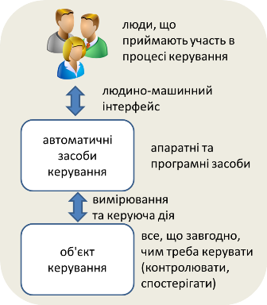
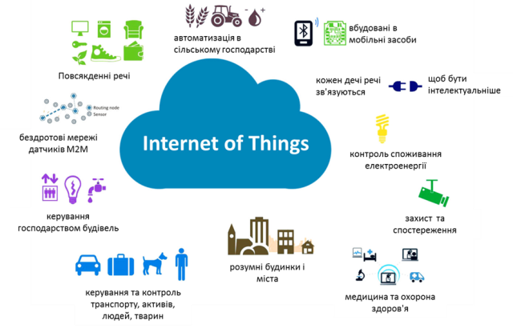
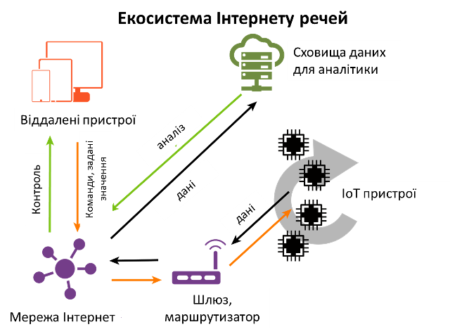
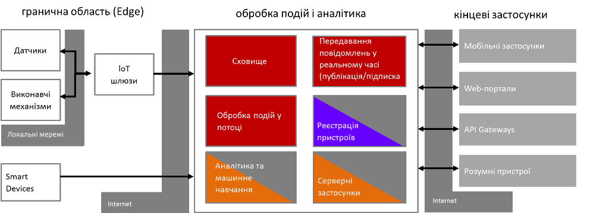
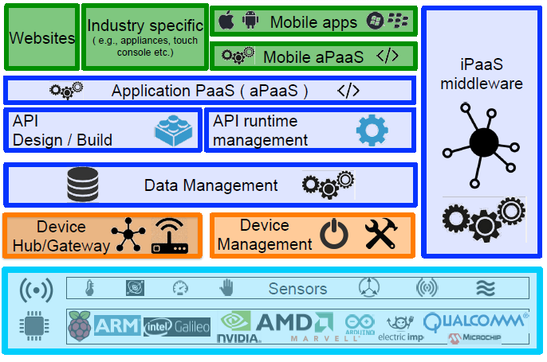
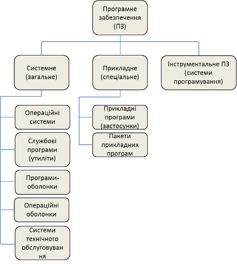
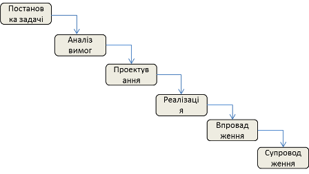
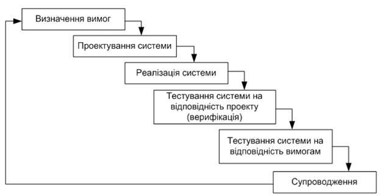

**Програмна інженерія в системах управління. Лекції.** Автор і лектор: Олександр Пупена 

| [<- до лекцій](README.md) | [на основну сторінку курсу](../README.md) |
| ------------------------- | ----------------------------------------- |
|                           |                                           |

# Вступ до програмної інженерії в системах автоматизованого керування

Мета дисципліни «Програмна інженерія в системах управління» -- формування знань з розробки програмного забезпечення, орієнтованого на автоматизовані системи керування (управління), що відносяться до технологічного та виробничого рівня (АСУТП, IIoT, MES та інші). Дисципліна направлена на вивчення методів та засобів програмної інженерії, розуміння основ побудов систем керування побудованих на основі архітектури Інтернету речей (IoT), поглиблення знання в програмуванні мови JavaScript, мережних технологіях Інтернету та використання СУБД.

У даній дисципліні розглядається два аспекти:

- технології, засоби та практики розробки програмного забезпечення для автоматизованих систем керування (АСК) на прикладі IoT
- основи програмної інженерії для АСК

## Автоматизовані системи керування та їх ПЗ

**Керування** (також використовують слово **управління**) — сукупність цілеспрямованих дій, що включає оцінку ситуації та стану об'єкта керування, вибір керівних дій та їх реалізацію

**Автоматичне керування**  – це керування, яке відбувається різноманітними апаратними та програмними засобами без участі людини.

**Автоматизоване керування** – це керування, яке відбувається за участі людини

**Автоматизована система керування (АСК)**  -  автоматизована система, що ґрунтується на комплексному використанні технічних, математичних,  інформаційних та організаційних засобів для керування складними  технічними й економічними об'єктами. 

АСК — це сукупність керованого  об'єкта й автоматичних вимірювальних та керуючих пристроїв, у якій  частину функцій виконує людина. На рис.1.1 показана типова структура автоматизованої системи керування. Об'єкт керування керується автоматичними засобами, які представлені апаратними та програмними засобами керування. Людина взаємодіє з цими засобами через людино-машинний інтерфейс і таким чином впливає на процес керування. Людина в даному випадку є частиною системи керування. Люди можуть також взаємодіяти з об'єктом безпосередньо, без використання автоматичних засобів керування.

рис.1.1. Структура автоматизованої системи керування

У даній дисципліні увага приділяється програмному забезпеченню, що використовується в автоматизованих ***системах керування (управління) технологічними процесами*** (***АСКТП або АСУТП***). Розгляд компонентів таких систем, а також алгоритмічного забезпечення, процесів керування та проектування є предметом багатьох дисциплін, які будуть читатися на старших курсах. Тут їх розглянемо тільки поверхово для розуміння загальних процесів керування та роль ПЗ в них.

Спрощена структура таких систем показана на рис.1.2.

рис.1.2. Типова структура АСКТП

АСУТП потрібна для автоматизації керування різнорідними процесами. Для взаємодії системи з тим, що автоматизують (технологічний процес, часто називають ***об'єкт управління***) існують датчики (сенсори) та виконавчі механізми (актуатори).

***Датчики*** (давачі) системі потрібні як людині зір, слух, нюх, різні рецептори, сенсорика і т.п. За допомогою датчиків система може дізнатися про значення температури (термометри) або про прохід людини через турнікет в метро (оптичні датчики). Типів датчиків та способів вимірювання настільки багато, що існують книги на кілька томів, які присвячені тільки цим засобам.

***Виконавчі механізми*** (ВМ) приводять в дію регулюючі органи (РО). Регулюючі органи безпосередньо впливають на об'єкт управління. Наприклад водопровідний кран -- це типовий регулюючий орган, який може закривати/відкривати людина своїм руками. Руки людини -- це її виконавчий орган, який можна замінити на виконавчий механізм системи -- двигун.

Датчики та виконавчі механізми підключаються до регуляторів, в яких закладена логіка управління об'єктом. Маючи інформацію з датчиків а також бажане значення він може діяти через виконавчий механізм на об'єкт забезпечуючи бажаний стан. Для алгоритмічно складних об'єктів використовують програмовані контролери (***ПЛК***). Це спеціалізовані комп'ютери з операційними системами реального часу, які програмуються на спеціалізованих мовах програмування, в тому числі текстових схожих на C чи JavaScript. Розробка такого ПЗ -- це також компетенції спеціаліста з автоматизації і буде розглядатися в старших курсах.

Більшість систем є ***автоматизованими***, тобто такими, де людина приймає участь в деяких рішеннях. У повністю ***автоматичних*** системах, машина бере на себе усі функції управління. Для автоматизованих систем необхідний ***людино-машинний інтерфейс*** (ЛМІ) -- комплекс засобів у тому числі програмних, які дають можливість взаємодіяти людині з регуляторами або ПЛК. Розробка ЛМІ також входить в компетенції спеціалістів з автоматизації і буде розглядатися в інших дисциплінах. Крім локальних засобів ЛМІ, великі АСУТП потребують диспетчерського управління, де в спеціальних пунктах спостерігають за всім виробництвом та координують дії.

Таким чином, у системах АСУТП програмні засоби займають велику роль, а їх розробка та супроводження є частиною життєвого циклу всієї системи.

Сучасні системи управління можуть бути розроблені різним способом. Для автоматизації різного рівня задач можуть використовуватися системи типу «Інтернет речей» (Internet of Things, IoT) або його промислове виконання «Промисловий Інтернет речей» (Industrial Internet of Things, IIoT). Саме програми та технології IoT будуть предметом даної дисципліни, життєвими циклами якої (у більшості програмною його частиною) необхідно буде управляти.

## Інтернет речей

### Про Інтернет речей

[Інтерне́т рече́й](https://uk.wikipedia.org/wiki/Інтернет_речей) (англ**. Internet of Things**, **IoT**) — концепція мережі, що складається із взаємозв'язаних фізичних пристроїв, які мають вбудовані датчики, а також програмне забезпечення, що дозволяє здійснювати передачу і обмін даними між фізичним світом і комп'ютерними системами, за допомогою використання стандартних протоколів зв'язку. Окрім датчиків, мережа може мати виконавчі пристрої, вбудовані у фізичні об'єкти і пов'язані між собою через дротові чи бездротові мережі. Ці взаємопов'язані пристрої мають можливість зчитування та приведення в дію, функцію програмування та ідентифікації, а також дозволяють виключити необхідність участі людини, за рахунок використання інтелектуальних інтерфейсів.

Термін «інтернет речей», зобов'язаний своєю появою Кевіну Ештону, який в 1997 р, працюючи на компанію Proctor and Gamble, застосував технологію **радіочастотної ідентифікації** (**RFID**) для керування системою поставок. Завдяки цій роботі в 1999 році його запросили в Масачусетський технологічний інститут, де він з групою однодумців організував дослідний консорціум Auto-ID Center (більш детальну інформацію можна знайти на [сайті]([www.smithsonianmag.com/innovation/kevin- ashton- describes-the-internet-of-things-180953749](http://www.smithsonianmag.com/innovation/kevin- ashton- describes-the-internet-of-things-180953749))). З тих пір Інтернет речей звершив перехід від простих радіочастотних міток до екосистеми і індустрії. 

Аж до 2012 р ідея підключення речей до Інтернету переважно відносилася до смартфонів, планшетів, ПК і ноутбуків. По суті, до тих пристроїв, які в усіх відношеннях виступають в якості комп'ютера. До цього, з моменту появи перших боязких зачатків Інтернету (таких як створена в 1969 р мережу ARPANET), більшості технологій, на яких будується Інтернет речей, просто не існувало. 

Зараз до Інтернету речей можна підключати будь-які речі.

рис.1.3. Інтернет речей

**Промисловий Інтернет речей** (**Industrial IoT**, **IIoT**) - це один з найбільш великих сегментів Інтернету речей з точки зору кількості підключених пристроїв і ступеня корисності цих сервісів для виробництва і автоматизації підприємств. Цей сегмент традиційно служить операційно-технологічною базою. Сюди входять апаратні і програмні засоби моніторингу фізичних пристроїв. 

Приклади застосування Промислового Інтернету Речей.

- профілактичне обслуговування промислового обладнання;
- зростання продуктивності завдяки попиту в реальному часі;
- енергозбереження;
- системи безпеки, такі як вимірювання температури, вимірювання тиску і контроль над витоком газу;
- експертна система для виробничого цеху.

### Екосистема Інтернету речей

До екосистеми Інтернету речей відносяться усі засоби, сервіси і технології, які використовуються в Інтернеті речей. 

рис.1.4 Екосистема Інтернету речей

До них можна віднести:

- **sensors (розумні датчики/виконавчі механізми)**: вбудовані системи, операційні системи реального часу, джерела безперебійного живлення, мікро-електромеханічні системи (МЕМС);
- **системи зв'язку з датчиками**: зона охоплення бездротових персональних мереж становить від 0 см до 100 м. Для обміну даними між датчиками застосовуються низькошвидкісні малопотужні інформаційні канали, які часто побудовані не на протоколі IP;
- **локальні обчислювальні мережі (LAN)**: зазвичай це системи обміну даними на основі протоколу IP, наприклад, 802.11 Wi-Fi-мережу для швидкої радіозв'язку, часто це пирингові або зіркоподібні мережі;

- **агрегатори, маршрутизатори** **(routers), шлюзи** (gateways), пограничні пристрої (Edge Device) : постачальники вбудованих систем, самі бюджетні складові (процесори, динамічна оперативна пам'ять і система зберігання даних), виробники модулів, виробники пасивних компонентів, виробники тонких клієнтів, виробники стільникових і бездротових радіосистем, постачальники міжплатформового програмного забезпечення, розробники інфраструктури туманних обчислень, інструментарій для граничної аналітики, безпеку граничних пристроїв, системи управління сертифікатами;

- **глобальна обчислювальна мережа**: оператори стільникового зв'язку, оператори супутникового зв'язку, оператори малопотужних глобальних мереж (Low- Power Wide-Area Network, LPWAN). Зазвичай застосовуються транспортні протоколи Інтернету для IoT і мережевих пристроїв (MQTT, CoAP і навіть HTTP);

- **хмара**: інфраструктура в якості постачальника послуг, платформа в якості постачальника послуг, розробники баз даних, постачальники послуг потокової і пакетної обробки даних, інструменти для аналізу даних, програмне забезпечення в якості постачальника послуг, постачальники озер даних, оператори програмно-визначених мереж / програмно-визначених периметрів, сервіси машинного навчання;
- **сервіси аналізу даних**: величезні масиви інформації передаються в хмару. Робота з великими обсягами даних і отримання з них користі - це завдання, що вимагає комплексної обробки подій, аналітики і прийомів машинного навчання;
- **засоби кібербезпеки (security)**: при зведенні всіх елементів архітектури воєдино постають питання кібербезпеки. Безпека стосується кожного компонента: від датчиків фізичних величин до ЦПУ і цифрового апаратного забезпечення, систем радіозв'язку і самих протоколів передачі даних. На кожному рівні необхідно забезпечити безпеку, достовірність і цілісність. У цьому ланцюзі не повинно бути слабких ланок, оскільки Інтернет речей стане головною мішенню для атак хакерів в світі.

Архітектура Інтернету речей відрізняється в залежності від реалізації. Тим не менше вона дещо схожа на архітектуру класичних систем АСУТП. Один із прикладів архітектури показаний на рис.1.5

рис.1.5. Архітектура Інтернету речей

Взаємодія з «речами» відбувається через датчики (sensors) та виконавчі механізми (Actuators), аналогічно як це робиться в АСУТП для будь якого об’єкту керування. Ці датчики разом з усією інфраструктурою для інтеграції з рівнем обробки подій через мережу Internet формують так звану граничну область (**Edge**). 

Події (дані) що поступають з граничної області зберігаються і обробляються відповідно до задачі (рівень обробки подій і аналітики, **event processing**, **Platform**). На цьому рівні події(дані) зберігаються (storage), обробляються (Event Processing), перенаправляються потрібним додаткам (Real-Time Message Brokering, Stream Processing). Додатково на цьому рівні відбувається адміністрування та керування пристроями з граничної області (Device Registry, Edge Device Management). Події (дані) обробляються з використанням аналітичних сервісів (Analytics) на основі них проводиться машинне навчання (Machine Learning), що дозволяє зробити певні висновки про об’єкт. Цей рівень як правило реалізований з використанням хмарних (Cloud) або туманних (Fog) обчислень. Якщо провести аналогію с АСУТП, то це рівень контролерів та SCADA (за виключенням функцій HMI).     

Отримання результатів, контроль, віддалене керування та адміністрування системи проводиться через кінцеві застосунки з використанням Internet. Цей рівень можна умовно порівняти з HMI в АСУТП.  

На рис.1.6 показана подібна наведеній вище архітектура, однак у вигляді сервісів. На ньому область Edge представлений у вигляді датчиків (Sensors), Device Hub/Gateway (збір та маршрутизація даних) та Device Management (керування пристроями). Останні частково виконуються як хмарні обчислення так і на граничних пристроях. Усі функції збереження та первинної обробки подій (даних) зведені до Data Management. Усі інші функції обробки, в тому числі аналітичні показані як додатки PaaS, що взаємодіють з сервісами керування даних через API (Application Program Interface).     

рис.1.6. Сервісна архітектура Інтернету речей (приклад 1)

#### Датчики та живлення

Інтернет починається або закінчується однією подією: простий рух, зміна температури або, може бути, важіль замикає замок. На відміну від багатьох існуючих ІТ-пристроїв, Інтернет речей здебільшого пов'язаний з фізичною дією або подією. Він формує реакцію на якийсь фактор реального світу. Іноді при цьому один-єдиний датчик може згенерувати величезний обсяг даних, наприклад, акустичний датчик для профілактичного огляду обладнання. В інших випадках всього одного біта даних достатньо, щоб передати життєво важливі відомості про стан здоров'я пацієнта. Якою б не була ситуація, системи датчиків еволюціонували і, відповідно до закону Мура, зменшилися до субнанометрових розмірів і стали істотно дешевше. Саме до цього апелюють ті, хто прогнозує, що до Інтернету речей будуть підключені мільярди пристроїв, і саме тому ці прогнози виправдаються.

Тому, розглядаючи Інтернет Речей, необхідно розглядати мікроелектромеханічні системи, датчики і інші типи недорогих граничних пристроїв і їх електрофізичних властивостей. Також це стосується силових і енергетичних систем, необхідних для живлення цих граничних пристроїв. Не можна вважати, що граничні пристрої забезпечуються енергією за замовчуванням. Мільярди маленьких датчиків все одно потребують великої кількості енергії. З питанням живлення також пов’язані питання організації хмарних сервісів IoT.

#### Передача даних

Велика увага при розробці IoT приділяється встановленню з'єднання і роботі мереж.  Інтернету речей не існувало б без надійних технологій передачі даних з найвіддаленіших і несприятливих областей в найбільші центри збору даних компаній Google, Amazon, Microsoft і IBM. Словосполучення «Інтернет речей» містить слово «Інтернет», тому необхідно вивчати питання, що стосуються мережних технологій, обміну даними та навіть теорії сигналів. Базова опора Інтернету речей - це не датчики і не програми, а можливість встановити з'єднання. 

Передача даних і встановлення мережевого з'єднання базуються на базі систем зв'язку ближньої дії - персональних мереж (PAN), зазвичай побудованих без дотримання правил IP-протоколу. Це може бути як дротові так і бездротові мережі. До бездротових IoT-мереж/протоколів як правило відносяться протоколи Bluetooth, mesh-мережі, Zigbee, Z-Wave. Для IIoT це також Wireless Hart та ISA100. Це яскравий приклад різноманіття бездротових систем зв'язку IoT.  Перелік дротових мереж ще більший, так як сюди входять усі можливі промислові мережі та протоколи. 

рис.1.7. Приклад підключення датчиків через мережні інтерфейси PAN (персональні мережі)

Крім PAN використовуються бездротові локальні мережі та системи зв'язку на основі IP-протоколу, включаючи широкий діапазон Wi-Fi-мереж на основі стандартів IEEE 802.11, 6LoWPAN і технології Thread. Нерідко використовуються телекомунікації на основі стільникових стандартів (3G, 4G LTE) і нові стандарти, що забезпечують роботу Інтернету речей і міжмашинної взаємодії, такими як Cat-1 і Cat-NB, а також пропрієтарні протоколи LoRaWAN і Sigfox, що використовуються саме для IoT.

рис.1.8 Приклад підключення датчиків через локальні мережі

#### Маршрутизація

Для передачі даних від датчиків в Інтернет-простір необхідні дві технології: маршрутизатор-шлюз і опорні інтернет-протоколи, що забезпечують ефективність обміну даними. Маршрутизатор особливо важливий в таких аспектах, як безпека, управління і напрям даних. Граничні маршрутизатори (Edge routers) керують і стежать за станом відповідних mesh-мереж, а також вирівнюють і підтримують якість даних. Також велике значення належить конфіденційності та безпеки даних. Маршрутизатор відіграє важливу роль в створенні віртуальних приватних мереж, віртуальних локальних мереж і програмно-визначених глобальних мереж. Вони в буквальному сенсі можуть містити тисячі вузлів, що обслуговуються єдиним граничним маршрутизатором, і в якійсь мірі маршрутизатор служить розширенням для хмари (edge device).

На цьому рівні використовується ряд протоколів, необхідних для обміну даними між вузлами, маршрутизаторами і хмарними сервісами в межах IoT-системи. Інтернет речей відкрив дорогу новим IoT-протоколам, які виходять на один рівень з традиційними протоколами HTTP і SNMP, які застосовуються вже кілька десятків років. Для передачі IoT-даних потрібні ефективні, енергозберігаючі протоколи з малою затримкою, здатні легко і безпечно відправляти дані в хмару і з нього. Зокрема тут використовуються такі протоколи, як всюдисущий MQTT, AMPQ і CoAP.

###  Туманні і граничні обчислення, аналітика і машинне навчання

На цьому етапі необхідно вирішити, що робити з потоком даних, що надходять в хмарний сервіс з граничного вузла (Edge Device). Щоб навчитися правильно оцінювати, як система буде розвиватися і рости, необхідно розібратися у всіх тонкощах і складнощах архітектури хмарних систем, який вплив на IoT-систему робить запізнювання. Крім того, не все треба відправляти в хмару. Пересилання всіх IoT-даних обходиться значно дорожче, ніж їх обробка на кордоні мережі (граничні обчислення, Edge Computing) або включення граничного маршрутизатора в зону, яку обслуговує хмарний сервіс (туманні обчислення, Fog computing). Туманні обчислення також стандартизуються, зокрема є стандарт туманних обчислень, наприклад архітектура OpenFog.

Дані, які були отримані шляхом перетворення аналогового фізичного впливу в цифровий сигнал, можуть мати велику вагу. Саме тут в гру вступають засоби аналітики і процесори правил IoT-системи. Ступінь складності введення в дію IoT-системи залежить від того, яке рішення проектується. У деяких ситуаціях все досить просто: наприклад, коли на граничний маршрутизатор, який контролює кілька датчиків, потрібно встановити простий процесор правил, що відслідковує аномальні скачки температури. Інша ситуація - величезна кількість структурованих і неструктурованих даних в режимі реального часу передається в хмарне озеро даних, що вимагає високої швидкості обробки (для прогнозної аналітики) і довгострокового прогнозування на базі високотехнологічних моделей машинного навчання, таких як рекурентна нейронна мережа в пакеті аналізу сигналів з кореляцією по часу. Тут є певні проблеми і складнощі аналітики, які вирішуються різними підходами та методами, наприклад складними обробниками подій, байесовськими мережами і формування нейронних мереж.

рис.1.9. Приклад онлайн-звіту.

#### Загроза і безпека в Інтернеті речей

Багато IoT-систем не будуть обмежені безпечним простором будинку або офісу. Вони будуть розташовуватися в громадських місцях, в дуже віддалених областях, в рухомих транспортних засобах або навіть всередині людини. Інтернет речей - це величезна єдина мішень для будь-яких видів хакерських атак. Вже було виявлено нескінченна кількість направлених на IoT-пристрої навчальних атак, добре організованих зломів і навіть уразливостей в системі безпеки національного масштабу. Розробник ІоТ рішень повинен знати особливості таких вразливостей і способи їх усунення, стандартні заходи, спрямовані на захист Інтернету речей або будь-якого компонента мережі.

рис.1.10. Шість принципів кіберзахисту IoT через стек. 

## Вступ до програмної інженерії 

У курсі «Основи програмування» Ви познайомилися з основними підходами та мовами програмування. Очевидним є, що в загальному програма (*program, routine*) -- це впорядкована послідовність команд (інструкцій) або операторів для вирішення конкретної задачі. Сукупність програм, а також необхідних для їх експлуатації документів для виконання певного переліку функцій, як єдиної системи прийнято називати ***програмним забезпеченням*** (**ПЗ**, *software*). По суті один виконавчий файл можна називати програмою, але взаємопов'язану систему таких файлів та документації на них -- ПЗ.

Все програмне забезпечення можна умовно поділити на такі типи:

-   системне ПЗ

-   прикладне ПЗ (включаючи інструментальне ПЗ)

***Системне ПЗ*** (***System Software***) -- сукупність програм і програмних комплексів для забезпечення роботи комп'ютера та обчислювальних мереж. Це операційна система та додаткові системні служби. По суті, кінцевий користувач напряму не використовує це ПЗ, його використовують інші програми. А от ***прикладне ПЗ*** слугує вирішенню певних задач і розраховане на кінцевого користувача. Прикладне ПЗ виконуються з використанням системного, тому його прийнято називати також ***застосунком*** (***application***).

рис.1.11. Типи програмного забезпечення.

Можна окремо виділити також такий тип застосунку, як ***інструментальне ПЗ*** -- програмне забезпечення, призначене для проектування, розробки і супроводження програм. За допомогою цього типу ПЗ розробляються інші програми. Комплекс інструментального ПЗ який призначений для виконання різних етапів розробки програм називається ***інтегрованим середовищем розробки*** (*Integrated development environment*, *IDE*). Туди як правило входить:

-   редактор (текстовий, або графічний)

-   компілятор/інтерпретатор

-   засоби автоматизації зборки, розгортання

-   відлагоджувач

-   довідникова система

-   систему підтримки життєвого циклу продукту

-   інше

Інтегрованим середовищем набагато зручніше користуватися, ніж розрізненим набором.

Створення невеликих програм може зайняти кілька годин. Це характерно для утилітарних програм (розроблених для власного користування) і вони, як правило, мають сервісне призначення та не призначені для широкого розповсюдження, або поширюються безкоштовно.

Програмний продукт комерційного характеру -- це комплекс взаємопов'язаних програм для вирішення певної проблеми (задачі) часто масового попиту, підготовлений до реалізації аналогічно будь-якому іншому виду промислової продукції. Програмний продукт повинен бути відповідним чином підготовлений до експлуатації (відлагоджений), мати необхідну технічну документацію, надавати сервіс і гарантію надійної роботи. Великі програмні продукти є системою взаємопов'язаних виконавчих програм, бібліотек та баз даних. Як правило розробкою таких програмних систем займається кілька людей, або навіть десятків чи сотень і при цьому необхідна чітка організація та інженерна діяльність, чим займається програмна інженерія.

***Програмна інженерія*** --- це застосування системного, вимірюваного підходу до розробки, використання та супроводу програмного забезпечення, а також дослідження цих підходів, тобто застосування принципів інженерії до програмного забезпечення.

Програмна інженерія може бути розділена на такі дисципліни:

- [Вимоги](https://uk.wikipedia.org/wiki/Вимоги_до_програмного_забезпечення): виявлення, аналіз, специфікація, перевірка вимог.
- [Проектування](https://uk.wikipedia.org/wiki/Проектування_програмного_забезпечення): процес визначення архітектури, складу компонентів, інтерфейсів та інших характеристик до системи.
- [Конструювання](https://uk.wikipedia.org/wiki/Життєвий_цикл_програмного_забезпечення#Конструюван): кодування, модульне та інтеграційне тестування, відлагодження.
- [Тестування](https://uk.wikipedia.org/wiki/Тестування_програмного_забезпечення): перевірка поведінки системи на відповідність до специфікації, пошук дефектів.
- [Супровід програмного забезпечення](https://uk.wikipedia.org/wiki/Супровід_програмного_забезпечення): поліпшення, оптимізація системи та процесів роботи з нею після вводу до експлуатації.
- [Конфігураційне керування](https://uk.wikipedia.org/wiki/Керування_конфігурацією): систематизує зміни до системи, що роблять розробники в процесі розробки та супроводу. Попереджують небажані та непередбачені ефекти.
- [Менеджмент](https://uk.wikipedia.org/wiki/Менеджмент): застосування методів та практик менеджменту для керування учасниками процесу розробки [ПЗ](https://uk.wikipedia.org/wiki/Програмне_забезпечення).
- [Цикл розробки ПЗ](https://uk.wikipedia.org/wiki/Життєвий_цикл_програмного_забезпечення): визначення, реалізація, оцінювання, вимірювання, керування та покращення [циклу розробки ПЗ](https://uk.wikipedia.org/w/index.php?title=Цикл_розробки_ПЗ&action=edit&redlink=1) як такого.
- Інструменти [комп'ютерних наук](https://uk.wikipedia.org/wiki/Комп'ютерні_науки): різні комп'ютерні системи що допомагають та дозволяють проводити процес розробки.
- [Якість програмного забезпечення](https://uk.wikipedia.org/wiki/Якість_програмного_забезпечення): відповідність [програмного продукту](https://uk.wikipedia.org/wiki/Програмний_продукт) вимогам.

### Життєвий цикл

Будь яка фізична сутність, у тому числі програмна, колись задумується, з'являється на світ і зникає. Кажуть, що вона проходить свій життєвий цикл. Весь комплекс процесів програмної (і системної) інженерії пов\'язаний з упорядкування робіт навколо життєвого циклу. Тобто планування робіт, використання інструментів та інших засобів для створення, зміни, чи обслуговування, перевірку виконання робіт та інші дії розглядають в контексті знаходження програмного продукту на певній стадії життєвого циклу.

***Життєвий цикл*** програмних систем включає в себе усі стадії від виникнення потреби в програмі певного цільового призначення до повного завершення використання цієї системи, у зв'язку з моральним старінням або втрати необхідності.

Стадії життєвого циклу виділяють по різному. Найпростіше життєвий цикл будь-якої системи можна розглядати як наступні стадії: задум, розробка, введення в дію, експлуатація, утилізація. Часто розробники систем останню стадію не враховують, вважаючи що після введення в дію та гарантійного терміну експлуатації, інше лежить на плечах покупця. Для програмного забезпечення вона також втрачає сенс, особливо для продуктів масового вжитку.

З точки зору розробника ПЗ основними стадіями життєвого циклу умовно можна виділити наступні стадії (рис.1.12):

- постановка задачі
- аналіз вимого і означення специфікацій
- проектування
- реалізація
- впровадження та тестування
- супровід

рис.1.12. Стадійність життєвого циклу

### Постановка задачі

На цій стадії чітко формулюють призначення програмного забезпечення і означують основні вимоги до нього. Кожна вимога представляє собою опис необхідної або бажаної властивості ПЗ. Розрізняють функціональні та експлуатаційні вимоги. ***Функціональні вимоги*** означують функції, які повинно виконувати розроблювальне програмне забезпечення. ***Експлуатаційні вимоги*** вказують на особливості його функціонування. При формуванні вимог до нового ПЗ, що не має аналогів інколи необхідно провести спеціальні передпроектні дослідження. Стадія завершується розробкою ***Технічного Завдання*** (***ТЗ***), яке фіксує принципові вимоги та основні проектні рішення.

### Аналіз вимог і означення специфікацій

Специфікаціями називають точний формалізований опис функцій і обмежень розроблювального ПЗ. Розрізняють функціональні та експлуатаційні специфікації, а також специфікацію якості майбутнього ПЗ. Сукупність специфікацій представляє собою загальну логічну модель проектованого ПЗ. Спочатку виконують аналіз вимог ТЗ, формують змістовну постановку задачі, вибирають математичний апарат формалізації, будують модель предметної області, визначають підзадачі і вибирають або розробляють методи їх вирішення. Частина специфікацій може бути означена в процесі передпроектних досліджень і відповідно зафіксована в технічному завданні. На цій стадії доцільно сформувати тести для пошуку помилок в проектованому ПЗ, вказавши очікувані результати.

### Проектування

Основною задачею цієї стадії є означення докладних специфікацій розроблюваного програмного забезпечення. Процес проектування складного програмного забезпечення зазвичай включає:

-   проектування загальної структури - визначення основних компонентів і їх взаємозв\'язків;

-   декомпозицію компонентів і побудова структурних ієрархій відповідно до рекомендацій блочно-ієрархічного підходу;

-   проектування компонентів.

Результатом проектування є детальна модель розроблюваного програмного забезпечення разом зі специфікаціями його компонентів всіх рівнів. Тип моделі залежить від обраного підходу (структурний, об\'єктний або компонентний) і конкретної технології проектування. Однак в будь-якому випадку процес проектування охоплює як проектування програм (підпрограм) і визначення взаємозв\'язків між ними, так і проектування даних, з якими взаємодіють ці програми або підпрограми.

Прийнято розрізняти також два аспекти проектування:

-   логічне проектування, яке включає ті проектні операції, які безпосередньо не залежать від наявних технічних і програмних засобів, що складають середовище функціонування майбутнього програмного продукту;

-   фізичне проектування - прив\'язка до конкретних технічних і програмних засобів середовища функціонування, тобто. врахування обмежень, означених у специфікаціях.

### Реалізація 

Реалізація -- це процес поетапного написання кодів програми з обраною мовою програмування (кодування), їх тестування і налагодження. По суті ця стадія включає ітераційні етапи: 

- написання коду, 
- тестування програми (верифікація), 
- налагодження.

### Впровадження та тестування (валідація). 

Впровадження ПЗ безпосередньо на місці використання та перевірка ПЗ відповідно до вимог. Ця стадія передбачає розгортання вже протестованого ПЗ на місці призначення та проходження кінцевого тестування. 

### Супровід

Супровід - це процес створення і впровадження нових версій програмного продукту. Причинами випуску нових версій можуть служити:

-   необхідність виправлення помилок, виявлених в процесі експлуатації попередніх версій;

-   необхідність вдосконалення попередніх версій, наприклад, поліпшення інтерфейсу або підвищення його продуктивності, розширення складу виконуваних функцій;

-   зміна середовища функціонування, наприклад, поява нових технічних засобів та/або програмних продуктів, з якими взаємодіє супроводжуване програмне забезпечення.

На цій стадії в програмний продукт вносять необхідні зміни, які так само, як в інших випадках, можуть вимагати перегляду проектних рішень, прийнятих на будь-якій попередній стадії.

Слід зазначити, що стадії в різних представленнях життєвого циклу можуть бути відмінні від перерахованих вище. Наприклад етап тестування (верифікації) програми відповідно до проектних вимог може бути виділено в окрему стадію.

### Моделі життєвих циклів

Для керування процесами життєвого циклу використовують різні методології, які відображаються в моделях життєвих циклів. Нижче наведені для прикладу дві моделі.

***Водоспадна*** або ***каскадна модель*** (waterfall model) - послідовний метод розробки програмного забезпечення, названий так через діаграму, схожу на водоспад (як на ілюстрації).

рис.1.13. Каскадна модель

Ця модель використовувалася і використовується для фізичних систем, де фізична реалізація вимагає чіткого продумування і виконання без помилок кожної попередньої стадії. Наприклад, якщо архітектор зробив помилки на стадії проектування, побудована будівля під час експлуатації може не витримати сильного вітру, або під час будівництва (реалізація) може не вистачити матеріалів. Якщо на стадії реалізації зробити неправильні дії, на стадії експлуатації можуть бути також проблеми.

Класична водоспадна модель не дуже придатна до ПЗ, тому використовують її модифікації або інші моделі. По-перше, висловлення вимог замовником - це суб'єктивний, неформалізований процес, який може багаторазово уточнюватися протягом розроблення і навіть після її завершення та випробовування, якщо з'ясується, що замовник \"хотів зовсім інше\". По-друге, змінюються обставини та умови використання системи, тому загальновизнаним законом програмної інженерії є закон еволюції, котрий можна сформулювати так: кожна діюча програмна система з часом потребує змін або перестає використовуватися.

Зважаючи на необхідність еволюції, водоспадну модель можна розглядати як модель життєвого циклу лише для першої версії розробки. Враховуючи, що на кожній стадії робіт може виникнути потреба змін, і цю потребу має бути задоволено таким чином, щоб: документація, яка є продуктом кожної стадії (опис вимог, опис проекту тощо), відповідала дійсному стану розробки після внесення змін, було створено так звану ***спіральну модель*** розвитку робіт, відміною якої є можливість багаторазового повернення до стадії формулювання вимог до розробки з будь-якої стадії робіт, якщо виявиться необхідність внесення змін. Кожний виток спіралі відповідає одній з версій розробки. На кожній стадії розроблення аналізується потреба змін, а внесення змін на будь-якій стадії обов'язково починається з внесення змін до попередньо зафіксованих вимог.

рис.1.14. Спіральна модель

Одним із сучасних засобів розробки ПЗ є CASE-технологія (CASE - Computer-Aided System Engineering) - програмний комплекс, що автоматизує весь технологічний процес аналізу, проектування, розробки і супроводу складних програмних систем. Основна перевага CASE-технології - це підтримка колективної роботи над проектом за рахунок можливості роботи в локальній мережі розробників, експорту (імпорту) будь-яких фрагментів проекту, організованого керування проектами.

Більш детально про інші моделі буде розглянуто в іншій лекції.

## Питання для самоконтролю

1. Чим автоматичне керування відрізняється від автоматизованого?
2. Які складові входять до структури автоматизованої системи керування?
3. Яке призначення датчиків?
4. Яке призначення виконавчих механізмів?
5. Яку роль в системі керування відіграють програмовані контролери?
6. Яке призначення засобів людино-машинного інтерфейсу?
7. Поясніть що таке Інтернет речей (IoT) і Промисловий Інтернет речей (IIoT).
8. Які сккладові як правило входять в екосистему Інтернету речей?
9. Поясніть призначення IoT-шлюзів (IoT-gateways, Edge-gateways).
10. Чому кібербезпека в питання Інтернету речей займає дуже важливе місце?
11. Які типи ПЗ можете виділити? 
12. Для чого призначене інструментальне прозрамне забезпечення? 
13. Які складові входять до складу інтегрованого середовища розробки?
14. Які дисцпліни входять до програмної інженерії?
15. Поясніть що таке життєвий цикл.
16. Які стадії можете виділити з життєвого циклу ПЗ? Поясніть призначення цих стадій.
17. Назвіть кілька моделей життєвого циклу. Чим вони відрзіняються?

| [<- до лекцій](README.md) | [на основну сторінку курсу](../README.md) |
| ------------------------- | ----------------------------------------- |
|                           |                                           |